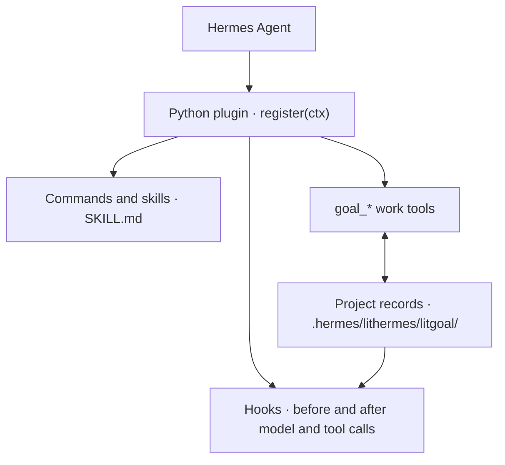

<p align="center"><picture><source media="(prefers-reduced-motion: reduce)" srcset="./docs/assets/cover-motion-still.webp" /></picture></p>

<p align="center"></p>

<details>
<summary>Copy ASCII logo</summary>

```
                             ▄▄▄▄
                   ▗███▌   ▗██████▖
 ▗▄▄▄▄▄          ▗▟████▌   ▝██████▘
 ▐█████        ▗▟██████▌    ▝▀▜█▀▘
 ▐█████      ▗▟███████▄▄▄▄▄▄▄▄▄▄▄▄▄▄▄▄▄▄▄▄
 ▐█████    ▗▟█████████████████████████ ▐█▀
 ▐█████    ████████████████████████████▀
 ▐█████    ██▛▘   ▄ ▄▄▄▄▖▄▄▄▄▄▄▄▄▄▄▄▄▄▖
 ▐█████    ▀    ▄██ ████▌█████████████▌
 ▐█████       ▄████ ████▌█████████████▌
 ▐█████     ▄█████▛                                 lithermes
 ▐█████  ▗▟█████▀▘       ▄▄▄▄▄     ▗▖
 ▐█████ ▐█████▀          █████     ▐▛▀
 ▐█████ ▐███▀            █████
 ▐█████ ▐█▀              █████
 ▐█████ ▝                █████
 ▐█████▄▄▄▄▄▄▄▖          █████
 ▐███████████▛           █████
 ▐██████████▀            █████

```

</details>

<p align="center"></p>
<p align="center"></p>

<p align="center">
<a href="#install"></a>
<a href="./LICENSE"></a>
</p>

<p align="center">
<a href="./docs/guide.md"> Docs</a> &nbsp;
<a href="#install">Install</a> &nbsp;
<a href="./docs/assets/readme/ignition-film.mp4"> Ignition</a> &nbsp;
<a href="./LICENSE"> MIT</a>
</p>

# LitHermes

**Keep the work lit.**

LitHermes is a plugin for **Hermes Agent**. It takes a task from a plan to work that has actually been checked, then leaves a note so the next session knows where things stand. You start it by adding one word, `lit`, to a request.

[한국어](./README_Ko-KR.md) · [npm](https://www.npmjs.com/package/@litfamily/lithermes) · [GitHub](https://github.com/wjgoarxiv/lithermes)

## Why LitHermes

**A spark has been placed in your hands. Give it a place in your work.**

A bug you want fixed, a screen you want built or a project you want to finish can start with one sentence. Coming back to it is the hard part. You need to know what was decided, what was actually checked and what comes next.

LitHermes keeps that record with the project. Goals, plans, evidence and next steps stay on disk, so another session can continue from the same record instead of starting over.

```text
Plan → Make → Check → Leave the next step
```

**Leave something the next session can pick up.**

## Install

You need Hermes Agent, Node.js 18 or later, and write access to your Hermes home (normally `~/.hermes`). This page describes `@litfamily/lithermes@1.0.13`.

```sh
npx --yes --package @litfamily/lithermes@latest -- lithermes install --yes --no-style
```

This one line fetches the installer, puts the plugin into your Hermes home and changes your Hermes configuration so the plugin loads. It is written to run without stopping for approval, which is why `--yes` appears twice: the first lets npx run the package, and the second approves the configuration changes. `--no-style` skips the picker for how replies are written, which would otherwise still come up in a terminal. The Ignition skin installs either way. Nothing connects to Telegram during installation.

Maybe you want to try LitHermes before it touches your everyday setup. Point `HERMES_HOME` at a new, empty directory before you install, and start Hermes with that same value; your usual home and settings stay as they are. The installer can also make compatibility edits to the Hermes installation it finds. If that installation lives outside your trial profile and you want it left alone too, add `--no-patch-installed-hermes`.

<details>
<summary>Installing from a reviewed .tgz instead</summary>

If a reviewed `.tgz` came with a release, replace the example path and run each line on its own:

```sh
LITHERMES_PACK='/absolute/path/to/the-reviewed-package.tgz'
```

```sh
npm exec --yes --package "$LITHERMES_PACK" -- lithermes install --yes --no-style --no-auto-update --no-patch-installed-hermes
```

The same file works for the other commands on this page:

```sh
npm exec --yes --package "$LITHERMES_PACK" -- lithermes install --dry-run --no-auto-update --no-patch-installed-hermes
npm exec --yes --package "$LITHERMES_PACK" -- lithermes doctor --offline --no-auto-update
npm exec --yes --package "$LITHERMES_PACK" -- lithermes uninstall --yes --no-auto-update
npm exec --yes --package "$LITHERMES_PACK" -- lithermes hud off
```

</details>

### Updates

LitHermes updates itself, and it does so carefully. Here is what actually happens.

It looks for a newer version in two situations: when you run `lithermes install`, `check` or `doctor` in a terminal, and when you send the first message of an interactive Hermes CLI session. It asks the npm registry for the latest stable release and waits up to 3 seconds. If that release is newer than yours, LitHermes installs it right then, and your command (or your first reply) waits until it finishes.

The install is built so that it can be undone:

1. LitHermes copies the plugin folder, `config.yaml`, the install record and the skins folder into `<Hermes home>/lithermes/auto-update/<id>/backup/`.
2. It runs the new version's installer as `install --yes --no-hud --no-style --no-patch-installed-hermes`. That means no questions about the skin accent or the reply style, and no compatibility edits to your Hermes installation. Your model and effort settings stay as they are.
3. It runs `doctor --offline`.
4. If the install fails, takes longer than 30 seconds, or does not pass that check, the backup goes back in place and you keep the version you had.

Only one update runs at a time in a Hermes home. The installer receives just what it needs to run: `PATH`, home and temp folders, locale, `TERM` and `NODE_EXTRA_CA_CERTS`. Your npm settings, proxies, `NODE_OPTIONS` and tokens stay behind. After a successful update the backup folder remains, so delete it once you no longer need it.

**What you will see.** Very little. During `lithermes install`, an update ends with `LitHermes automatic update committed (<version>). Restart Hermes to load it.` because the newer installer has already done the install; run the command again if you wanted its own options. `check` and `doctor` carry on with their usual report. A failed update that was rolled back is silent, and the command continues with your current version. Inside Hermes nothing is added to the conversation, and the first reply simply waits for the update. Restart the Hermes CLI and any gateways to load the new version.

Each run leaves two records in `<Hermes home>/lithermes/`. `auto-update-journal.json` follows the steps, and `auto-update-receipt.json` shows whether the update went through, which version it aimed for and whether it rolled back. If the rollback itself fails, LitHermes stops the command and says the Hermes home is in an unknown state. Keep the backup and run `lithermes doctor --offline --hermes-home PATH` before you go on.

**When it stays out of the way.** An update needs a person at the terminal, with input, output and error output all interactive. Piped output and any run with `CI` set therefore skip it, and so do commands with `--offline`, `--json` or `--dry-run` and commands run through `bunx`. Inside Hermes it is tried at most once per session, only in the top-level session and never in a delegated helper. The update only covers a LitHermes that the npm installer put in place. A copy from the Hermes catalog, or one you copied in yourself, stays yours to manage. An install made by an older installer qualifies once you have run the installer again.

**The update notice.** Separately, LitHermes can tell you about a release without installing it. After `install`, `check` or `doctor` it looks in the background, at most once every 24 hours, and saves the answer in `update-check.json`. Later runs read that file and, if a newer release is listed, suggest a command such as `npx --yes --package @litfamily/lithermes@<version> -- lithermes install --yes --no-hud`. You run it yourself, so the notice is how you hear about releases when automatic updates are off. The same rules apply: nothing is checked with `--offline`, `--json` or `--dry-run`, in CI, or when output is piped.

**Turning it off.** Pick the one that fits:

- `LITHERMES_NO_AUTO_UPDATE=1`: install new versions yourself and keep the notice. Set it in the shell that runs `lithermes` and in the one that starts Hermes.
- `--no-auto-update` on `install`, `check` or `doctor`: skip the update for that one command.
- `NO_UPDATE_NOTIFIER=1` or `LITHERMES_NO_UPDATE_CHECK=1`: stop LitHermes from asking npm about new versions at all. The update and the notice both turn off.

LitHermes only checks that a variable is set, so any value works, `0` included.

## Quick start

Restart the Hermes CLI or gateway so it loads the plugin. Then give it a task with `lit` in front:

```text
lit Build a to-do list in one HTML file without external dependencies. Implement add, complete, and delete; record what you checked and what remains.
```

`/lit <request>` does the same thing as an explicit command. Either way, the reply opens with a single `🔥 **LIT IGNITED · <discipline>** 🔥` line on its own, and the route acknowledgement shows up as the reply arrives. Once you see them, LitHermes has picked up the task and the work has started; how well it went is for you to check in the result.

When it finishes, open the HTML file and try each action yourself. Ask Hermes to separate the checks it actually ran from anything still unverified. Then run `/lit-handoff` to leave the result and the next step in the project. In a new session, open the same project and ask Hermes to read that handoff before it continues.

The spark is that record. Once the session closes, nothing carries on in the background; the next session picks the work up from the handoff.

### What you will see on your first run

Here is what LitHermes puts on your screen, from the install to your first task. The text in the pictures is what the product prints. Each caption says whether the picture was captured from a real command or built from the exact strings the plugin produces. The Jev pictures live in [their own section](#optional-jev-skill-hint).

**The install.** The installer copies the plugin into your Hermes home, writes the default model routes for a fresh home and saves a backup of your configuration first, so you can see where the backup file sits. It ends with the reminder to restart any running gateway, and one line about whether the film tools were fetched.

<p align="center"><picture><source media="(prefers-color-scheme: dark)" srcset="./docs/assets/screens/install-dark.webp" /></picture></p>

*Captured from the real installer in a scratch Hermes home, run with three extra flags so that nothing left the machine and no Hermes installation was touched: offline, no automatic update and no compatibility patch. It read the local Hermes source without changing it. The lines about model routes are cut ("…"), and the scratch folder is written as ~/.hermes.*

**The check.** Run doctor after installing, or any time something looks off. It reads what is installed against what shipped and gives every area a short tag. With the offline switch it stays on your machine, and the one thing it cannot see that way, whether Hermes has loaded the plugin, shows as PARTIAL.

<p align="center"><picture><source media="(prefers-color-scheme: dark)" srcset="./docs/assets/screens/doctor-dark.webp" /></picture></p>

*Captured from the real doctor command in the same scratch home. The picture keeps eleven of the result lines and cuts the rest ("…"), which cover model routes and the film tools.*

**Start and stop.** With the Ignition skin selected, Hermes greets you with the small LIT mark and the words LIT ready, and says stay lit when you leave. It is a quick way to see that the skin is on.

<p align="center"><picture><source media="(prefers-color-scheme: dark)" srcset="./docs/assets/screens/welcome-dark.webp" /></picture></p>

*Captured from a real Hermes session with the Ignition skin selected. The Hermes banner, tip and warnings between the pictured lines are cut. In the light picture, pale colors are darkened so they read on a light window.*

**The first line of a task.** When a request starts with lit or /lit, the reply opens with one line on its own, and the small LIT mark follows with the same words beside it. Once you see them, the request has been routed and the work has started; the result is yours to check. The name after the dot tells you which route took it, for example litwork for a plain lit and lit-plan for a plan.

<p align="center"><picture><source media="(prefers-color-scheme: dark)" srcset="./docs/assets/screens/lit-ack-dark.webp" /></picture></p>

*Illustration built from LitHermes's own strings. The mark and the line beside it are the real output of the acknowledgement code, run on its own. The opening line is the one the plugin tells the model to write, and the prompt line is sample text. No model was involved. In the light picture, pale colors are darkened.*

**The update notice.** When a newer release is known and automatic updates are switched off, check, doctor and install end with a three-line notice: the two versions, the exact command to run, and a reminder to restart Hermes. The notice only tells you; nothing is installed until you run that command.

<p align="center"><picture><source media="(prefers-color-scheme: dark)" srcset="./docs/assets/screens/update-notice-dark.webp" /></picture></p>

*Captured from the real check command in the scratch home. To make the notice appear, a saved update file naming 1.0.14 was placed there, so that release number is a stand-in. The banner above the result lines is cut.*

## Watch it in motion

A short film walks through one full round: one word starts a task, the work is checked, a note is left in HANDOFF.md, and a new session picks it up. The picture below is a silent preview that loops. The MP4 carries a generated music bed.

<p align="center"><a href="./docs/assets/promo/promo.mp4"><picture><source media="(prefers-reduced-motion: reduce)" srcset="./docs/assets/promo/promo-reduced-motion.webp" /></picture></a></p>

[Watch the film with sound (MP4, 3.0 MiB)](./docs/assets/promo/promo.mp4)

*The request and the sample replies in the film are examples. The LIT IGNITED line, the LIT ready welcome, the stay lit goodbye and the mark colors are what LitHermes prints.*

## Skills

These are all the skills you can call in LitHermes, with the words that start each one. Any of them also loads by name as `lithermes:<name>`.

<table>
<tr><th>What it looks like</th><th>Skill</th><th>What you get</th></tr>
<tr>
<td></td>
<td><code>litwork</code><br /><sub><code>lit &lt;task&gt;</code> · <code>litwork &lt;task&gt;</code></sub></td>
<td>Add <code>lit</code> to a request. It keeps a notepad and takes each criterion through a strict loop: a failing test, a passing one, a check on the real thing, then cleanup.</td>
</tr>
<tr>
<td></td>
<td><code>lit-plan</code><br /><sub><code>lit plan &lt;what&gt;</code> · <code>/lit-plan</code></sub></td>
<td>A plan file with numbered task rows that <code>start-work</code> can execute. Nothing is edited yet.</td>
</tr>
<tr>
<td></td>
<td><code>start-work</code><br /><sub><code>/start-work &lt;approved-plan&gt;</code></sub></td>
<td>Runs a plan row by row. A box is checked only after all five gates pass.</td>
</tr>
<tr>
<td></td>
<td><code>review-work</code><br /><sub><code>lit review &lt;scope&gt;</code> · <code>/review-work</code></sub></td>
<td>Five reviewers read the same change on their own, and each leads with what it found.</td>
</tr>
<tr>
<td></td>
<td><code>litgoal</code><br /><sub><code>lit goal &lt;outcome&gt;</code> · <code>/litgoal</code></sub></td>
<td>One objective with checkable criteria, kept on disk so the next session can pick it up.</td>
</tr>
<tr>
<td></td>
<td><code>lit-recap</code><br /><sub><code>lit-recap</code></sub></td>
<td>A read-only summary: done, in progress, blocked, where the evidence is, what comes next.</td>
</tr>
<tr>
<td></td>
<td><code>lit-handoff</code><br /><sub><code>handoff</code> · <code>/lit-handoff</code></sub></td>
<td>Type <code>handoff</code> to get a continuation file the next session can read and resume from.</td>
</tr>
<tr>
<td></td>
<td><code>deep-interview</code><br /><sub><code>deep-interview &lt;idea&gt;</code> · <code>/deep-interview</code></sub></td>
<td>One question at a time until the idea is clear enough to build. A meter shows how much is still vague.</td>
</tr>
<tr>
<td></td>
<td><code>litresearch</code><br /><sub><code>lit research &lt;question&gt;</code></sub></td>
<td>Splits a research question, sends parallel searchers and follows every lead before answering with sources.</td>
</tr>
<tr>
<td></td>
<td><code>lit-crucible</code><br /><sub><code>lit-crucible &lt;brief&gt;</code></sub></td>
<td>Pressure-tests a brief before planning. Only the risks that survive critique reach the plan.</td>
</tr>
<tr>
<td></td>
<td><code>lit-init</code><br /><sub><code>lit-init</code></sub></td>
<td>Maps a repository into a root AGENTS.md and short guides for the folders that need one.</td>
</tr>
<tr>
<td></td>
<td><code>lit-comprehend</code><br /><sub><code>lit-comprehend</code> · <code>comprehend &lt;range&gt;</code></sub></td>
<td>An explainer page for agent-written work: intuition first, then the walkthrough, then a short quiz.</td>
</tr>
<tr>
<td></td>
<td><code>lit-humanizer</code><br /><sub><code>humanizer &lt;text&gt;</code> · <code>/lit-humanizer</code></sub></td>
<td>Rewrites stiff model prose in English or Korean. Facts and hedges stay, and no file is edited on its own.</td>
</tr>
<tr>
<td></td>
<td><code>lit-diagram-drawer</code><br /><sub><code>lit-diagram-drawer &lt;brief&gt;</code> · <code>/lit-diagram-drawer</code></sub></td>
<td>A checked, editable diagram for slides and documents, with PNG and Office-safe SVG exports.</td>
</tr>
<tr>
<td></td>
<td><code>lit-pptx</code><br /><sub><code>lit-pptx &lt;brief&gt;</code> · <code>/lit-pptx</code></sub></td>
<td>Ask for slides with <code>lit</code> and get an editable PowerPoint deck and its Markdown source, AZURE-PRO with Pretendard by default. QA and integrity checks run on the finished file.</td>
</tr>
<tr>
<td></td>
<td><code>lit-docx</code><br /><sub><code>lit-docx &lt;brief&gt;</code> · <code>/lit-docx</code></sub></td>
<td>Ask for a report with <code>lit</code> and get a styled Word file and its Markdown source. Korean text uses the korean-generic profile; prose lint and a rendered-page check follow.</td>
</tr>
<tr>
<td></td>
<td><code>frontend-ui-ux</code><br /><sub><code>lit design &lt;target&gt;</code> · <code>frontend-ui-ux &lt;target&gt;</code></sub></td>
<td>Builds a working interface, then renders it with the installed measuring probe in seven views: four widths, dark, reduced motion and 200% zoom.</td>
</tr>
<tr>
<td></td>
<td><code>readme-studio</code><br /><sub><code>readme-studio &lt;scope&gt;</code></sub></td>
<td>A factual README with a moving cover, checked at phone and desktop widths in light and dark.</td>
</tr>
<tr>
<td></td>
<td><code>lit-typographic-motion</code><br /><sub><code>lit-typographic-motion &lt;request&gt;</code> · <code>/lit-typographic-motion</code></sub></td>
<td>Ask for a video with <code>lit</code>. A treatment comes first, then drawn scenes or moving type, a generated sound bed and a gate before the film is delivered.</td>
</tr>
<tr>
<td></td>
<td><code>lit-scientific-visualization</code><br /><sub><code>lit-scientific-visualization</code> · <code>/lit-scientific-visualization</code></sub></td>
<td>A journal-sized figure with vector and 600 DPI exports. The chart type follows the data.</td>
</tr>
<tr>
<td></td>
<td><code>visual-qa</code><br /><sub><code>visual-qa &lt;target&gt;</code></sub></td>
<td>Checks a real screen at each viewport and returns an honest verdict, or names exactly what blocked it.</td>
</tr>
<tr>
<td></td>
<td><code>browser-drive</code><br /><sub><code>browser-drive &lt;task&gt;</code></sub></td>
<td>Drives a real page after verifying the browser driver. If there is none, it says so.</td>
</tr>
<tr>
<td></td>
<td><code>structural-search</code><br /><sub><code>lit structural &lt;pattern&gt;</code> · <code>structural-search &lt;pattern&gt;</code></sub></td>
<td>Finds code by the shape of its syntax instead of its exact text, and shows a rewrite before applying it.</td>
</tr>
<tr>
<td></td>
<td><code>wikify</code><br /><sub><code>wikify &lt;mode&gt;</code> · <code>lit wikify &lt;mode&gt;</code></sub></td>
<td>Keeps reviewed project knowledge on disk and answers later questions from it, with sources.</td>
</tr>
<tr>
<td></td>
<td><code>debugging</code><br /><sub><code>lit debug &lt;symptom&gt;</code> · <code>debugging &lt;symptom&gt;</code></sub></td>
<td>Reproduces the bug, tests at least three explanations, and fixes only the confirmed cause.</td>
</tr>
<tr>
<td></td>
<td><code>refactor</code><br /><sub><code>lit refactor &lt;target&gt;</code> · <code>refactor &lt;target&gt;</code></sub></td>
<td>Restructures code while tests pin its behavior before and after every step.</td>
</tr>
<tr>
<td></td>
<td><code>lit-burnoff</code><br /><sub><code>lit slop &lt;scope&gt;</code></sub></td>
<td>Cleans AI-written bloat out of a change set after tests lock what it does.</td>
</tr>
<tr>
<td></td>
<td><code>lit-burnoff-file</code><br /><sub><code>ask to clean one file</code></sub></td>
<td>The same cleanup for one file: fewer narrating comments, less defensive noise, flatter code.</td>
</tr>
<tr>
<td></td>
<td><code>lit-code</code><br /><sub><code>ask for strict implementation</code></sub></td>
<td>Strict implementation rules: tests first, typed boundaries, small files.</td>
</tr>
<tr>
<td></td>
<td><code>lit-commit</code><br /><sub><code>lit git &lt;task&gt;</code></sub></td>
<td>Splits your changes into atomic commits in the repo's own style and leaves unrelated work alone.</td>
</tr>
<tr>
<td></td>
<td><code>lsp-setup</code><br /><sub><code>lsp-setup &lt;language&gt;</code></sub></td>
<td>Sets up a language server for your language and proves diagnostics really work.</td>
</tr>
<tr>
<td></td>
<td><code>lsp</code><br /><sub><code>lsp &lt;request&gt;</code></sub></td>
<td>Uses Hermes' language server for diagnostics, references and rename checks when you ask.</td>
</tr>
<tr>
<td></td>
<td><code>rules</code><br /><sub><code>rules &lt;question&gt;</code></sub></td>
<td>Explains which rule files Hermes loads, and when.</td>
</tr>
<tr>
<td></td>
<td><code>comment-checker</code><br /><sub><code>comment-checker</code></sub></td>
<td>Reviews the comments an edit added: reasons stay, narration goes. It also runs after source edits.</td>
</tr>
<tr>
<td></td>
<td><code>autoresearch</code><br /><sub><code>autoresearch &lt;mode&gt;</code></sub></td>
<td>An approved, budgeted experiment loop. Each round changes one thing and keeps or reverts it.</td>
</tr>
<tr>
<td></td>
<td><code>autoconference</code><br /><sub><code>autoconference &lt;mode&gt;</code></sub></td>
<td>A budgeted research conference: separate researchers, reviewers, and a synthesis that keeps disagreement.</td>
</tr>
</table>

## How it works

LitHermes is a Python plugin. When Hermes loads it, `register(ctx)` adds hooks, commands, skills and work tools. The hooks step in just before and after each model or tool call. The `goal_*` tools write your goals, and the evidence gathered for them, to local records in your project.



Before the next model call, the context hook reads those records and hands the model the current goal and how far it has got.

The plugin decides where a request goes; Hermes Agent still runs the model. Permissions, sign-in, model access and anything that needs a real screen remain Hermes' own business.

## Beyond code

### Reports and slides

Ask for a report or a presentation with a bare `lit`, and LitHermes hands it to its bundled Word and PowerPoint skills. You get a DOCX, a PPTX or both, with the Markdown source kept beside each file. Korean documents use the korean-generic profile unless you pick another, and slides use AZURE-PRO with Pretendard unless you ask for something else.

The first time you use either skill, its Office runtime installs the pinned versions of the tools it needs into a LitHermes cache. Then it runs its QA checks on the finished document or deck. To call a skill directly, type `/lit-docx <brief>` or `/lit-pptx <brief>`.

The installed skill IDs are `lit-pptx` and `lit-docx`; Hermes lists them as `lithermes:lit-pptx` and `lithermes:lit-docx`.

### Diagrams

For concept maps and technical diagrams, use `lit-diagram-drawer` (Hermes lists it as `lithermes:lit-diagram-drawer`). You can also just ask for a diagram and put a bare `lit` before or after the request; LitHermes picks this skill and tells Hermes where its installed entrypoint is. Product pages belong to `frontend-ui-ux`, and plots of measured scientific data to `lit-scientific-visualization`.

### Films

`lit-typographic-motion` is available as `lithermes:lit-typographic-motion` and `/lit-typographic-motion <brief>`. Ask for a film with a bare `lit` and it works like a director: it writes a treatment first. Then it renders a stage film (a model-authored HTML page captured frame by frame) or, when the words themselves are the film, a type film on its original WebGL2 engine. By default it adds a generated sound bed and labels it as generated.

A film needs Chrome and ffmpeg on your machine, plus a few pinned helper packages and fonts. Rendering never downloads anything by itself, so those helpers wait in a local cache until a film needs them. `lithermes install` tries to fill that cache for you. If that step was skipped (with `--offline`, say) or did not finish, the installer prints one line saying so, and you can fill the cache later with `lithermes motion-runtime install`, run outside the render session.

To see where things stand, run `lithermes motion-runtime status`. It reports Chrome, ffmpeg, WebGL2, whether rendering has fallen back to software, and the pinned fonts. When the film passes its final check, the skill delivers a 60 fps film (1920×1080, or 1080×1920 on the stage path), a compact preview, a poster, a reduced-motion still and a numeric QA report. The typographic-motion engine is adapted from mexicat/pdoom-video (MIT, Giacomo Magnanini), commit `ca251e3`.

### Interfaces and READMEs

`frontend-ui-ux` builds the interface you describe, after checking with you on the design choices that matter. Ask it only for a review or a plan, and it reads and reports without editing anything. `readme-studio` (listed in Hermes as `lithermes:readme-studio`) writes a factual README and a cover made on your own machine: outlined Pretendard/Meslo type, an editable source, and motion when it can be verified. When Hermes has no built-in image generator, the skill says so with `IMAGE_GENERATION_UNAVAILABLE` and can still compose images you give it. Neither skill logs in, installs anything globally or publishes.

### Rewriting prose

The `lit-humanizer` skill is available as `lithermes:lit-humanizer`. It helps you revise Korean and English drafts while keeping their facts and intended meaning.

The skill also comes with a detector that watches what Hermes writes for people to read. When Hermes saves text through `write_file` or `patch`, in any supported format including SVG, the detector reads the changed part first. A serious finding (block tier) can stop the write before the file is saved; a milder one (warning tier) comes back as advice to review.

Office files and PDFs are checked after they exist. A DOCX or PPTX is read once a file-write event or a script result reports where it was saved. A PDF is read the same way, but only if `pdftotext` is installed. By then the file is already saved, so these checks only advise: Hermes is asked to fix the source and rebuild. Either way, the detector reads wording only and has no way to tell who wrote the text.

## The Ignition skin

LitHermes also gives the Hermes CLI a new look. Type `/skin` in the CLI to see which skin is active and which ones you can pick. Choose `/skin lithermes-ignition` and restart Hermes, and the startup banner appears in orange, lime, ivory and navy. In the compact layout the welcome still shows the five-row MICRO mark, although the host may leave out the full `banner_logo` there. The ten numbered accent presets are all still there too.

If you install for the first time with `--yes` in an interactive terminal that shows color, Ignition is selected for you, but only when `display.skin` is not in your configuration at all. A skin you already chose, and any skin files you already have, stay as they are.

On a light terminal, pick `/skin lithermes-tokyonight-day`; on a dark one, `/skin lithermes-tokyonight`. Restart Hermes after switching. Both keep body text, status lines and the completion menu readable, recolor the MICRO mark and banner art, and leave your other skin choices and files alone. What you type keeps your terminal's default color. When a Lit reply comes in through a natural route, the MICRO acknowledgement appears once, at the end.

The skin and the output style are separate things: the skin changes how the CLI looks, and the output style changes how replies are worded. Gateway conversations never show the CLI skin. How it looks depends on your host and terminal, so after a restart, check it on screen.

LitHermes won't overwrite a named skin file you already have. To get a fresh copy of one that is a regular file, move it somewhere safe as a backup, run the installer again so it recreates the missing file, then copy your own edits back in. Symlinks and anything unexpected in that spot are left untouched. On macOS, one detail may stay in ANSI-256 color: the `prompt_toolkit` divider when CPR is turned off, even though the rest of the Rich output keeps the approved colors.

## Commands

| Type | What it does |
|---|---|
| `lit <request>` or `/lit` | Start a bounded task and leave checked results. |
| `handoff` or `/lit-handoff` | Carry the current work and next step into another session. |
| `lit-plan` or `/lit-plan` | Write a plan before anything is executed. |
| `/start-work <approved-plan>` | Execute an approved plan. |
| `/review-work` | Review a plan or result and record findings. |
| `lit review <target>` | Review a plan or result. |
| `litresearch` or `lit research <question>` | Run the research workflow, with source notes. |
| `/lit-loop` | Start, inspect, resume or close an explicit loop. |
| `/litgoal` | Track criteria, evidence, checkpoints and blockers. |
| `/lit-humanizer` | Revise Korean and English prose while preserving meaning. Legacy aliases include `/lit-korean`, `/text-naturalization`, `/text-neutralization` and `/korean-ai-slop-remover`. |
| `/lit-diagram-drawer <brief>` | Create an accessible, Korean-ready diagram and check its content and geometry with the installed Python tools. |
| `/lit-pptx <brief>` | Create and check a PowerPoint deck with the bundled AZURE-PRO engine. |
| `/lit-docx <brief>` | Create, edit and audit a Word report with publisher profiles. |
| `/lit-typographic-motion <brief>` | Direct and gate an original film from a treatment, on the stage or the type path. |

On a Telegram gateway, use `/lit_loop` and `/lit_plan`. The [operating guide](./docs/guide.md) has the full command examples and hook behavior. When the acknowledgement line shows after a command, the work has started. Check the result yourself, including any visual check, before you rely on it.

## Automatic handoff

A long session fills the model's context window, and when it is full Hermes compacts the conversation and older detail is lost. Automatic handoff has the model write a handoff before that happens, and brings it back afterwards. It is off by default, and the percent is yours to choose: LitHermes has no built-in value.

Turn it on inside a session with a percent of your own:

```
/lit-handoff auto on 60
```

From then on, once a model call uses more than 60% of the context window, your next message carries a short request to write a handoff with the lit-handoff procedure. The model saves the file and tells you one line: `Handoff saved. Run /compact now.` (On Hermes 0.17 the command is `/compress`.) After you compact, the next message carries a short digest of that handoff, so the work picks up where it stopped.

Hermes lets a plugin watch and ask, and only you or Hermes can compact. These are the four steps and who does each one here:

| Step | Who does it on Hermes |
|---|---|
| Measure how full the context is | Automatic. LitHermes reads the token count of every model call. |
| Ask the model for the handoff | Automatic request, on the first message after the percent is passed. The model still has to follow it. |
| Compact the conversation | You, with `/compact`, or Hermes on its own threshold. A plugin cannot start compaction on Hermes. |
| Load the handoff again | Automatic, on the first message after compaction. It loads only a file that carries this session's id and was written after the request; otherwise LitHermes says it found nothing to load. |

These switches set it up:

- `/lit-handoff auto on <percent>` turns it on at a whole number from 1 to 99. Without a number it reuses the last one you chose, and asks for one if you never chose.
- `/lit-handoff auto off` turns it off and remembers the percent for next time.
- `/lit-handoff auto status` shows whether it is on, the latest reading of this session and how it compares with Hermes' own compaction point.
- `LITHERMES_AUTO_HANDOFF=1` together with `LITHERMES_AUTO_HANDOFF_PERCENT=60` sets the same thing from the environment Hermes runs in, which suits a shell profile. The environment wins over the command. Any other value of the first variable keeps the feature off, and a percent that is not a whole number from 1 to 99 also keeps it off and shows up as a warning in `hermes lithermes doctor`.

Choose a percent below the point where Hermes compacts on its own. On current Hermes that is about half of the window by default, raised to 75% for windows under 512K tokens, and lowered to a fixed token count when your Hermes config sets a cap. If your percent is at or above that point, Hermes compacts first and no handoff is written. `hermes lithermes doctor` and `/lit-handoff auto status` compare the two and warn you.

The request goes out once each time usage crosses your percent, never inside a tool call and never to helper agents. LitHermes saves only your switch and last percent, in the `lithermes` folder of your Hermes home. The handoff itself is the usual `HANDOFF.md` (or `.handoff/HANDOFF.md`) in your project.

## Optional: Jev skill hint

Sometimes a plain prompt would suit one of the bundled skills, but nothing in it says so. For those prompts, LitHermes can ask Jev, TypeSafe's hosted decision model, which skill fits. Jev's answer is added to that turn's context as one line of advice. It is only a suggestion: the Hermes model still decides whether to load the skill, and the hint cannot grant permissions or start tools. Slash commands, and prompts an existing LitHermes route already handles, are left alone.

It is off by default. To turn it on, set both variables, with your own TypeSafe key, in the environment Hermes runs in:

```sh
export LITHERMES_JEV=1
export TYPESAFE_API_KEY=<your key>
```

While it is on, each eligible prompt is sent to TypeSafe (typesafe.ai), truncated to 2,000 characters, with home paths, email addresses and token-shaped strings redacted. Anything in the prompt without a token shape is sent as written, such as hostnames, customer names, and passwords not written as `password=...`. In Hermes gateway mode, messages from other participants in a chat are eligible prompts too. Nothing else from the session is sent.

Because `TYPESAFE_API_KEY` is exported in the shell that starts Hermes, the agent's own tools can read it. Use a key dedicated to this feature, with a low spend limit. TypeSafe bills your account, at about $0.04 per million input tokens. Each request has a 1.5-second limit and no retry; on any failure the turn continues unchanged, with one short note per session.

While it is on, the first reply of each session starts with the plain line `✦ Jev skill hint ON`, so you can tell at a glance. You also see it in `hermes lithermes status` and `hermes lithermes doctor`. The last hint is kept per session, so run them inside a Hermes session, for example through the agent's terminal:

- `Jev skill hint: on — last hint lit-humanizer (0.43s)` names that session's last hinted skill and how long Jev took.
- `on — no hint yet` means no hint so far in that session.
- Outside any session the line reads `on — no session`. Otherwise it reads `off` or `flag on but TYPESAFE_API_KEY missing`.

To turn it off, unset `LITHERMES_JEV` or set it to any value other than `1`.

### What you will see

These four screens show what changes on your side. The text in them is what LitHermes prints; the skill name and the timing are examples.

**The first reply.** With Jev off, replies arrive as Hermes wrote them. With Jev on, the first reply of each session starts with one extra line, so you can tell at a glance that your prompts are going to Jev. It shows once per session, and the reply under it is unchanged.

<p align="center"><picture><source media="(prefers-color-scheme: dark)" srcset="./docs/assets/jev/jev-first-reply-dark.webp" /></picture></p>

*Sample output. The first line is what LitHermes's own reply hook produced. The sentence under it is made-up sample text.*

**When Jev cannot answer in time.** If TypeSafe is slow or unreachable, the turn carries on without a hint. LitHermes adds one short note under the first line, once per session, so you know why no hint came.

<p align="center"><picture><source media="(prefers-color-scheme: dark)" srcset="./docs/assets/jev/jev-first-reply-note-dark.webp" /></picture></p>

*Sample output from LitHermes's own reply hook, with a stand-in that plays a TypeSafe reply that never arrives. Nothing was sent anywhere.*

**Before it works.** `hermes lithermes doctor` includes a Jev line. While Jev is off, the line is a plain note. If you set the switch and forget the key, it turns into a warning that names the missing key, which is the quickest way to spot that.

<p align="center"><picture><source media="(prefers-color-scheme: dark)" srcset="./docs/assets/jev/jev-status-before-dark.webp" /></picture></p>

*Captured from the real `hermes lithermes doctor` command in a scratch Hermes home.*

**Once it is on.** Inside a session, `status` first says that no hint has come yet. After Jev suggests a skill, the same line names that skill and how long Jev took, and `doctor` shows it with an OK tag.

<p align="center"><picture><source media="(prefers-color-scheme: dark)" srcset="./docs/assets/jev/jev-status-on-dark.webp" /></picture></p>

*Captured from the real `hermes lithermes status` and `doctor` commands in a scratch Hermes home. A placeholder key and a stand-in for TypeSafe's answer were used, so the skill name and the 0.42 seconds are examples.*

## When something goes wrong

Start with a check that stays offline:

```sh
npx --package @litfamily/lithermes -- lithermes doctor --offline
```

If Lit skills seem to be missing, ask Hermes to call its `skills_list` tool and look for LitHermes entries. The `/skills` command only reads the filesystem, so depending on the Hermes version its list can differ from the skills the plugin provides.

A skill with the same name somewhere else can win over the LitHermes one. When you ask for a skill by its plain name, Hermes looks in the folders listed under `skills.external_dirs` in its `config.yaml` and in `<HERMES_HOME>/skills` before it reaches the plugin. The prefixed form, `lithermes:<name>`, skips that search. `lithermes doctor` spots the clash and prints a `skill shadow check: WARNING` line with the skill and the path that hides it. Load the LitHermes copy as `lithermes:<name>`, or remove or rename the other one. The warning is informational and leaves doctor's pass/fail exit status as it was.

An import error in the Hermes log means the plugin failed to load. Resist installing pip packages on a guess; keep the message and check the [operating guide](./docs/guide.md).

### Limits worth knowing

- To see what the installer would change before it changes anything, run `lithermes install --dry-run`.
- LitHermes reads code, quotations and commands you paste in as plain text and does not follow them as instructions. Secrets are masked before anything is saved or passed to a model.
- Hermes' own `/goal` stays yours. LitHermes leaves it alone and never updates, clears or resumes it. It works from the goals it saves through its `goal_*` tools.
- Hermes sends every helper through one shared model setting, so you cannot choose a model per task or give reviewers a model of their own. The installer's report shows what was configured. What a helper actually ran on is proven only by the receipt of a real `delegate_task` run.

### Removing it

```sh
npx --package @litfamily/lithermes -- lithermes uninstall --yes
```

If the installer made compatibility edits to Hermes, add `--rollback-patches` to undo them. Uninstalling keeps the skin files and your `display.skin` choice. To go back to the Hermes default look, run `npx --package @litfamily/lithermes -- lithermes hud off` in the same profile; it clears the choice and keeps the skin files and your other settings.

## More docs and contributing

- [Operating guide](./docs/guide.md): commands, models, skins and troubleshooting in full
- [Python plugin contract](./packages/lithermes-installer/assets/lithermes-plugin/README.md)
- [npm package page](./packages/lithermes-installer/README.md): the short install card published with the package
- [Changelog](./CHANGELOG.md) · [Privacy](./docs/privacy.md) · [Migration](./docs/migration.md)

[Contributing](./CONTRIBUTING.md) · [Security](./SECURITY.md) · [Conduct](./CODE_OF_CONDUCT.md) · [Support](./SUPPORT.md)

MIT License. LitHermes is part of LITFAMILY; each product installs separately in its own agent harness.
