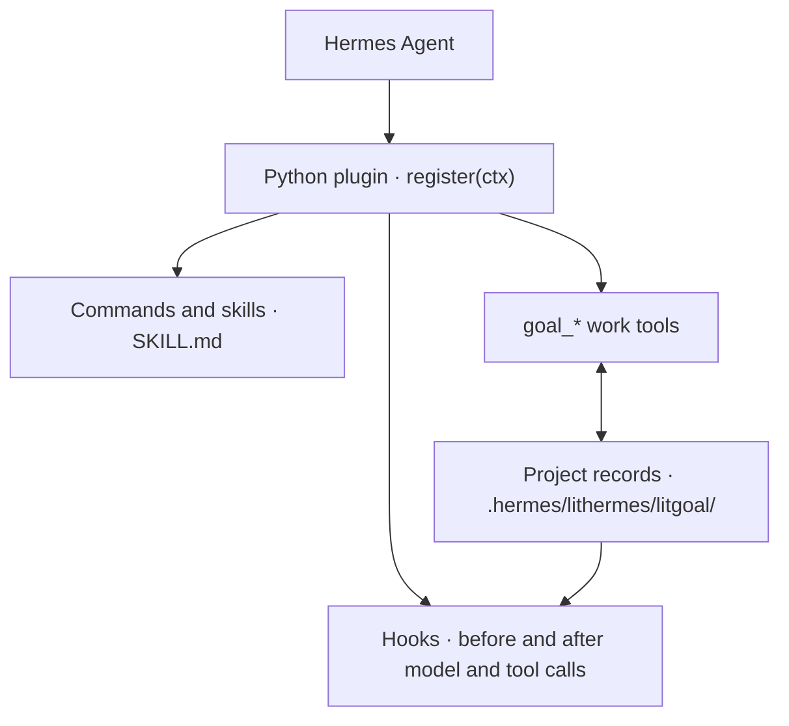

<p align="center"><picture><source media="(prefers-reduced-motion: reduce)" srcset="./docs/assets/cover-motion-still.webp" /></picture></p>

<p align="center"></p>

<details>
<summary>Copy ASCII logo</summary>

```
                             ▄▄▄▄
                   ▗███▌   ▗██████▖
 ▗▄▄▄▄▄          ▗▟████▌   ▝██████▘
 ▐█████        ▗▟██████▌    ▝▀▜█▀▘
 ▐█████      ▗▟███████▄▄▄▄▄▄▄▄▄▄▄▄▄▄▄▄▄▄▄▄
 ▐█████    ▗▟█████████████████████████ ▐█▀
 ▐█████    ████████████████████████████▀
 ▐█████    ██▛▘   ▄ ▄▄▄▄▖▄▄▄▄▄▄▄▄▄▄▄▄▄▖
 ▐█████    ▀    ▄██ ████▌█████████████▌
 ▐█████       ▄████ ████▌█████████████▌
 ▐█████     ▄█████▛                                 lithermes
 ▐█████  ▗▟█████▀▘       ▄▄▄▄▄     ▗▖
 ▐█████ ▐█████▀          █████     ▐▛▀
 ▐█████ ▐███▀            █████
 ▐█████ ▐█▀              █████
 ▐█████ ▝                █████
 ▐█████▄▄▄▄▄▄▄▖          █████
 ▐███████████▛           █████
 ▐██████████▀            █████

```

</details>

<p align="center"></p>
<p align="center"></p>

<p align="center">
<a href="#install"></a>
<a href="./LICENSE"></a>
</p>

<p align="center">
<a href="./docs/guide.md"> Docs</a> &nbsp;
<a href="#install">Install</a> &nbsp;
<a href="./docs/assets/readme/ignition-film.mp4"> Ignition</a> &nbsp;
<a href="./LICENSE"> MIT</a>
</p>

# LitHermes

**Keep the work lit.**

**What it is:** LitHermes connects planning, execution, review, and handoff inside **Hermes Agent**.

[한국어](./README_Ko-KR.md) · [npm](https://www.npmjs.com/package/@litfamily/lithermes) · [GitHub](https://github.com/wjgoarxiv/lithermes)

## Install

Source version: `@litfamily/lithermes@1.0.9`. Have Hermes Agent and Node.js 18+ installed, with write access to your Hermes home (normally `~/.hermes`).

The installer targets your Hermes home. For an isolated trial, set `HERMES_HOME` to a new empty directory before installation and use that same value when starting Hermes. Keep your existing home and settings. `--no-patch-installed-hermes` also prevents compatibility edits to the detected host installation outside that profile.

Install the scoped npm package:

```sh
npx --yes --package @litfamily/lithermes@latest -- lithermes install --yes --no-style
```

For a separate local trial, use the reviewed `.tgz` supplied with the release packet. Replace the example path, then run each line separately:

```sh
LITHERMES_PACK='/absolute/path/to/the-reviewed-package.tgz'
```

```sh
npm exec --yes --package "$LITHERMES_PACK" -- lithermes install --yes --no-style --no-auto-update --no-patch-installed-hermes
```

The first `--yes` approves npx execution; the second approves Hermes configuration changes. `--no-style` skips the reply-writing style picker; it does not disable the native visual Skin. Installation does not connect to Telegram.

## Quick start

Restart the Hermes CLI or gateway, then enter a task in the conversation:

```text
lit Build a to-do list in one HTML file without external dependencies. Implement add, complete, and delete; record what you checked and what remains.
```

For an explicit command, use `/lit <request>`. The reply begins with exactly one `🔥 **LIT IGNITED · <discipline>** 🔥` line on its own first line; the route acknowledgement appears when the reply arrives.

Open the HTML file yourself and try each action. Ask Hermes to separate checks it actually ran from anything still unverified. Then use `/lit-handoff` to leave the result and next action in the project. In a new session, open the same project and ask Hermes to read that handoff before continuing.

The spark is the record you leave. It does not mean work runs forever after the session closes.

## Key features

**A spark has been placed in your hands. Give it a place in your work.** A bug you want fixed, a screen you want built, or a project you want to finish can start with one sentence. Returning to the work takes a record of what you decided, what you checked, and what comes next. **Leave something the next session can pick up.**

### Bounded work and durable handoff

```text
Plan → Make → Check → Leave the next step
```

LitHermes connects planning, execution, review, and handoff in Hermes Agent. Goals, plans, evidence, and next steps stay with the project so another session can continue from the same record.

### Hermes integration

When Hermes loads the Python plugin, `register(ctx)` registers hooks, commands, skills, and work tools. Hooks participate in model and tool calls; `goal_*` tools write goals and evidence to local records. The plugin routes the request; Hermes Agent owns model execution. Host permissions, authentication, model access, and visual checks remain separate capabilities.



The context hook reads those records to pass the current goal and progress into the next model call.

### Ignition Skin

In the Hermes CLI, `/skin` lists the active and available skins. Select `/skin lithermes-ignition`, then restart Hermes to inspect the startup banner. Ignition uses orange, lime, ivory, and navy. Its supported welcome includes the five-row MICRO mark in compact layout, while the host may still omit the full `banner_logo` there. The ten numbered accent presets remain available. A fresh interactive color-capable unattended install selects Ignition only when `display.skin` is absent. Existing selections and skin files are preserved.

For a light terminal, select `/skin lithermes-tokyonight-day`; for a dark terminal, select `/skin lithermes-tokyonight`, then restart Hermes. Both keep body, status, and completion-menu text readable, recolor the existing MICRO and banner artwork, and preserve existing skin selections and files. Typed input keeps the terminal's default color. A natural Lit reply adds its MICRO acknowledgement once at the end.

The Skin changes the CLI appearance. Output style changes reply wording. A gateway conversation does not show the CLI Skin. Rendered appearance depends on the host and terminal; installed YAML alone does not establish that it is visible.

Existing named skin files are not auto-refreshed. To refresh an existing regular file, move it to a preserved backup, rerun the installer so the missing named file is recreated, then reapply your custom edits. Symlinked or unexpected targets remain protected. On macOS, the CPR-disabled `prompt_toolkit` divider may remain ANSI-256 even when other Rich output retains the approved colors.

### Interface and README work

`frontend-ui-ux` builds a specified interface after confirming material design choices; review-only and plan-only requests stay read-only. `readme-studio` writes a factual README and local cover with outlined Pretendard/Meslo type, editable source, and verified motion when available. Hermes lists it as `lithermes:readme-studio`. If no native image generator is available, the skill reports `IMAGE_GENERATION_UNAVAILABLE`; explicitly supplied imagery can still be composed. These workflows do not log in, install globally, or publish.

Use the exact `lit-diagram-drawer` route, exposed as `lithermes:lit-diagram-drawer`, for conceptual and technical diagrams. A diagram-creation request with leading or trailing bare `lit` also selects this skill and points to its installed entrypoint. Product pages stay with `frontend-ui-ux`, and plots of measured scientific data stay with `lit-scientific-visualization`. For reports and presentations, bare `lit` routes to the bundled `lithermes:lit-docx` and `lithermes:lit-pptx` skills. It creates DOCX, PPTX, or both as requested and keeps Markdown sources beside them. The defaults are the korean-generic document profile for Korean and AZURE-PRO with Pretendard for slides; explicit user choices win. The packaged Office runtime installs pinned dependencies on first use into a LitHermes cache, then runs the document and deck QA gates. Use `/lit-docx <brief>` or `/lit-pptx <brief>` for an explicit route.

The installed skill IDs are `lit-pptx` and `lit-docx`; Hermes exposes them as `lithermes:lit-pptx` and `lithermes:lit-docx`.

`lit-typographic-motion` is available as `lithermes:lit-typographic-motion` and `/lit-typographic-motion <brief>`. Bare `lit` plus a film-creation request loads it as a film director: it writes a treatment first, then renders a stage film (a model-authored HTML page captured frame by frame) or, when the words themselves are the film, a type film on its original WebGL2 engine, with a labelled generated sound bed by default. Run `lithermes motion-runtime status` to check Chrome, ffmpeg, WebGL2, software rendering and pinned fonts; `lithermes motion-runtime install` pre-warms dependencies outside the render session. The skill delivers a 60 fps film (1920×1080, or 1080×1920 on the stage path), compact preview, poster, reduced-motion still and a numeric QA report when its gate passes. Typographic-motion engine adapted from mexicat/pdoom-video (MIT, Giacomo Magnanini), commit `ca251e3`.

### Reader-facing prose

The `lit-humanizer` skill is available as `lithermes:lit-humanizer`.

`lithermes:lit-humanizer` helps revise Korean and English drafts while preserving their facts and intended meaning. Its detector checks changed reader-facing text in supported formats, including SVG, passed through Hermes `write_file` and `patch`: block-tier findings can stop those writes before save, and warning-tier findings are review advice. DOCX/PPTX checks run after creation when a file-write event or script result reports the output path; PDF text is checked only when `pdftotext` is available and its path is reported. Those document checks are advisory and ask Hermes to revise the source and rebuild. The detector does not identify who wrote text.


## Skills at a glance

Every skill you can call in LitHermes, with the route that starts it. Each one also loads explicitly as `lithermes:<name>`.

<table>
<tr><th>What it looks like</th><th>Skill</th><th>What you get</th></tr>
<tr>
<td></td>
<td><code>litwork</code><br /><sub><code>lit &lt;task&gt;</code> · <code>litwork &lt;task&gt;</code></sub></td>
<td>Add <code>lit</code> to a request. A notepad plus a strict RED, GREEN, surface, cleanup loop for each criterion.</td>
</tr>
<tr>
<td></td>
<td><code>lit-plan</code><br /><sub><code>lit plan &lt;what&gt;</code> · <code>/lit-plan</code></sub></td>
<td>A plan file with numbered task rows that <code>start-work</code> can execute. Nothing is edited yet.</td>
</tr>
<tr>
<td></td>
<td><code>start-work</code><br /><sub><code>/start-work &lt;approved-plan&gt;</code></sub></td>
<td>Runs a plan row by row. A box is checked only after all five gates pass.</td>
</tr>
<tr>
<td></td>
<td><code>review-work</code><br /><sub><code>lit review &lt;scope&gt;</code> · <code>/review-work</code></sub></td>
<td>Five independent review lanes read the same change and report findings first.</td>
</tr>
<tr>
<td></td>
<td><code>litgoal</code><br /><sub><code>lit goal &lt;outcome&gt;</code> · <code>/litgoal</code></sub></td>
<td>One objective with checkable criteria, kept on disk so the next session can pick it up.</td>
</tr>
<tr>
<td></td>
<td><code>lit-recap</code><br /><sub><code>lit-recap</code></sub></td>
<td>A read-only summary: done, in progress, blocked, where the evidence is, what comes next.</td>
</tr>
<tr>
<td></td>
<td><code>lit-handoff</code><br /><sub><code>handoff</code> · <code>/lit-handoff</code></sub></td>
<td>Type <code>handoff</code> to get a continuation file the next session can read and resume from.</td>
</tr>
<tr>
<td></td>
<td><code>deep-interview</code><br /><sub><code>deep-interview &lt;idea&gt;</code> · <code>/deep-interview</code></sub></td>
<td>One question at a time until the idea is clear enough to build. A meter shows how much is still vague.</td>
</tr>
<tr>
<td></td>
<td><code>litresearch</code><br /><sub><code>lit research &lt;question&gt;</code></sub></td>
<td>Splits a research question, sends parallel searchers and follows every lead before answering with sources.</td>
</tr>
<tr>
<td></td>
<td><code>lit-crucible</code><br /><sub><code>lit-crucible &lt;brief&gt;</code></sub></td>
<td>Pressure-tests a brief before planning. Only the risks that survive critique reach the plan.</td>
</tr>
<tr>
<td></td>
<td><code>lit-init</code><br /><sub><code>lit-init</code></sub></td>
<td>Maps a repository into a root AGENTS.md and short guides for the folders that need one.</td>
</tr>
<tr>
<td></td>
<td><code>lit-comprehend</code><br /><sub><code>lit-comprehend</code> · <code>comprehend &lt;range&gt;</code></sub></td>
<td>An explainer page for agent-written work: intuition first, then the walkthrough, then a short quiz.</td>
</tr>
<tr>
<td></td>
<td><code>lit-humanizer</code><br /><sub><code>humanizer &lt;text&gt;</code> · <code>/lit-humanizer</code></sub></td>
<td>Rewrites stiff model prose in English or Korean. Facts and hedges stay, and no file is edited on its own.</td>
</tr>
<tr>
<td></td>
<td><code>lit-diagram-drawer</code><br /><sub><code>lit-diagram-drawer &lt;brief&gt;</code> · <code>/lit-diagram-drawer</code></sub></td>
<td>A checked, editable diagram for slides and documents, with PNG and Office-safe SVG exports.</td>
</tr>
<tr>
<td></td>
<td><code>lit-pptx</code><br /><sub><code>lit-pptx &lt;brief&gt;</code> · <code>/lit-pptx</code></sub></td>
<td>Ask for slides with <code>lit</code> and get an editable PowerPoint deck and its Markdown source, AZURE-PRO with Pretendard by default. QA and integrity checks run on the finished file.</td>
</tr>
<tr>
<td></td>
<td><code>lit-docx</code><br /><sub><code>lit-docx &lt;brief&gt;</code> · <code>/lit-docx</code></sub></td>
<td>Ask for a report with <code>lit</code> and get a styled Word file and its Markdown source. Korean text uses the korean-generic profile; prose lint and a rendered-page check follow.</td>
</tr>
<tr>
<td></td>
<td><code>frontend-ui-ux</code><br /><sub><code>lit design &lt;target&gt;</code> · <code>frontend-ui-ux &lt;target&gt;</code></sub></td>
<td>Builds a working interface, then the installed measured probe renders it in seven views: four widths, dark, reduced motion and 200% zoom.</td>
</tr>
<tr>
<td></td>
<td><code>readme-studio</code><br /><sub><code>readme-studio &lt;scope&gt;</code></sub></td>
<td>A factual README with a moving cover, checked at phone and desktop widths in light and dark.</td>
</tr>
<tr>
<td></td>
<td><code>lit-typographic-motion</code><br /><sub><code>lit-typographic-motion &lt;request&gt;</code> · <code>/lit-typographic-motion</code></sub></td>
<td>Ask for a video with <code>lit</code>. A treatment comes first, then drawn scenes or moving type, a generated sound bed and a gate before the film is delivered.</td>
</tr>
<tr>
<td></td>
<td><code>lit-scientific-visualization</code><br /><sub><code>lit-scientific-visualization</code> · <code>/lit-scientific-visualization</code></sub></td>
<td>A journal-sized figure with vector and 600 DPI exports. The chart type follows the data.</td>
</tr>
<tr>
<td></td>
<td><code>visual-qa</code><br /><sub><code>visual-qa &lt;target&gt;</code></sub></td>
<td>Checks a real screen at each viewport and returns an honest verdict, or names exactly what blocked it.</td>
</tr>
<tr>
<td></td>
<td><code>browser-drive</code><br /><sub><code>browser-drive &lt;task&gt;</code></sub></td>
<td>Drives a real page after verifying the browser driver. If there is none, it says so.</td>
</tr>
<tr>
<td></td>
<td><code>structural-search</code><br /><sub><code>lit structural &lt;pattern&gt;</code> · <code>structural-search &lt;pattern&gt;</code></sub></td>
<td>Finds code by its syntax shape, not its text, and previews rewrites before applying them.</td>
</tr>
<tr>
<td></td>
<td><code>wikify</code><br /><sub><code>wikify &lt;mode&gt;</code> · <code>lit wikify &lt;mode&gt;</code></sub></td>
<td>Keeps reviewed project knowledge on disk and answers later questions from it, with sources.</td>
</tr>
<tr>
<td></td>
<td><code>debugging</code><br /><sub><code>lit debug &lt;symptom&gt;</code> · <code>debugging &lt;symptom&gt;</code></sub></td>
<td>Reproduces the bug, tests at least three explanations, and fixes only the confirmed cause.</td>
</tr>
<tr>
<td></td>
<td><code>refactor</code><br /><sub><code>lit refactor &lt;target&gt;</code> · <code>refactor &lt;target&gt;</code></sub></td>
<td>Restructures code while tests pin its behavior before and after every step.</td>
</tr>
<tr>
<td></td>
<td><code>lit-burnoff</code><br /><sub><code>lit slop &lt;scope&gt;</code></sub></td>
<td>Cleans AI-written bloat out of a change set after tests lock what it does.</td>
</tr>
<tr>
<td></td>
<td><code>lit-burnoff-file</code><br /><sub><code>ask to clean one file</code></sub></td>
<td>The same cleanup for one file: fewer narrating comments, less defensive noise, flatter code.</td>
</tr>
<tr>
<td></td>
<td><code>lit-code</code><br /><sub><code>ask for strict implementation</code></sub></td>
<td>Strict implementation rules: tests first, typed boundaries, small files.</td>
</tr>
<tr>
<td></td>
<td><code>lit-commit</code><br /><sub><code>lit git &lt;task&gt;</code></sub></td>
<td>Splits your changes into atomic commits in the repo's own style and leaves unrelated work alone.</td>
</tr>
<tr>
<td></td>
<td><code>lsp-setup</code><br /><sub><code>lsp-setup &lt;language&gt;</code></sub></td>
<td>Sets up a language server for your language and proves diagnostics really work.</td>
</tr>
<tr>
<td></td>
<td><code>lsp</code><br /><sub><code>lsp &lt;request&gt;</code></sub></td>
<td>Uses Hermes' language server for diagnostics, references and rename checks when you ask.</td>
</tr>
<tr>
<td></td>
<td><code>rules</code><br /><sub><code>rules &lt;question&gt;</code></sub></td>
<td>Explains which rule files Hermes loads, and when.</td>
</tr>
<tr>
<td></td>
<td><code>comment-checker</code><br /><sub><code>comment-checker</code></sub></td>
<td>Reviews the comments an edit added: reasons stay, narration goes. It also runs after source edits.</td>
</tr>
<tr>
<td></td>
<td><code>autoresearch</code><br /><sub><code>autoresearch &lt;mode&gt;</code></sub></td>
<td>An approved, budgeted experiment loop. Each round changes one thing and keeps or reverts it.</td>
</tr>
<tr>
<td></td>
<td><code>autoconference</code><br /><sub><code>autoconference &lt;mode&gt;</code></sub></td>
<td>A budgeted research conference: separate researchers, reviewers, and a synthesis that keeps disagreement.</td>
</tr>
</table>

## Simple-prompt A/B

Each prompt is one casual Korean line. The LitHermes arm adds ` lit` to the same line and nothing else. Both arms ran in Hermes Agent v0.21.3 with `gpt-6-sol` at reasoning `high` on 2026-09-26, one trial per arm; the LitHermes arm used a local pre-release build. A blind judge (Claude Opus 5.5) saw both outputs with tool names removed and compared them in both orders. The maintainer then looked at both outputs side by side and made the final call.

S3, S4 and S11 come from a later UI round, and S5, S8 and S9 from an office round that used `lit-pptx` and `lit-docx`; each replaces the earlier result for the same task. In the UI round the LitHermes arm never ran its measured interface probe, because the skill did not yet give the probe's installed path. The skill now does; those three tasks have not been re-run. In S3 and S4 the baseline ran without the file-write sandbox the LitHermes arm ran in.

| Task | Prompt | Final verdict | Blind judge (same round) |
|---|---|---|---|
| S1 · Terminal to-do CLI | 터미널에서 쓰는 할 일 관리 CLI 만들어줘 | Tie | Baseline won |
| S2 · API server bugs | 이 API 서버 가끔 이상하게 동작하는데 고쳐줘 | Tie | Tie |
| S3 · Budget dashboard (UI round) | 개인 가계부 대시보드 웹페이지 만들어줘 | **LitHermes won** | LitHermes won |
| S4 · Café landing page (UI round) | 동네 카페 브랜드 랜딩페이지 만들어줘 | **LitHermes won** | LitHermes won |
| S5 · Report and slides from sources (office round) | sources 폴더 자료로 보고서랑 발표자료 만들어줘 | **LitHermes won** | LitHermes won |
| S6 · Node 22→24 research | Node 22에서 24로 올릴 때 달라지는 거 조사해줘 | **LitHermes won** | Tie |
| S7 · Order, payment and shipping diagram | 주문-결제-배송 서비스 구조도 그려줘 | **LitHermes won** | LitHermes won |
| S8 · Quarterly results deck (office round) | 분기 실적 발표자료 만들어줘 | **LitHermes won** | Baseline won |
| S9 · New product plan (office round) | 신제품 기획서 써줘 | **LitHermes won** | LitHermes won |
| S11 · Meeting-room booking web app (UI round) | 회의실 예약 웹앱 만들어줘 | **LitHermes won** | Tie |
| Total | | **8 won, 2 tied, 0 lost** | 5 won, 3 tied, 2 lost |

The motion cover at the top was made with the LitFamily motion skill. That skill (`lit-typographic-motion` here) was rebuilt after its first A/B and has no A/B result yet.

### What each side produced

**S1 · Tie (judge: baseline won).** Both CLIs handled help, add, list and done, and both passed their own tests (6 for the baseline, 4 for LitHermes). The judge preferred the baseline: its interface stayed in Korean, it added editing and a done-only filter, and it guarded the data file with locking and atomic writes, while the LitHermes CLI and README were in English. The maintainer judged the two even.

**S2 · Tie.** Both arms fixed all six known bugs and left no visible test failing. LitHermes named four of them in its reply against three and confirmed the page-two fix on a running server; the baseline documented its new validation rules in the README. The judge and the maintainer both called it even.

**S3 · LitHermes won.** The LitHermes dashboard added CSV export and budget editing with one consistent icon set, and its reply cited browser checks from 320 to 1440 px. The baseline chart stretched its axis and month labels, worst on a phone. The accessibility scan flagged more nodes on the LitHermes page (117 against 91).

| Baseline | LitHermes |
|---|---|
|  |  |

**S4 · LitHermes won.** LitHermes built a tabbed menu with items and prices, six distinct photos and an arched hero; the baseline menu was three mood cards, and it reused one interior photo. Only the baseline gave location and opening hours, and the page check found 7 clipped or off-screen text boxes on the LitHermes page against none on the baseline.

| Baseline | LitHermes |
|---|---|
|  |  |

**S5 · LitHermes won.** Both arms got all 12 checked source facts right. LitHermes noticed that the 2026 review and council deadlines had already passed, where the baseline listed them as upcoming tasks, and it added points the sources support, such as the gap between weekend hub and weekday van use. The baseline's slides are the better designed ones; the LitHermes deck is a plain default template.

Baseline:


LitHermes:


**S6 · LitHermes won (judge: tie).** LitHermes found 3 of 10 reference facts against 1, every link it gave pointed to an official source (a quarter of the baseline's did), and it covered npm 11 applying `--ignore-scripts` to `prepare`, Undici 7 and the dropped ARMv7 builds. The baseline listed more API details but presented the permission-flag rename as new in 24, which the judge called misleading.

**S7 · LitHermes won.** LitHermes delivered a rendered, editable HTML diagram with payment-failure and cancellation paths, and said plainly that it skipped the PNG export and visual check because the required Chrome was missing. The baseline drew ASCII boxes in chat, which the judge expected to misalign because Korean characters are double width. The maintainer called the gap overwhelming.

| Baseline | LitHermes |
|---|---|
| ASCII boxes in chat; no rendered file |  |

**S8 · LitHermes won (judge: baseline won).** The prompt gave no company and no figures. The baseline made a 7-slide template with placeholders; LitHermes made an 8-slide deck with three charts for a fictional company and marked every figure as an assumed example. The judge preferred the baseline's ready-to-fill template and found the LitHermes charts sparse, without data labels; the maintainer preferred the LitHermes deck.

Baseline:


LitHermes:


**S9 · LitHermes won.** The baseline asked which product to plan and wrote no document. LitHermes wrote a 3-page Word plan for a fictional modular desk tray, with the customer problem, price assumptions, a validation schedule and a production decision rule, and the judge found its break-even arithmetic correct.

| Baseline | LitHermes |
|---|---|
| No document; it asked which product to plan |  |

**S11 · LitHermes won (judge: tie).** LitHermes delivered an app with a date overview, a people filter, search, 30-minute slots and four passing logic tests. The judge found the baseline's single timeline across all rooms clearer and noted that it opens straight from `index.html`, while the LitHermes app needs npm and a local server and puts an illustrated banner above the schedule. The maintainer preferred the LitHermes app.

| Baseline | LitHermes |
|---|---|
|  |  |

## Commands and hooks

### Core commands

| Input | Use |
|---|---|
| `lit <request>` or `/lit` | Start a bounded task and leave checked results. |
| `handoff` or `/lit-handoff` | Carry the current work and next step into another session. |
| `lit-plan` or `/lit-plan` | Write a plan before execution. |
| `/start-work <approved-plan>` | Execute an approved plan. |
| `/review-work` | Review a plan or result and record findings. |
| `litresearch` or `lit research <question>` | Use the shipped research workflow with source notes. |
| `lit review <target>` | Review a plan or result. |
| `/lit-loop` | Start, inspect, resume, or close an explicit loop. |
| `/litgoal` | Track criteria, evidence, checkpoints, and blockers. |
| `/lit-humanizer` | Revise Korean and English prose while preserving meaning. Legacy aliases include `/lit-korean`, `/text-naturalization`, `/text-neutralization`, and `/korean-ai-slop-remover`. |

For Telegram gateway dispatch, use `/lit_loop` and `/lit_plan`. The complete command examples and hook behavior are in the [operating guide](./docs/guide.md). A route acknowledgement is a host message; it does not prove that the work or visual checks are complete.

### Jev skill hint (optional)

LitHermes can ask Jev, TypeSafe's hosted decision model, which bundled LitHermes skill fits a plain prompt. The answer becomes one advisory line in that turn's context. The Hermes model still decides whether to load the skill; the hint grants no permission and starts no tool. Slash commands and prompts that an existing LitHermes route already handles are left alone.

It is off by default. To turn it on, set both variables, with your own TypeSafe key, in the environment Hermes runs in:

```sh
export LITHERMES_JEV=1
export TYPESAFE_API_KEY=<your key>
```

When it is on, each eligible prompt is sent to TypeSafe (typesafe.ai), truncated to 2,000 characters, with home paths, email addresses and token-shaped strings redacted. Anything in the prompt without a token shape is sent as written, such as hostnames, customer names, and passwords not written as `password=...`. In Hermes gateway mode, messages from other participants in a chat are eligible prompts too. Nothing else from the session is sent. Because `TYPESAFE_API_KEY` is exported in the shell that starts Hermes, the agent's own tools can read it, so use a key dedicated to this feature with a low spend limit. TypeSafe bills your account, at about $0.04 per million input tokens. Each request has a 1.5-second limit and no retry; on any failure the turn continues unchanged, with one short note per session. While it is on, the first reply of each session starts with the plain line `✦ Jev skill hint ON`, so you can tell at a glance that it is enabled. You see it in `hermes lithermes status` and `hermes lithermes doctor`: `Jev skill hint: on — last hint lit-humanizer (0.43s)` names the last hinted skill and how long Jev took, `on — no hint yet` means no hint so far, and otherwise the line reads `off` or `flag on but TYPESAFE_API_KEY missing`. To turn it off, unset `LITHERMES_JEV` or set it to any value other than `1`.

## Troubleshooting

### Safety and host limits

- Preview configuration changes with `npm exec --yes --package "$LITHERMES_PACK" -- lithermes install --dry-run --no-auto-update --no-patch-installed-hermes`. Code, quotations, and copied commands remain inert data; secrets are redacted before persistence or model handoff.
- Native `/goal` is user-managed and unobserved. Durable `goal_*` state is authoritative; there is no automatic update, clear, or resume of native `/goal`.
- Hermes uses a global child model route. Per-task model overrides and named reviewer routes are unavailable. A configuration receipt does not prove an effective child execution.
- The generated negative gate matrix uses an isolated HOME and `HERMES_HOME`; its receipt is safe to compare across concurrent sessions.

### Verify and uninstall

Check an installation offline:

```sh
npm exec --yes --package "$LITHERMES_PACK" -- lithermes doctor --offline --no-auto-update
```

Remove the plugin:

```sh
npm exec --yes --package "$LITHERMES_PACK" -- lithermes uninstall --yes --no-auto-update
```

If compatibility patches were installed, add `--rollback-patches` when uninstalling. Uninstall leaves native skin files and the selected `display.skin` in place. To clear the choice explicitly, run `npm exec --yes --package "$LITHERMES_PACK" -- lithermes hud off` in that profile; this keeps the skin files and other settings.

If Lit skills are missing, ask Hermes to call its `skills_list` tool and look for LitHermes entries. Plugin-provided skills and filesystem-only `/skills` listings may differ by host version. An import error in the Hermes log is a loading failure, not a missing pip package to install speculatively; retain the message and consult the operating guide.

## Links

### Deeper docs

- [Operating guide: commands, models, skins, and troubleshooting](./docs/guide.md)
- [Python plugin contract](./packages/lithermes-installer/assets/lithermes-plugin/README.md)
- [Changelog](./CHANGELOG.md)
- [npm package guide](./packages/lithermes-installer/README.md)
- [Privacy](./docs/privacy.md) · [Migration](./docs/migration.md)

### Community and migration

[Contributing](./CONTRIBUTING.md) · [Security](./SECURITY.md) · [Conduct](./CODE_OF_CONDUCT.md) · [Support](./SUPPORT.md)

MIT License.

### LITFAMILY

Install each product separately in its supported agent harness.
