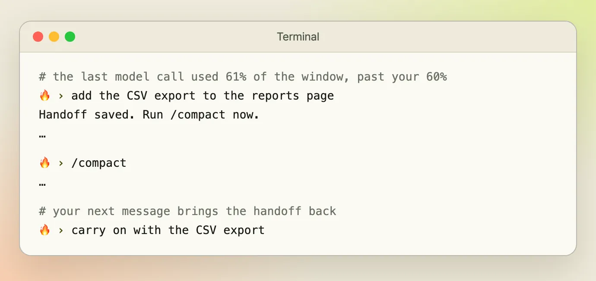
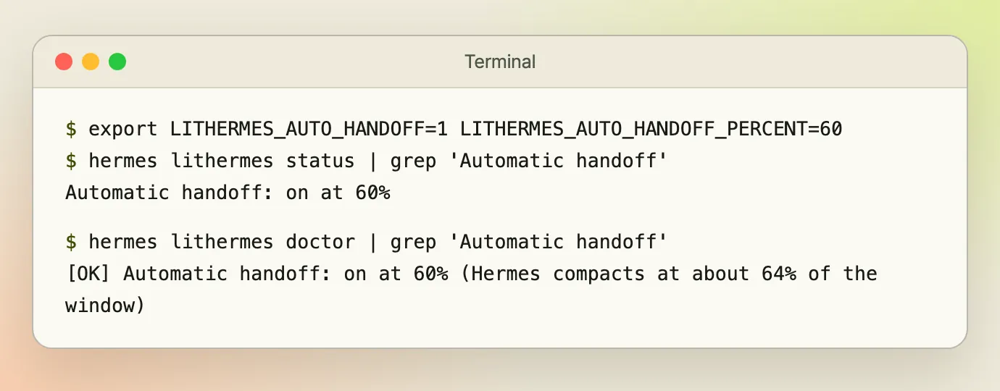
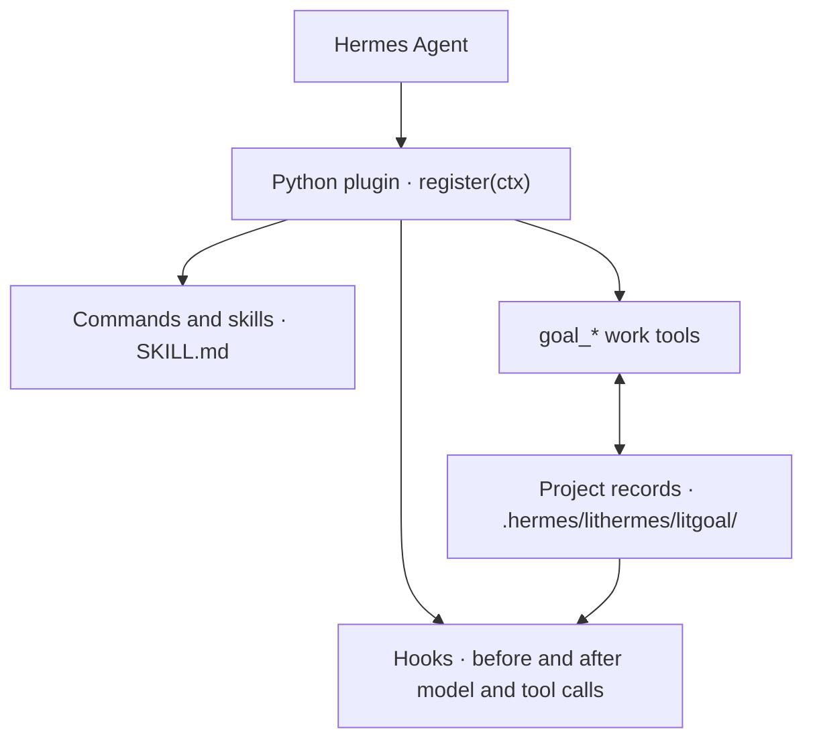

<p align="center"><picture><source media="(prefers-reduced-motion: reduce)" srcset="./docs/assets/cover-motion-still.webp" /></picture></p>

# LitHermes

**Keep the work lit.**

LitHermes is a plugin for [Hermes Agent](https://github.com/NousResearch/hermes-agent). Put `lit` in front of a request, and Hermes plans the task, does it, checks what it did and leaves a note that the next session can pick up.

<p align="center">
<a href="https://www.npmjs.com/package/@litfamily/lithermes"></a>
<a href="https://www.npmjs.com/package/@litfamily/lithermes"></a>
<a href="./LICENSE"></a>
<a href="https://github.com/wjgoarxiv/lithermes/stargazers"></a>
</p>

<p align="center"><a href="#install">Install</a> · <a href="#your-first-task">First task</a> · <a href="#what-you-get">What you get</a> · <a href="#learn-more">Learn more</a> · <a href="./README_Ko-KR.md">한국어</a> · <a href="https://www.npmjs.com/package/@litfamily/lithermes">npm</a></p>

<p align="center"></p> <!-- demo-gif -->

## Why LitHermes

Hermes Agent does what you ask in the moment. The trouble starts when a task outlives one session. The conversation gets compacted, the terminal closes, and the next time you sit down you have to piece together what was decided, what was really tested and what was left half done.

LitHermes gives that work a record. Add `lit` to a request and the task gets checkable criteria, a test that fails before the change and passes after it, a check against the running result, and a handoff note in your project. Goals, plans and evidence stay on disk, so the next session can read where things stand and carry on.

```text
Plan → Make → Check → Leave the next step
```

## Quick start

### Install

You need Hermes Agent, Node.js 18 or later, and write access to your Hermes home (normally `~/.hermes`). This page describes `@litfamily/lithermes@1.0.23`.

```sh
npx --yes --package @litfamily/lithermes@latest -- lithermes install --yes --no-style
```

This puts the plugin into your Hermes home and updates the Hermes configuration so the plugin loads, without stopping to ask. `--no-style` skips the picker for how replies are worded. If you would like to try LitHermes before it touches your everyday setup, point `HERMES_HOME` at a new, empty directory first and start Hermes with the same value. The first install also downloads the film helpers, so it can take a minute. The report may list some model routes as unavailable when Hermes cannot be verified; `lithermes doctor --offline` is the check that matters. The [install page](./docs/install.md) explains each flag, the trial profile and installing from a reviewed `.tgz`.

You can also hand the install to a coding agent. Paste the prompt below into it. The agent checks what you have, shows you its plan and waits for your yes, installs the official npm package, runs the offline check and tells you what it found. Restarting Hermes stays with you, because a running gateway only picks up a new plugin when it starts again.

```text
Install LitHermes, the lit workflow plugin for Hermes Agent, on this machine.

1. Check first: Hermes Agent is installed (hermes --version), Node.js is 18 or later
   (node --version), and I can write to my Hermes home (~/.hermes, or $HERMES_HOME if set).
2. Show me your plan and the exact commands, and wait for my yes before you change
   anything. You may preview the install first; it changes nothing:
   npx --yes --package @litfamily/lithermes@latest -- lithermes install --dry-run
3. Use only the official npm package @litfamily/lithermes. Do not clone a repository,
   copy plugin files by hand or install any other package. Install with:
   npx --yes --package @litfamily/lithermes@latest -- lithermes install --yes --no-style
4. Verify with:
   npx --package @litfamily/lithermes -- lithermes doctor --offline
   Report the result to me, including every line that is not PASS. "loaded plugin:
   PARTIAL" is expected offline, and model routes may show as unavailable.
5. Do not restart Hermes or its gateway yourself. Remind me to restart the Hermes CLI
   and any running Hermes gateway (Telegram, Discord and so on) so the plugin loads,
   and then to start a task with lit in front.
```

### Your first task

Restart the Hermes CLI or gateway so it loads the plugin. Then give it a task with `lit` in front:

```text
lit Build a to-do list in one HTML file without external dependencies. Implement add, complete, and delete; record what you checked and what remains.
```

`/lit <request>` does the same thing as a command. On a Telegram gateway, use `/lit_loop` and `/lit_plan`.

### What you will see

The reply opens with one line of its own, `🔥 **LIT IGNITED · <discipline>** 🔥`. The name after the dot is the route that took the request: `litwork` for a plain `lit`, `lit-plan` for a plan. That line only tells you the work has started; whether it went well is for you to judge from the result.

Once a plan is being worked through, the reply also ends with one line that shows where the work stands, for example `🔥 LIT · lit-loop — 📝 plan ✓ › 🔨 WORK ▰▰▰▱▱▱▱ 3/7 › 🔍 · › 🏁 ·`. LitHermes reads it from the plan, the run and the litgoal criteria saved in the project, leaves out a step that has nothing saved for it, and never puts a file name or a command in it. With a LitHermes skin active, the spinner turns in flame faces such as `(🔥 lit)` while Hermes works. A bell when a turn finishes stays off until you add `--bell` to the install or answer yes when the installer asks; a `display.bell_on_complete` value you already chose is kept.

When it finishes, open the HTML file and try each action yourself. Ask Hermes to separate the checks it actually ran from anything still unverified. Then type `/lit-handoff`, and the result and the next step are written to `HANDOFF.md` in the project. Next time, open a new session in the same project and ask Hermes to read the handoff before it continues. When the session closes, the work stops, and the handoff file is what the next session reads to continue.

### Automatic handoff

A long session fills the model's context window. When it is full, Hermes compacts the conversation and older detail is lost. Automatic handoff has the model write the handoff before that happens. Once it is saved, you run `/compact`, and the next stretch of the session starts from a written record. It is off by default, and the percent is yours to choose; LitHermes has no built-in value. Your choice is saved in your Hermes home at `~/.hermes/lithermes/auto-handoff.json`, so it follows you from project to project.

Type `/lit-handoff auto on 60` inside a Hermes session, with any whole number from 1 to 99 in place of 60. The reply says what will happen and compares your percent with the point where Hermes would compact on its own. Later, `/lit-handoff auto status` shows the latest reading of the session, and `/lit-handoff auto off` turns it off while remembering your percent for next time.

<p align="center"><picture><source media="(prefers-color-scheme: dark)" srcset="./docs/assets/handoff/auto-handoff-switch-dark.webp" /></picture></p>

Once a model call passes your percent, your next message carries a short request to write a handoff. The model saves `HANDOFF.md` with the lit-handoff procedure, tells you one line, `Handoff saved. Run /compact now.`, and then carries on with what you asked. Compacting stays your call, so run `/compact` when it suits you. After the compaction, your next message brings a short digest of that handoff back to the model, and the work picks up where it stopped.

<p align="center"><picture><source media="(prefers-color-scheme: dark)" srcset="./docs/assets/handoff/auto-handoff-turn-dark.webp" /></picture></p>

If you want it on in every session, set `LITHERMES_AUTO_HANDOFF=1` and `LITHERMES_AUTO_HANDOFF_PERCENT=60` in the environment Hermes runs in, for example in your shell profile. The environment wins over the slash command. `hermes lithermes status` and `hermes lithermes doctor` each print one line about it, and doctor warns you when your percent is at or above Hermes' own compaction point, because Hermes would then compact first and no handoff would be written.

<p align="center"><picture><source media="(prefers-color-scheme: dark)" srcset="./docs/assets/handoff/auto-handoff-shell-dark.webp" /></picture></p>

[Automatic handoff](./docs/automatic-handoff.md) goes through each step and says who does it.

## What you get

LitHermes installs 36 skills. These six are a good place to start.

**A task that ends checked.** A plain `lit` keeps a notepad and takes each criterion through the same loop: a failing test, a passing one, a check against the running result, then cleanup. You get the change and a list of what was verified.

```text
lit fix the failing login test
```

**Plan first, then build.** `lit plan` writes a plan file with numbered task rows and edits nothing. Once you approve it, `/start-work` runs the plan row by row and checks a box only after all five gates pass.

```text
lit plan add CSV export to the reports page
```

**A review with five readers.** `lit review` hands the same change to five reviewers who read it separately. Each one leads with what it found.

```text
lit review the changes on this branch
```

**Research with sources.** `lit research` splits a question, sends searchers out in parallel and follows every lead before it answers. Each claim comes back with its source, and anything fetched is read as plain data.

```text
lit research how do popular CLIs migrate old config files?
```

**Reports, slides and diagrams.** Ask for a report or a deck with `lit` and you get an editable Word or PowerPoint file with its Markdown source beside it. The skill picks a look for your reader, tells you which one and why, and checks the finished file before handing it over. `lit-diagram-drawer` does the same for diagrams.

```text
lit make a 10-slide deck from notes.md for Monday's team meeting
```

**Korean and English prose.** `humanizer` rewrites stiff model prose so it reads like a person wrote it. It keeps the facts, hedges and register, shows you a before/after comparison and edits no file on its own.

```text
humanizer 이 문단을 자연스러운 한국어로 다듬어줘: …
```

The other 30 cover debugging, refactoring, browser work, films, interfaces, scientific figures and more. [Skills and commands](./docs/skills.md) shows each one with a picture. Any skill also loads by name as `lithermes:<name>`.

## How it works

LitHermes is a Python plugin. When Hermes loads it, `register(ctx)` adds hooks, commands, skills and work tools. The hooks step in just before and after each model or tool call. The `goal_*` tools write your goals, and the evidence gathered for them, to local records in your project.


```mermaid
flowchart TD
    H["Hermes Agent"] --> P["Python plugin · register(ctx)"]
    P --> K["Hooks · before and after model and tool calls"]
    P --> S["Commands and skills · SKILL.md"]
    P --> T["goal_* work tools"]
    T <--> R["Project records · .hermes/lithermes/litgoal/"]
    R --> K
```

Before the next model call, the context hook reads those records and hands the model the current goal and how far it has got. The plugin decides where a request goes, and Hermes Agent still runs the model. Permissions, sign-in, model access and anything that needs a real screen stay with Hermes.

## Requirements, updates and removal

LitHermes needs Hermes Agent, Node.js 18 or later, and write access to your Hermes home.

It keeps itself up to date. When you run `install`, `check` or `doctor` in a terminal, or send the first message of an interactive Hermes CLI session, it looks for a newer stable release. If there is one, it backs up your plugin and settings, installs the new version, runs `doctor --offline`, and puts the backup back if anything fails. Set `LITHERMES_NO_AUTO_UPDATE=1` if you would rather install updates yourself. [Updates](./docs/install.md#updates) lists every step and switch.

LitHermes keeps its records on your machine: goals, plans and evidence under `.hermes/lithermes/` in your project, and its install record, update cache and backups in your Hermes home. Its own network use is the npm version check, which `LITHERMES_NO_UPDATE_CHECK=1` switches off, and pinned helper tools: `install` downloads the film helpers once (skip it with `--offline`), and the Office tools download the first time you make a Word or PowerPoint file. Your prompts still go to whichever model provider Hermes is set up with. [Privacy and local records](./docs/privacy.md) lists every file it writes.

To check an install without going online, and to remove it:

```sh
npx --package @litfamily/lithermes -- lithermes doctor --offline
npx --package @litfamily/lithermes -- lithermes uninstall --yes
```

If the installer made compatibility edits to your Hermes installation, add `--rollback-patches` when you uninstall. [When something goes wrong](./docs/install.md#when-something-goes-wrong) covers missing skills, name clashes and import errors.

## Learn more

- [Install, update and remove](./docs/install.md): every install option, how updates work, troubleshooting and limits
- [A tour of LitHermes](./docs/tour.md): screens from a first run, the short film, the Ignition skin and the LIT marks
- [Skills and commands](./docs/skills.md): all 36 skills with pictures, the command list, and what the document, film and prose skills make
- [Automatic handoff](./docs/automatic-handoff.md): handing work across a compaction, step by step
- [Optional Jev skill hint](./docs/jev.md): an opt-in feature that sends eligible prompts to a third-party service
- <a href="./docs/guide.md"> Operating guide</a>: commands, natural routing, models, skins and safety in full
- <a href="./docs/assets/readme/ignition-film.mp4"> Ignition film</a> (MP4)
- [Python plugin contract](./packages/lithermes-installer/assets/lithermes-plugin/README.md) · [npm package page](./packages/lithermes-installer/README.md) · [Changelog](./CHANGELOG.md) · [Privacy](./docs/privacy.md) · [Migration](./docs/migration.md)

LitHermes belongs to [LitFamily](https://github.com/wjgoarxiv/litfamily), the same `lit` workflow ported to five coding agents. Each one installs on its own.

## Contributing

If LitHermes saves you from re-explaining a project to a fresh session, a star helps other Hermes users find it.

Bug reports and pull requests are welcome. Start with [Contributing](./CONTRIBUTING.md), and see [Security](./SECURITY.md), [Conduct](./CODE_OF_CONDUCT.md) and [Support](./SUPPORT.md).

<a href="./LICENSE"> MIT License</a>
