<p align="center"><picture><source media="(prefers-reduced-motion: reduce)" srcset="./docs/assets/cover-motion-still.webp" />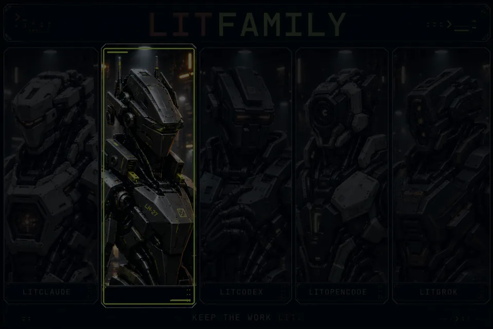</picture></p>

<p align="center">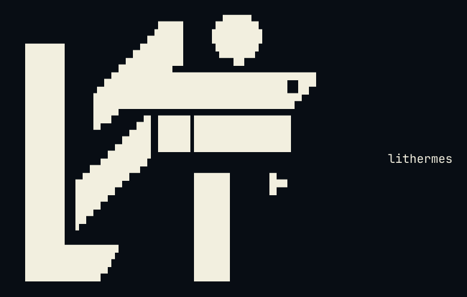</p>

<details>
<summary>ASCII 로고 복사</summary>

```
                             ▄▄▄▄
                   ▗███▌   ▗██████▖
 ▗▄▄▄▄▄          ▗▟████▌   ▝██████▘
 ▐█████        ▗▟██████▌    ▝▀▜█▀▘
 ▐█████      ▗▟███████▄▄▄▄▄▄▄▄▄▄▄▄▄▄▄▄▄▄▄▄
 ▐█████    ▗▟█████████████████████████ ▐█▀
 ▐█████    ████████████████████████████▀
 ▐█████    ██▛▘   ▄ ▄▄▄▄▖▄▄▄▄▄▄▄▄▄▄▄▄▄▖
 ▐█████    ▀    ▄██ ████▌█████████████▌
 ▐█████       ▄████ ████▌█████████████▌
 ▐█████     ▄█████▛                                 lithermes
 ▐█████  ▗▟█████▀▘       ▄▄▄▄▄     ▗▖
 ▐█████ ▐█████▀          █████     ▐▛▀
 ▐█████ ▐███▀            █████
 ▐█████ ▐█▀              █████
 ▐█████ ▝                █████
 ▐█████▄▄▄▄▄▄▄▖          █████
 ▐███████████▛           █████
 ▐██████████▀            █████

```

</details>

<p align="center">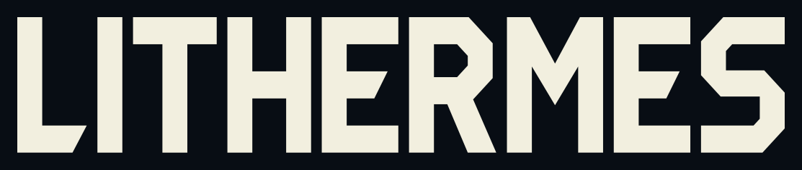</p>
<p align="center"></p>

<p align="center">
<a href="#설치"></a>
<a href="./LICENSE"></a>
</p>

<p align="center">
<a href="./docs/guide.ko.md"> 문서</a> &nbsp;
<a href="#설치">설치</a> &nbsp;
<a href="./docs/assets/readme/ignition-film.mp4"> Ignition</a> &nbsp;
<a href="./LICENSE"> MIT</a>
</p>

# LitHermes

**Keep the work lit.**

LitHermes는 **Hermes Agent**용 플러그인입니다. 작업을 계획부터 시작해 실제로 확인한 결과까지 끌고 가고, 마지막에는 다음 세션이 어디서부터 이어야 할지 알 수 있게 기록을 남깁니다. 요청 앞에 `lit` 한 단어만 붙이면 시작됩니다.

[English](./README.md) · [npm](https://www.npmjs.com/package/@litfamily/lithermes) · [GitHub](https://github.com/wjgoarxiv/lithermes)

## 왜 LitHermes인가요

**불씨를 건네받았습니다. 이제, 당신의 작업에 옮길 차례입니다.**

고치고 싶은 버그, 만들고 싶은 화면, 끝내고 싶은 프로젝트는 한 문장으로 시작할 수 있습니다. 어려운 건 나중에 다시 돌아올 때입니다. 무엇을 정했고, 실제로 무엇을 확인했고, 다음에 무엇을 할지 알아야 이어갈 수 있습니다.

LitHermes는 그 기록을 프로젝트에 남깁니다. 목표와 계획, 근거, 다음 할 일이 디스크에 남아 있으니, 다른 세션은 처음부터 다시 시작하지 않고 같은 기록에서 이어갈 수 있습니다.

```text
계획하기 → 만들기 → 확인하기 → 다음 작업에 건네기
```

**다음 세션이 이어받을 수 있는 것을 남기세요.**

## 설치

Hermes Agent와 Node.js 18 이상, 그리고 Hermes 홈(기본 `~/.hermes`)에 쓸 권한이 필요합니다. 이 문서는 `@litfamily/lithermes@1.0.13` 기준입니다.

```sh
npx --yes --package @litfamily/lithermes@latest -- lithermes install --yes --no-style
```

이 한 줄이 설치 프로그램을 받아 오고, 플러그인을 Hermes 홈에 넣고, 플러그인이 불러와지도록 Hermes 설정을 고칩니다. 중간에 승인을 묻느라 멈추지 않게 만든 명령이라 `--yes`가 두 번 들어갑니다. 앞의 것은 npx에게 패키지를 실행해도 된다고 알리고, 뒤의 것은 설정 변경을 승인합니다. `--no-style`은 답변 문체를 고르는 화면을 건너뜁니다. 이 옵션이 없으면 터미널에서는 그 화면이 여전히 뜹니다. Ignition 스킨은 어느 쪽이든 설치됩니다. 설치하는 동안 Telegram에는 연결하지 않습니다.

평소 쓰는 환경을 건드리기 전에 먼저 써 보고 싶을 수도 있습니다. 그럴 때는 설치 전에 `HERMES_HOME`을 비어 있는 새 디렉터리로 지정하고, Hermes를 시작할 때도 같은 값을 쓰세요. 원래 쓰던 홈과 설정은 그대로 남습니다. 설치 프로그램은 찾아낸 Hermes 설치본에 호환성 수정을 할 수도 있습니다. 그 설치본이 시험용 프로필 밖에 있고 그것까지 그대로 두고 싶다면 `--no-patch-installed-hermes`를 붙이세요.

<details>
<summary>검토된 .tgz로 설치하기</summary>

릴리스와 함께 검토된 `.tgz`를 받았다면, 예시 경로를 실제 경로로 바꾸고 각 줄을 따로 실행하세요.

```sh
LITHERMES_PACK='/absolute/path/to/the-reviewed-package.tgz'
```

```sh
npm exec --yes --package "$LITHERMES_PACK" -- lithermes install --yes --no-style --no-auto-update --no-patch-installed-hermes
```

이 문서의 다른 명령도 같은 파일로 실행할 수 있습니다.

```sh
npm exec --yes --package "$LITHERMES_PACK" -- lithermes install --dry-run --no-auto-update --no-patch-installed-hermes
npm exec --yes --package "$LITHERMES_PACK" -- lithermes doctor --offline --no-auto-update
npm exec --yes --package "$LITHERMES_PACK" -- lithermes uninstall --yes --no-auto-update
npm exec --yes --package "$LITHERMES_PACK" -- lithermes hud off
```

</details>

### 업데이트

LitHermes는 스스로 업데이트하는데, 조심스럽게 합니다. 실제로 무슨 일이 일어나는지 순서대로 설명합니다.

새 버전을 확인하는 때는 두 가지입니다. 터미널에서 `lithermes install`, `check`, `doctor`를 실행할 때, 그리고 대화형 Hermes CLI 세션에서 첫 메시지를 보낼 때입니다. npm 레지스트리에 최신 안정 버전을 물어보고 답을 최대 3초까지 기다립니다. 지금 쓰는 것보다 새 버전이면 그 자리에서 바로 설치하고, 설치가 끝날 때까지 실행한 명령(또는 첫 응답)이 기다립니다.

설치는 되돌릴 수 있게 짜여 있습니다.

1. 플러그인 폴더, `config.yaml`, 설치 기록, 스킨 폴더를 `<Hermes 홈>/lithermes/auto-update/<id>/backup/`에 복사해 둡니다.
2. 새 버전의 설치 프로그램을 `install --yes --no-hud --no-style --no-patch-installed-hermes`로 실행합니다. 스킨 강조색과 답변 문체를 다시 묻지 않고, Hermes 설치본에도 손대지 않습니다. 설정해 둔 모델과 추론 강도는 그대로 남습니다.
3. `doctor --offline`을 실행합니다.
4. 설치가 실패하거나 30초를 넘기거나 이 점검을 통과하지 못하면 백업을 복원해서 쓰던 버전이 그대로 남습니다.

한 Hermes 홈에서는 업데이트가 한 번에 하나만 진행됩니다. 설치 프로그램에는 실행에 필요한 `PATH`, 홈과 임시 폴더, 로케일, `TERM`, `NODE_EXTRA_CA_CERTS`만 넘어가고, 셸에 있는 npm 설정, 프록시, `NODE_OPTIONS`, 토큰은 넘어가지 않습니다. 업데이트에 성공해도 백업 폴더는 남으니, 필요 없어지면 직접 지우세요.

**보이는 것은 많지 않습니다.** `lithermes install` 중에 업데이트가 일어나면 `LitHermes automatic update committed (<version>). Restart Hermes to load it.`를 출력하고 끝납니다. 새 설치 프로그램이 이미 설치를 마쳤기 때문입니다. 그 명령에 붙였던 옵션이 필요하면 명령을 한 번 더 실행하세요. `check`와 `doctor`는 하던 대로 결과를 보여 줍니다. 업데이트가 실패해서 백업을 복원했다면 아무 출력 없이 쓰던 버전으로 이어집니다. Hermes 안에서도 대화에는 아무것도 추가되지 않고, 첫 응답이 업데이트가 끝날 때까지 기다릴 뿐입니다. 새 버전을 불러오려면 Hermes CLI와 gateway를 다시 시작하세요.

실행할 때마다 `<Hermes 홈>/lithermes/`에 기록이 두 개 남습니다. `auto-update-journal.json`은 진행 단계를, `auto-update-receipt.json`은 성공 여부와 목표 버전, 복원 여부를 담습니다. 복원마저 실패하면 LitHermes가 명령을 멈추고 Hermes 홈이 알 수 없는 상태라고 알려 줍니다. 백업은 지우지 말고, 계속하기 전에 `lithermes doctor --offline --hermes-home PATH`를 실행하세요.

**업데이트가 일어나지 않는 경우.** 업데이트는 사람이 터미널 앞에 있을 때만 합니다. 입력, 출력, 오류 출력이 모두 대화형 터미널이어야 하므로 출력을 파이프로 넘기거나 `CI` 변수가 설정된 실행에서는 건너뜁니다. `--offline`, `--json`, `--dry-run`을 붙인 명령과 `bunx`로 실행한 명령도 마찬가지입니다. Hermes 안에서는 세션마다 최대 한 번, 최상위 세션에서만 시도하고 위임받은 보조 세션에서는 시도하지 않습니다. 대상은 npm 설치 프로그램이 넣어 준 LitHermes뿐입니다. Hermes 카탈로그로 들어왔거나 직접 복사해 넣은 사본은 사용자가 관리합니다. 예전 설치 프로그램으로 설치했다면 설치 프로그램을 한 번 다시 실행한 뒤부터 대상이 됩니다.

**업데이트 안내.** 이와는 따로, LitHermes는 설치하지 않고 새 릴리스 소식만 알려 줄 수도 있습니다. `install`, `check`, `doctor`를 실행한 뒤 백그라운드에서 24시간에 한 번까지만 확인하고, 결과를 `update-check.json`에 저장합니다. 다음에 실행할 때 이 파일을 읽어 더 새로운 릴리스가 적혀 있으면 `npx --yes --package @litfamily/lithermes@<version> -- lithermes install --yes --no-hud` 같은 명령을 안내합니다. 이 명령은 직접 실행하는 것이라서, 자동 업데이트를 꺼 두었을 때 새 릴리스 소식을 듣는 방법이 됩니다. `--offline`, `--json`, `--dry-run`을 붙였거나 CI에서 돌거나 출력을 파이프로 넘길 때는 이 확인도 하지 않습니다.

**끄는 방법.** 필요한 것을 고르세요.

- `LITHERMES_NO_AUTO_UPDATE=1`: 새 버전은 직접 설치하고 안내는 계속 받습니다. `lithermes`를 실행하는 셸과 Hermes를 시작하는 셸 양쪽에 설정해야 합니다.
- `install`, `check`, `doctor`에 `--no-auto-update`: 그 명령 한 번만 업데이트를 건너뜁니다.
- `NO_UPDATE_NOTIFIER=1` 또는 `LITHERMES_NO_UPDATE_CHECK=1`: 새 버전을 npm에 물어보는 일 자체를 멈춥니다. 자동 업데이트와 안내가 모두 꺼집니다.

LitHermes는 변수가 설정되어 있는지만 보기 때문에, `0`을 포함해 어떤 값이든 똑같이 적용됩니다.

## 빠른 시작

플러그인을 불러오도록 Hermes CLI 또는 gateway를 다시 시작하세요. 그다음 요청 앞에 `lit`을 붙여 작업을 맡깁니다.

```text
lit 외부 의존성 없이 HTML 파일 하나로 할 일 목록을 만들어줘. 추가·완료·삭제를 구현하고 확인한 내용과 다음 행동을 남겨줘.
```

명령으로 부르고 싶다면 `/lit <요청>`을 쓰면 됩니다. 어느 쪽이든 응답 첫 줄에 `🔥 **LIT IGNITED · <discipline>** 🔥`가 한 번 따로 나오고, 응답이 도착할 때 경로 확인 표시도 함께 뜹니다. 이 표시가 보이면 LitHermes가 요청을 받아 작업을 시작한 것이고, 결과가 잘 나왔는지는 직접 확인하시면 됩니다.

작업이 끝나면 HTML 파일을 직접 열어 각 동작을 눌러 보세요. Hermes에는 실제로 확인한 내용과 아직 확인하지 못한 내용을 나눠 달라고 하세요. 그다음 `/lit-handoff`로 결과와 다음 할 일을 프로젝트에 남기세요. 다음번에는 새 세션에서 같은 프로젝트를 열고, 이어가기 전에 그 인계 기록부터 읽도록 요청하면 됩니다.

불씨란 이렇게 남겨 둔 기록입니다. 세션을 닫으면 뒤에서 따로 돌아가는 작업은 없고, 다음 세션이 인계 기록을 읽고 이어받습니다.

### 처음 실행하면 보이는 것

설치부터 첫 작업까지, LitHermes가 화면에 무엇을 보여 주는지 모았습니다. 그림 속 글자는 제품이 출력하는 문구 그대로입니다. 그림마다 붙은 설명에 실제 명령에서 얻은 것인지, 플러그인이 만드는 문구로 다시 구성한 것인지 적어 두었습니다. Jev 그림은 [Jev 섹션](#선택-기능-jev-스킬-힌트)에 따로 있습니다.

**설치.** 설치 프로그램은 플러그인을 Hermes 홈에 복사하고, 새 홈이면 기본 모델 경로를 쓰고, 그 전에 설정 파일의 백업을 남깁니다. 백업 파일이 어디에 놓이는지 화면에서 바로 보입니다. 마지막에는 실행 중인 gateway를 다시 시작하라는 안내와, 영상 도구를 받았는지에 대한 한 줄이 나옵니다.

<p align="center"><picture><source media="(prefers-color-scheme: dark)" srcset="./docs/assets/screens/install-dark.webp" /></picture></p>

*스크래치용 Hermes 홈에서 실제 설치 프로그램으로 얻은 출력입니다. 밖으로 아무것도 나가지 않고 Hermes 설치본도 건드리지 않도록 오프라인, 자동 업데이트 끄기, 호환 패치 끄기 옵션을 더해 실행했습니다. 로컬 Hermes 소스는 읽기만 했습니다. 모델 경로 줄은 잘랐고("…"), 스크래치 폴더는 ~/.hermes로 적었습니다.*

**점검.** 설치한 뒤나 뭔가 이상할 때 doctor를 실행하세요. 설치된 내용을 배포본과 견주어 영역마다 짧은 표시를 붙여 줍니다. 오프라인 옵션을 주면 내 컴퓨터 안에서만 돌고, 그렇게는 볼 수 없는 것, 곧 Hermes가 플러그인을 불러왔는지는 PARTIAL로 나옵니다.

<p align="center"><picture><source media="(prefers-color-scheme: dark)" srcset="./docs/assets/screens/doctor-dark.webp" /></picture></p>

*같은 스크래치 홈에서 실제 doctor 명령으로 얻은 출력입니다. 결과 줄 가운데 열한 줄만 남기고 나머지("…")는 잘랐습니다. 자른 줄은 모델 경로와 영상 도구에 관한 내용입니다.*

**시작과 종료.** Ignition 스킨을 고르면 Hermes가 시작할 때 작은 LIT 마크와 LIT ready를 보여 주고, 끝낼 때 stay lit이라고 인사합니다. 스킨이 켜졌는지 바로 알 수 있습니다.

<p align="center"><picture><source media="(prefers-color-scheme: dark)" srcset="./docs/assets/screens/welcome-dark.webp" />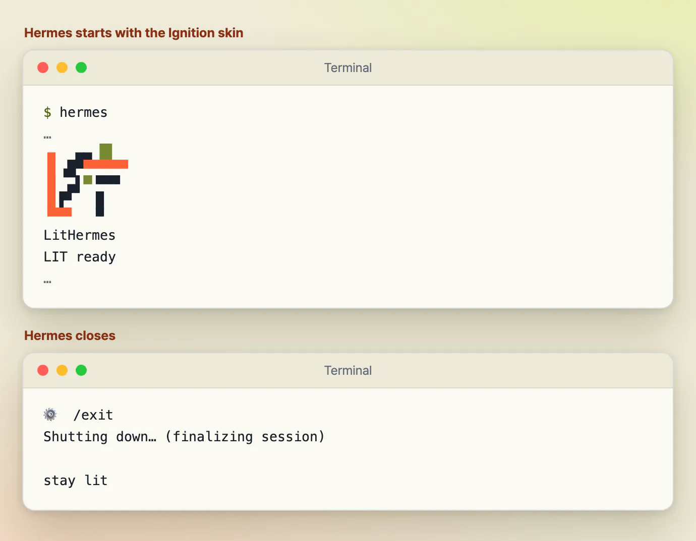</picture></p>

*Ignition 스킨을 고른 실제 Hermes 세션에서 얻은 출력입니다. 그림 속 줄 사이에 있던 Hermes 배너, 팁, 경고는 잘랐습니다. 밝은 그림에서는 옅은 색을 어둡게 바꿔 밝은 창에서도 읽히게 했습니다.*

**작업 첫 줄.** 요청이 lit이나 /lit으로 시작하면 응답이 따로 한 줄로 열리고, 이어서 같은 문구가 옆에 붙은 작은 LIT 마크가 나옵니다. 둘이 보이면 요청이 경로에 실려 작업이 시작된 것이고, 결과는 직접 확인하시면 됩니다. 점 뒤의 이름은 어느 경로가 받았는지 알려 줍니다. 그냥 lit이면 litwork, 계획이면 lit-plan입니다.

<p align="center"><picture><source media="(prefers-color-scheme: dark)" srcset="./docs/assets/screens/lit-ack-dark.webp" />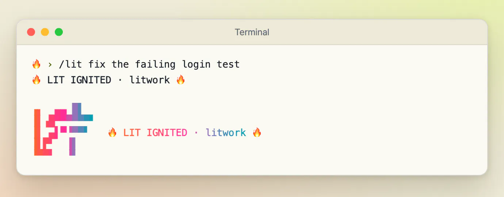</picture></p>

*LitHermes 자체 문구로 다시 구성한 예시 그림입니다. 마크와 그 옆 줄은 확인 표시 코드를 따로 실행해 얻은 실제 출력입니다. 첫 줄은 플러그인이 모델에게 쓰라고 지시하는 줄이고, 프롬프트 줄은 예시 글입니다. 모델은 쓰지 않았습니다. 밝은 그림에서는 옅은 색을 어둡게 바꿨습니다.*

**업데이트 알림.** 새 버전이 있다는 것을 알고 있고 자동 업데이트가 꺼져 있으면, check, doctor, install이 끝날 때 세 줄짜리 알림이 나옵니다. 두 버전, 실행할 정확한 명령, Hermes를 다시 시작하라는 안내입니다. 알림은 알려 주기만 하고, 그 명령을 직접 실행하기 전까지 아무것도 설치되지 않습니다.

<p align="center"><picture><source media="(prefers-color-scheme: dark)" srcset="./docs/assets/screens/update-notice-dark.webp" />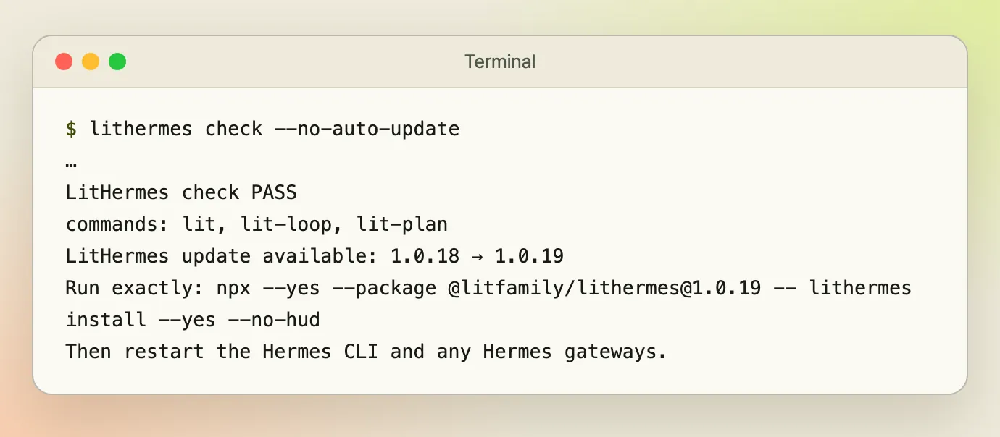</picture></p>

*스크래치 홈에서 실제 check 명령으로 얻은 출력입니다. 알림이 나오도록 1.0.14를 적은 업데이트 확인 파일을 미리 놓았으므로 이 버전 번호는 예시입니다. 결과 줄 위의 배너는 잘랐습니다.*

## 움직이는 모습 보기

짧은 영상 하나로 한 바퀴를 볼 수 있습니다. 한 단어로 작업이 시작되고, 결과를 확인하고, HANDOFF.md에 다음 할 일을 남기면, 새 세션이 그 기록을 이어받습니다. 아래 그림은 소리 없이 반복 재생되는 미리보기이고, MP4에는 생성한 배경 음악이 들어 있습니다.

<p align="center"><a href="./docs/assets/promo/promo-ko.mp4"><picture><source media="(prefers-reduced-motion: reduce)" srcset="./docs/assets/promo/promo-reduced-motion-ko.webp" /></picture></a></p>

[소리가 있는 영상 보기 (MP4, 3.0 MiB)](./docs/assets/promo/promo-ko.mp4)

*영상 속 요청과 응답은 예시입니다. 마지막 문구 Keep the work lit.와 터미널 안의 read the handoff and continue는 영어 그대로 둡니다. LIT IGNITED 줄, LIT ready 환영 문구, stay lit 작별 문구, 마크 색은 LitHermes가 실제로 출력하는 것입니다.*

## 스킬

LitHermes에서 부를 수 있는 모든 스킬과 그 스킬을 시작하는 말입니다. 어느 스킬이든 `lithermes:<이름>`으로 직접 불러올 수도 있습니다.

<table>
<tr><th>이렇게 됩니다</th><th>스킬</th><th>얻는 것</th></tr>
<tr>
<td>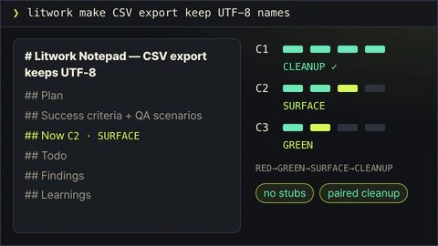</td>
<td><code>litwork</code><br /><sub><code>lit &lt;task&gt;</code> · <code>litwork &lt;task&gt;</code></sub></td>
<td>요청에 <code>lit</code>만 붙이세요. 노트를 펴 두고, 기준 하나마다 실패하는 테스트, 통과, 실물 확인, 정리 순서를 엄격하게 밟습니다.</td>
</tr>
<tr>
<td>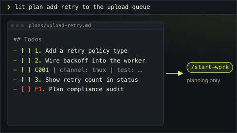</td>
<td><code>lit-plan</code><br /><sub><code>lit plan &lt;what&gt;</code> · <code>/lit-plan</code></sub></td>
<td><code>start-work</code>가 그대로 실행할 수 있는 번호 붙은 작업 목록이 파일로 나옵니다. 코드는 아직 건드리지 않습니다.</td>
</tr>
<tr>
<td>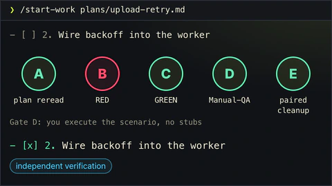</td>
<td><code>start-work</code><br /><sub><code>/start-work &lt;approved-plan&gt;</code></sub></td>
<td>계획을 한 줄씩 실행합니다. 다섯 관문을 모두 통과해야 체크 표시가 붙습니다.</td>
</tr>
<tr>
<td>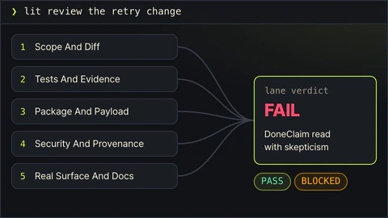</td>
<td><code>review-work</code><br /><sub><code>lit review &lt;scope&gt;</code> · <code>/review-work</code></sub></td>
<td>리뷰어 다섯이 같은 변경을 각자 읽고, 찾은 문제부터 알려 줍니다.</td>
</tr>
<tr>
<td>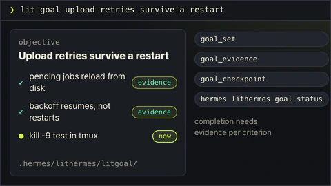</td>
<td><code>litgoal</code><br /><sub><code>lit goal &lt;outcome&gt;</code> · <code>/litgoal</code></sub></td>
<td>목표 하나와 확인 가능한 기준을 디스크에 남겨, 다음 세션이 이어받을 수 있습니다.</td>
</tr>
<tr>
<td>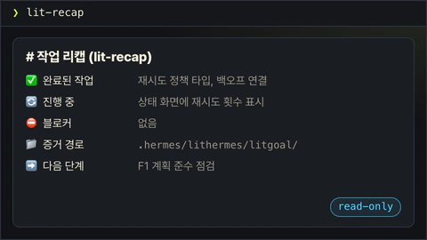</td>
<td><code>lit-recap</code><br /><sub><code>lit-recap</code></sub></td>
<td>읽기 전용 요약입니다. 끝난 일, 진행 중인 일, 막힌 곳, 증거 위치, 다음 단계를 보여줍니다.</td>
</tr>
<tr>
<td>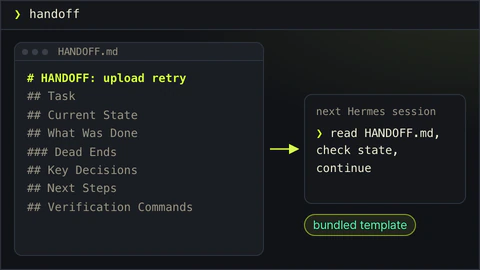</td>
<td><code>lit-handoff</code><br /><sub><code>handoff</code> · <code>/lit-handoff</code></sub></td>
<td><code>handoff</code>라고 치면 다음 세션이 읽고 이어갈 인수인계 파일이 생깁니다.</td>
</tr>
<tr>
<td>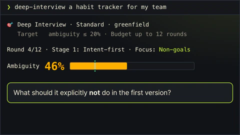</td>
<td><code>deep-interview</code><br /><sub><code>deep-interview &lt;idea&gt;</code> · <code>/deep-interview</code></sub></td>
<td>한 번에 한 질문씩 물어 아이디어를 만들 수 있을 만큼 분명하게 다듬습니다. 남은 모호함은 게이지로 보입니다.</td>
</tr>
<tr>
<td>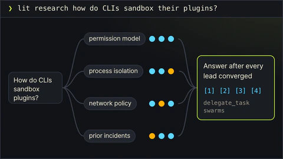</td>
<td><code>litresearch</code><br /><sub><code>lit research &lt;question&gt;</code></sub></td>
<td>조사 질문을 잘게 나누고 여러 검색을 동시에 돌려, 단서를 끝까지 따라간 뒤 출처와 함께 답합니다.</td>
</tr>
<tr>
<td>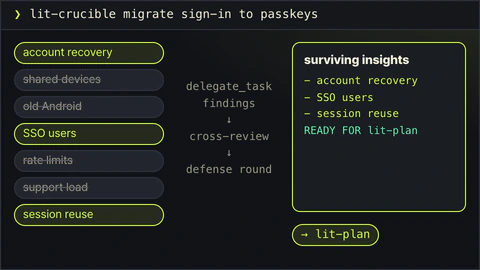</td>
<td><code>lit-crucible</code><br /><sub><code>lit-crucible &lt;brief&gt;</code></sub></td>
<td>계획 전에 요구사항을 반박해 봅니다. 반박을 견딘 위험만 계획으로 넘어갑니다.</td>
</tr>
<tr>
<td>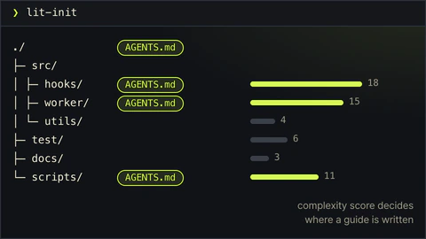</td>
<td><code>lit-init</code><br /><sub><code>lit-init</code></sub></td>
<td>저장소를 훑어 루트 AGENTS.md와, 필요한 폴더에만 짧은 안내서를 만듭니다.</td>
</tr>
<tr>
<td>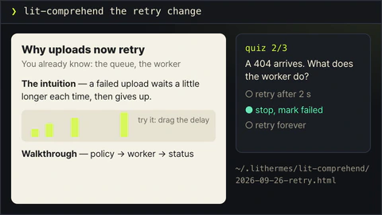</td>
<td><code>lit-comprehend</code><br /><sub><code>lit-comprehend</code> · <code>comprehend &lt;range&gt;</code></sub></td>
<td>에이전트가 쓴 작업을 이해하도록 돕는 설명 페이지입니다. 직관, 흐름 설명, 짧은 퀴즈 순서입니다.</td>
</tr>
<tr>
<td>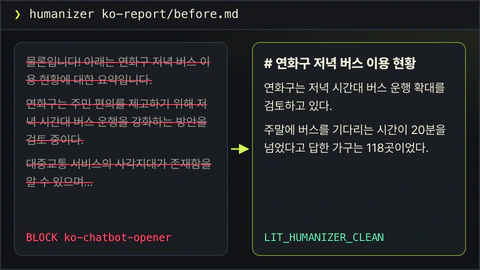</td>
<td><code>lit-humanizer</code><br /><sub><code>humanizer &lt;text&gt;</code> · <code>/lit-humanizer</code></sub></td>
<td>딱딱한 AI 문장을 한국어나 영어로 다시 씁니다. 사실과 단서는 남기고, 파일을 멋대로 고치지 않습니다.</td>
</tr>
<tr>
<td>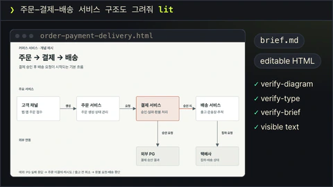</td>
<td><code>lit-diagram-drawer</code><br /><sub><code>lit-diagram-drawer &lt;brief&gt;</code> · <code>/lit-diagram-drawer</code></sub></td>
<td>슬라이드와 문서에 넣을 다이어그램을 편집 가능한 형태로 그리고, 검사한 뒤 PNG와 SVG로 내보냅니다.</td>
</tr>
<tr>
<td>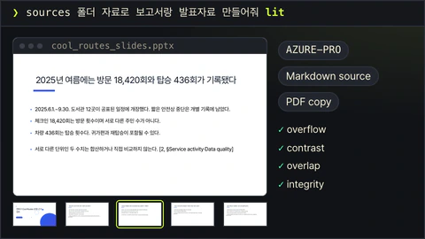</td>
<td><code>lit-pptx</code><br /><sub><code>lit-pptx &lt;brief&gt;</code> · <code>/lit-pptx</code></sub></td>
<td><code>lit</code>으로 발표자료를 요청하면 편집 가능한 PowerPoint 파일과 원고 Markdown이 나옵니다. 기본은 AZURE-PRO와 Pretendard이고, 완성된 파일로 품질 검사와 무결성 검사를 돌립니다.</td>
</tr>
<tr>
<td>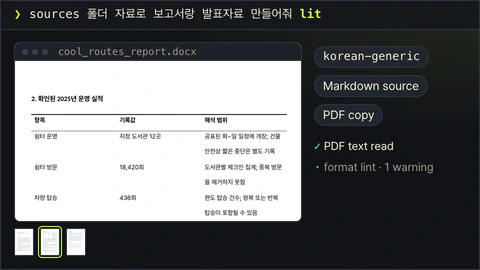</td>
<td><code>lit-docx</code><br /><sub><code>lit-docx &lt;brief&gt;</code> · <code>/lit-docx</code></sub></td>
<td><code>lit</code>으로 보고서를 요청하면 서식을 갖춘 Word 파일과 원고 Markdown이 나옵니다. 한국어는 korean-generic 서식을 쓰고, 문체 검사와 렌더링된 페이지 확인이 뒤따릅니다.</td>
</tr>
<tr>
<td>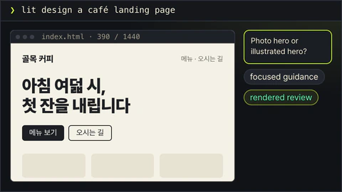</td>
<td><code>frontend-ui-ux</code><br /><sub><code>lit design &lt;target&gt;</code> · <code>frontend-ui-ux &lt;target&gt;</code></sub></td>
<td>실제로 동작하는 화면을 만든 뒤, 설치된 측정 프로브로 일곱 가지 모습을 렌더링해 봅니다. 네 가지 폭, 다크 모드, 모션 줄이기, 200% 확대입니다.</td>
</tr>
<tr>
<td>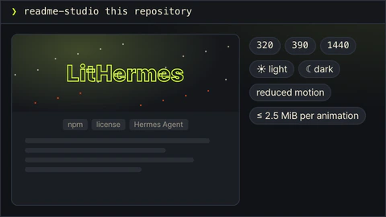</td>
<td><code>readme-studio</code><br /><sub><code>readme-studio &lt;scope&gt;</code></sub></td>
<td>사실에 맞는 README와 움직이는 커버를 만들고, 휴대폰과 데스크톱 폭, 라이트와 다크 모드에서 확인합니다.</td>
</tr>
<tr>
<td>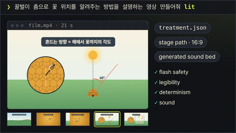</td>
<td><code>lit-typographic-motion</code><br /><sub><code>lit-typographic-motion &lt;request&gt;</code> · <code>/lit-typographic-motion</code></sub></td>
<td><code>lit</code>으로 영상을 요청하면 트리트먼트를 먼저 쓰고, 장면을 그리거나 글자를 움직이고, 사운드를 만든 뒤 검사를 거쳐 영상을 넘깁니다.</td>
</tr>
<tr>
<td>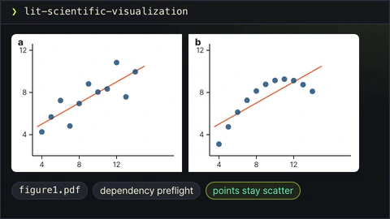</td>
<td><code>lit-scientific-visualization</code><br /><sub><code>lit-scientific-visualization</code> · <code>/lit-scientific-visualization</code></sub></td>
<td>학술지 규격 그림을 벡터와 600 DPI로 내보냅니다. 그래프 종류는 데이터 성격에 맞춰 고릅니다.</td>
</tr>
<tr>
<td>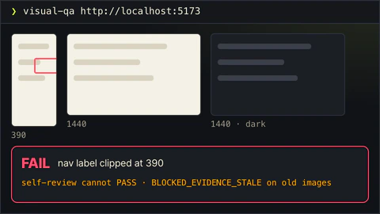</td>
<td><code>visual-qa</code><br /><sub><code>visual-qa &lt;target&gt;</code></sub></td>
<td>실제 화면을 폭별로 확인해 결과를 정직하게 돌려줍니다. 막히면 무엇이 막았는지 정확히 알려줍니다.</td>
</tr>
<tr>
<td>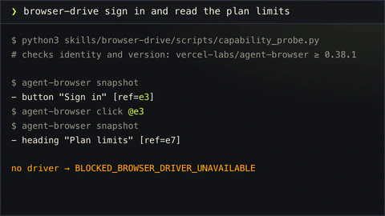</td>
<td><code>browser-drive</code><br /><sub><code>browser-drive &lt;task&gt;</code></sub></td>
<td>브라우저 드라이버를 먼저 확인한 뒤 실제 페이지를 조작합니다. 드라이버가 없으면 그렇다고 말합니다.</td>
</tr>
<tr>
<td>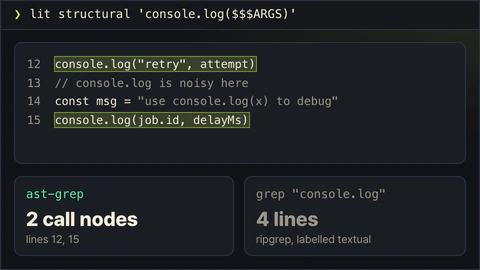</td>
<td><code>structural-search</code><br /><sub><code>lit structural &lt;pattern&gt;</code> · <code>structural-search &lt;pattern&gt;</code></sub></td>
<td>글자 대신 문법 구조로 코드를 찾고, 바꾸기 전에 결과를 미리 보여줍니다.</td>
</tr>
<tr>
<td>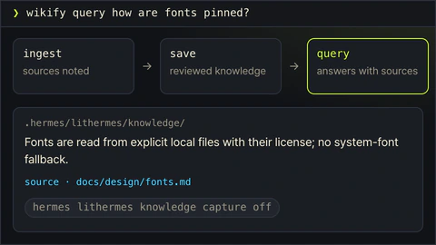</td>
<td><code>wikify</code><br /><sub><code>wikify &lt;mode&gt;</code> · <code>lit wikify &lt;mode&gt;</code></sub></td>
<td>검토를 거친 프로젝트 지식을 디스크에 두고, 나중 질문에 출처와 함께 답합니다.</td>
</tr>
<tr>
<td>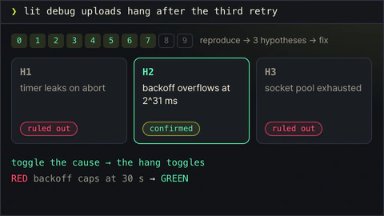</td>
<td><code>debugging</code><br /><sub><code>lit debug &lt;symptom&gt;</code> · <code>debugging &lt;symptom&gt;</code></sub></td>
<td>버그를 재현하고, 가설을 세 개 이상 세워 확인한 뒤, 확인된 원인만 고칩니다.</td>
</tr>
<tr>
<td>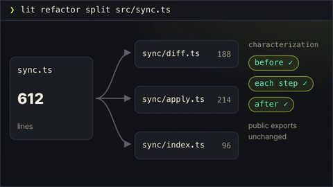</td>
<td><code>refactor</code><br /><sub><code>lit refactor &lt;target&gt;</code> · <code>refactor &lt;target&gt;</code></sub></td>
<td>동작을 테스트로 고정한 채 코드 구조를 바꿉니다. 단계마다 확인합니다.</td>
</tr>
<tr>
<td>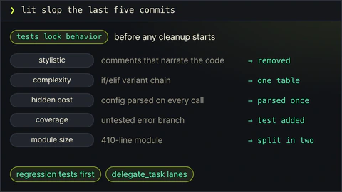</td>
<td><code>lit-burnoff</code><br /><sub><code>lit slop &lt;scope&gt;</code></sub></td>
<td>테스트로 동작을 먼저 묶어 두고, 변경분에 붙은 AI식 군더더기를 걷어냅니다.</td>
</tr>
<tr>
<td>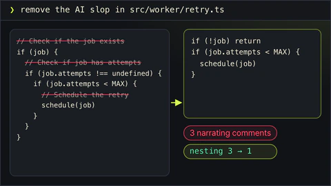</td>
<td><code>lit-burnoff-file</code><br /><sub><code>ask to clean one file</code></sub></td>
<td>파일 하나만 정리합니다. 설명조 주석과 과한 방어 코드를 줄이고 중첩을 펴줍니다.</td>
</tr>
<tr>
<td>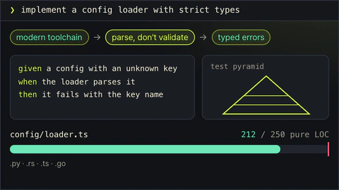</td>
<td><code>lit-code</code><br /><sub><code>ask for strict implementation</code></sub></td>
<td>엄격한 구현 규칙입니다. 테스트 먼저, 경계에서 타입 확인, 작은 파일.</td>
</tr>
<tr>
<td>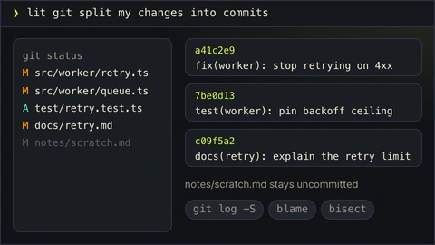</td>
<td><code>lit-commit</code><br /><sub><code>lit git &lt;task&gt;</code></sub></td>
<td>변경을 저장소 스타일에 맞는 작은 커밋으로 나눕니다. 관계없는 작업은 건드리지 않습니다.</td>
</tr>
<tr>
<td>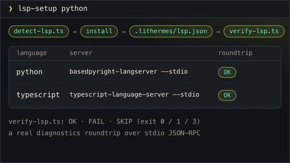</td>
<td><code>lsp-setup</code><br /><sub><code>lsp-setup &lt;language&gt;</code></sub></td>
<td>사용하는 언어의 언어 서버를 설치하고, 진단이 실제로 도는지 확인합니다.</td>
</tr>
<tr>
<td>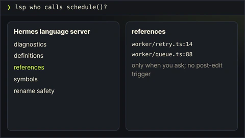</td>
<td><code>lsp</code><br /><sub><code>lsp &lt;request&gt;</code></sub></td>
<td>요청할 때 Hermes 언어 서버로 진단, 참조, 이름 바꾸기 안전성을 확인합니다.</td>
</tr>
<tr>
<td>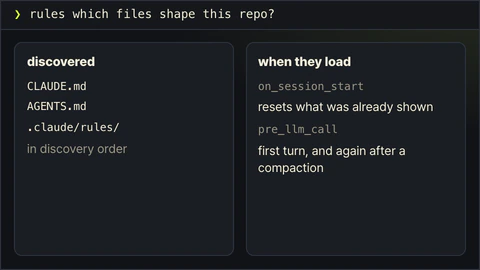</td>
<td><code>rules</code><br /><sub><code>rules &lt;question&gt;</code></sub></td>
<td>Hermes가 어떤 규칙 파일을 언제 읽는지 설명합니다.</td>
</tr>
<tr>
<td>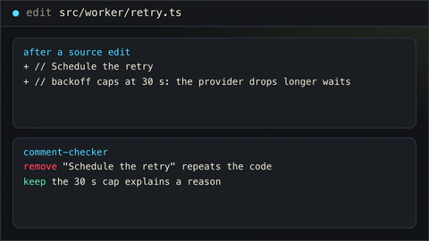</td>
<td><code>comment-checker</code><br /><sub><code>comment-checker</code></sub></td>
<td>수정으로 추가된 주석을 검토합니다. 이유는 남기고, 되풀이하는 주석은 뺍니다. 소스 파일을 고친 뒤에도 알아서 돕니다.</td>
</tr>
<tr>
<td>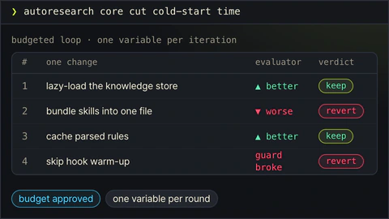</td>
<td><code>autoresearch</code><br /><sub><code>autoresearch &lt;mode&gt;</code></sub></td>
<td>승인된 예산 안에서 실험을 반복합니다. 한 번에 하나만 바꾸고, 결과에 따라 남기거나 되돌립니다.</td>
</tr>
<tr>
<td>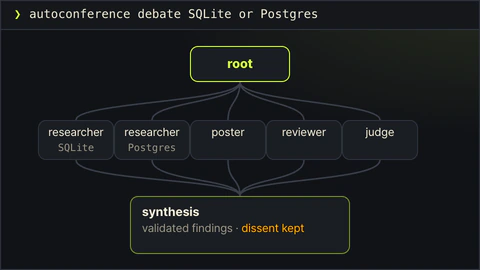</td>
<td><code>autoconference</code><br /><sub><code>autoconference &lt;mode&gt;</code></sub></td>
<td>예산을 정한 연구 회의입니다. 연구자와 리뷰어가 따로 일하고, 종합에는 반대 의견도 남깁니다.</td>
</tr>
</table>

## 정말 도움이 되나요? 한 줄 요청 A/B

알고 싶은 것은 간단합니다. 평범한 요청에 `lit`을 붙이면 결과가 달라질까요? 아래 요청은 모두 가볍게 쓴 한국어 한 줄입니다. LitHermes 쪽에는 같은 줄 끝에 ` lit`만 붙였고, 다른 것은 바꾸지 않았습니다.

두 쪽 모두 2026-09-26에 Hermes Agent v0.21.3, `gpt-6-sol`, 추론 `high`로 한 번씩 실행했습니다. LitHermes 쪽은 배포 전 로컬 빌드를 썼습니다. 블라인드 판정자(Claude Opus 5.5)는 도구 이름을 지운 두 결과를 순서를 바꿔 가며 두 번 비교했습니다. 그다음 메인테이너가 두 결과를 나란히 놓고 최종 판정을 내렸습니다.

모든 줄이 이 첫 실행에서 나온 것은 아닙니다. S3·S4·S11은 나중에 UI 라운드에서, S5·S8·S9는 `lit-pptx`와 `lit-docx`를 쓴 오피스 라운드에서 다시 돌렸고, 새 결과가 같은 작업의 이전 결과를 대신합니다. UI 라운드에 대해서는 두 가지를 알아 두세요. 먼저, LitHermes 쪽은 그 라운드에서 화면 측정 프로브를 한 번도 실행하지 않았습니다. 당시 스킬이 프로브가 설치된 경로를 알려 주지 않았기 때문입니다. 지금은 알려 주지만, 이 세 작업은 아직 다시 돌리지 않았습니다. 그리고 S3·S4의 기준선은 LitHermes 쪽과 달리 파일 쓰기 격리 없이 실행됐습니다.

| 작업 | 요청 | 최종 판정 | 블라인드 판정(같은 라운드) |
|---|---|---|---|
| S1 · 터미널 할 일 CLI | 터미널에서 쓰는 할 일 관리 CLI 만들어줘 | 무승부 | 기준선 승 |
| S2 · API 서버 버그 | 이 API 서버 가끔 이상하게 동작하는데 고쳐줘 | 무승부 | 무승부 |
| S3 · 가계부 대시보드 (UI 라운드) | 개인 가계부 대시보드 웹페이지 만들어줘 | **LitHermes 승** | LitHermes 승 |
| S4 · 카페 랜딩페이지 (UI 라운드) | 동네 카페 브랜드 랜딩페이지 만들어줘 | **LitHermes 승** | LitHermes 승 |
| S5 · 자료 기반 보고서와 발표자료 (오피스 라운드) | sources 폴더 자료로 보고서랑 발표자료 만들어줘 | **LitHermes 승** | LitHermes 승 |
| S6 · Node 22→24 조사 | Node 22에서 24로 올릴 때 달라지는 거 조사해줘 | **LitHermes 승** | 무승부 |
| S7 · 주문·결제·배송 구조도 | 주문-결제-배송 서비스 구조도 그려줘 | **LitHermes 승** | LitHermes 승 |
| S8 · 분기 실적 발표자료 (오피스 라운드) | 분기 실적 발표자료 만들어줘 | **LitHermes 승** | 기준선 승 |
| S9 · 신제품 기획서 (오피스 라운드) | 신제품 기획서 써줘 | **LitHermes 승** | LitHermes 승 |
| S11 · 회의실 예약 웹앱 (UI 라운드) | 회의실 예약 웹앱 만들어줘 | **LitHermes 승** | 무승부 |
| 합계 | | **8승 2무 0패** | 5승 3무 2패 |

맨 위 모션 표지는 LitFamily 모션 스킬로 만들었습니다. 이 스킬(여기서는 `lit-typographic-motion`)은 첫 A/B 이후 다시 만들어졌고, 아직 A/B 결과가 없습니다.

### 양쪽이 만든 것

**S1 · 무승부 (판정자: 기준선 승).** 두 CLI 모두 도움말, 추가, 조회, 완료가 동작했고 자체 테스트도 통과했습니다(기준선 6개, LitHermes 4개). 판정자는 기준선을 골랐습니다. 기준선은 화면 문구를 한국어로 유지하고 수정 기능과 완료 항목 필터를 더했으며, 파일 잠금과 원자적 쓰기로 데이터 파일을 보호했습니다. LitHermes의 CLI 출력과 README는 영어였습니다. 메인테이너는 둘을 비겼다고 봤습니다.

**S2 · 무승부.** 두 쪽 모두 알려진 버그 6개를 모두 고쳤고 보이는 테스트 실패도 없었습니다. LitHermes는 답변에서 버그 4개를 짚었고(기준선 3개) 실행 중인 서버에서 두 번째 페이지 수정을 확인했습니다. 기준선은 새 검증 규칙을 README에 적었습니다. 판정자와 메인테이너 모두 무승부로 봤습니다.

**S3 · LitHermes 승.** LitHermes 대시보드는 CSV 내보내기와 예산 수정을 더했고 아이콘을 한 세트로 맞췄으며, 답변에 320~1440px 브라우저 확인을 적었습니다. 기준선 차트는 축과 월 라벨이 늘어나 휴대폰에서 특히 일그러졌습니다. 접근성 검사에서는 LitHermes 쪽 위반 노드가 더 많았습니다(117 대 91).

| 기준선 | LitHermes |
|---|---|
| 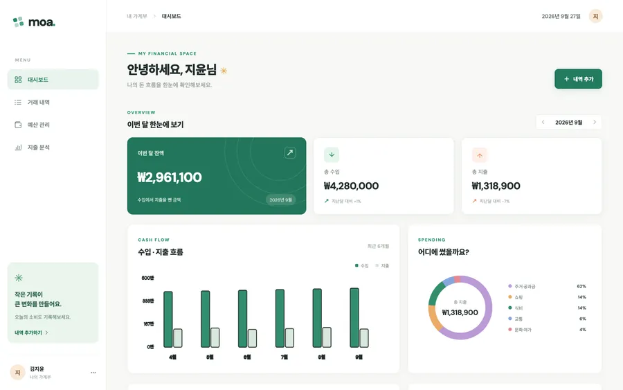 | 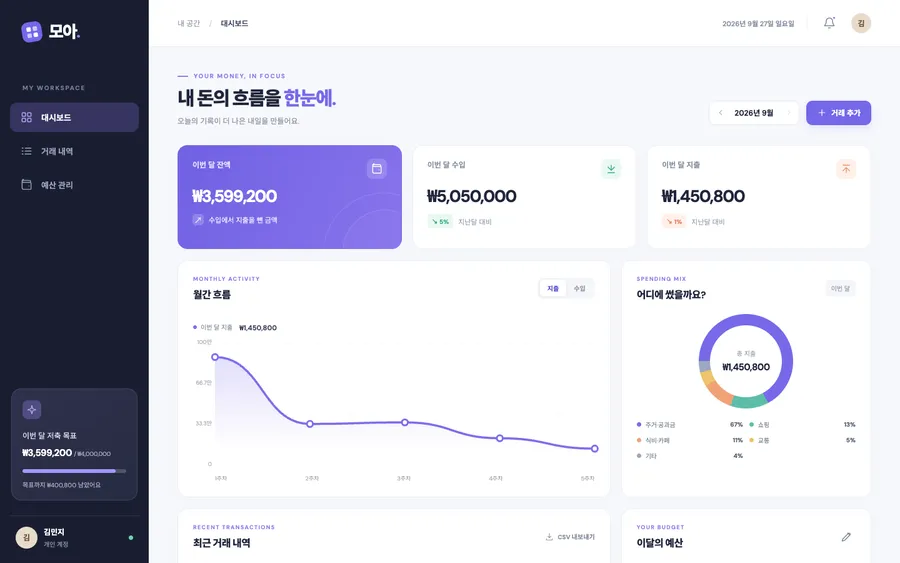 |

**S4 · LitHermes 승.** LitHermes는 품목과 가격이 있는 탭 메뉴, 서로 다른 사진 6장, 아치형 첫 화면을 만들었습니다. 기준선 메뉴는 분위기 카드 3장이었고 같은 실내 사진을 두 번 썼습니다. 위치와 영업시간은 기준선에만 있었고, 페이지 검사에서 잘리거나 화면 밖으로 나간 글자 상자가 LitHermes 쪽에서 7개, 기준선에서 0개 나왔습니다.

| 기준선 | LitHermes |
|---|---|
| 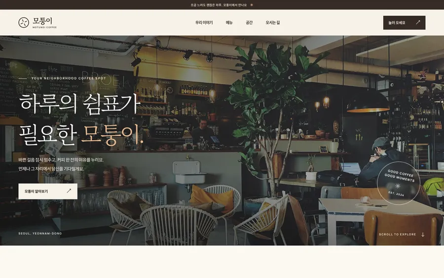 | 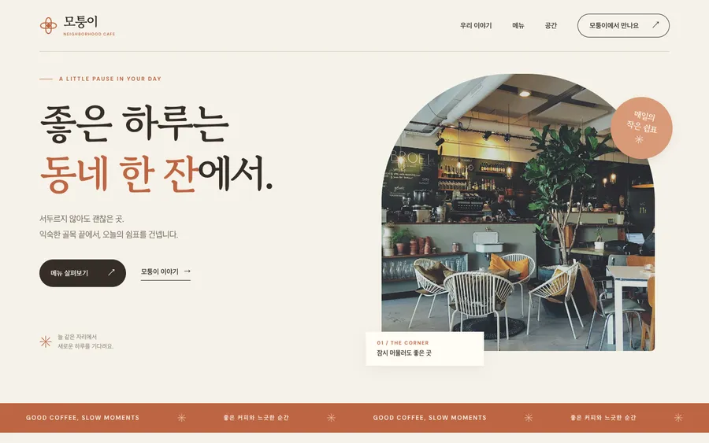 |

**S5 · LitHermes 승.** 두 쪽 모두 확인 대상 사실 12개를 모두 맞혔습니다. LitHermes는 2026년 점검과 의회 보고 기한이 이미 지났다는 점을 짚었고, 기준선은 이를 앞으로 할 일로 적었습니다. LitHermes는 주말 거점과 평일 승합차 이용의 차이처럼 자료가 뒷받침하는 분석도 더했습니다. 슬라이드 디자인은 기준선이 낫고, LitHermes 발표자료는 기본 템플릿 그대로입니다.

기준선:

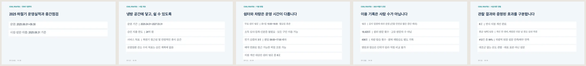

LitHermes:

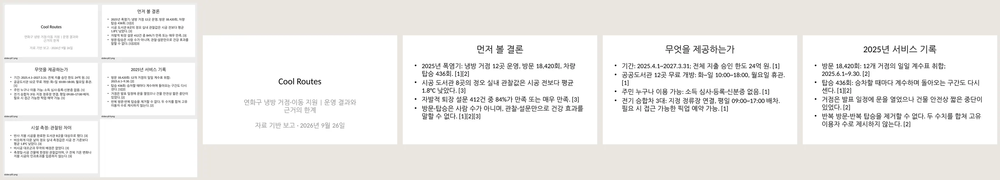

**S6 · LitHermes 승 (판정자: 무승부).** LitHermes는 기준 사실 10개 중 3개를 찾았고(기준선 1개), 링크는 모두 공식 출처였습니다(기준선은 4분의 1). npm 11에서 `--ignore-scripts`가 `prepare`에도 적용되는 점, Undici 7, ARMv7 빌드 중단도 다뤘습니다. 기준선은 API 세부 사항을 더 많이 적었지만 권한 플래그 이름 변경을 24의 새 변화처럼 소개해, 판정자가 오해 소지가 있다고 봤습니다.

**S7 · LitHermes 승.** LitHermes는 결제 실패와 취소 흐름까지 담은, 렌더링된 편집 가능한 HTML 구조도를 냈고, 필요한 Chrome이 없어 PNG 내보내기와 화면 검토를 건너뛰었다고 밝혔습니다. 기준선은 채팅에 ASCII 상자를 그렸는데, 판정자는 한글이 두 칸 폭이라 줄이 어긋날 것으로 봤습니다. 메인테이너는 차이가 압도적이라고 평했습니다.

| 기준선 | LitHermes |
|---|---|
| 채팅 속 ASCII 상자만 있고 렌더링된 파일 없음 | 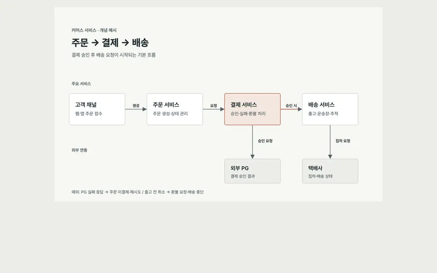 |

**S8 · LitHermes 승 (판정자: 기준선 승).** 요청에는 회사도 실적 수치도 없었습니다. 기준선은 빈칸을 둔 7장짜리 템플릿을, LitHermes는 가상 기업의 8장짜리 발표자료와 차트 3개를 만들고 모든 수치에 가정 예시라고 표시했습니다. 판정자는 바로 채워 쓸 수 있는 기준선 템플릿을 골랐고, LitHermes 차트는 데이터 라벨이 없어 빈약하다고 봤습니다. 메인테이너는 LitHermes 발표자료를 골랐습니다.

기준선:

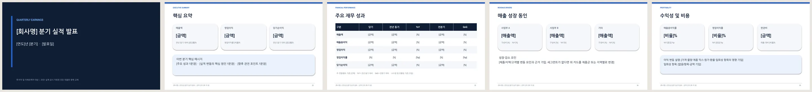

LitHermes:

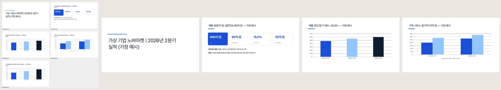

**S9 · LitHermes 승.** 기준선은 어떤 제품인지 되묻기만 하고 문서를 쓰지 않았습니다. LitHermes는 가상의 모듈형 책상 정리 트레이를 대상으로 고객 문제, 가격 가정, 검증 일정, 생산 결정 기준을 담은 3쪽짜리 Word 기획서를 썼고, 판정자는 손익분기 계산이 맞다고 봤습니다.

| 기준선 | LitHermes |
|---|---|
| 문서 없음. 어떤 제품인지 되물음 | 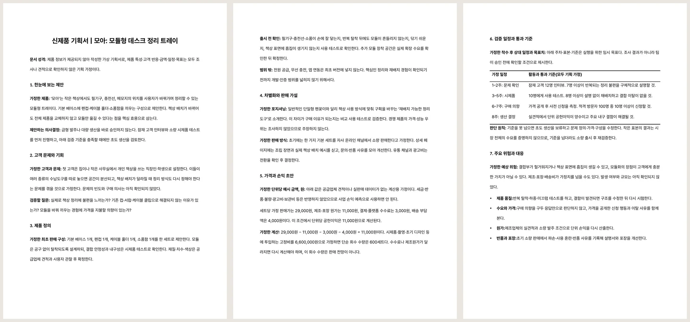 |

**S11 · LitHermes 승 (판정자: 무승부).** LitHermes는 날짜별 현황, 인원 필터와 검색, 30분 단위 예약을 갖추고 로직 테스트 4개가 통과하는 앱을 냈습니다. 판정자는 모든 회의실을 한 타임라인에 보여 주는 기준선이 더 알아보기 쉽고 `index.html`만 열면 된다고 봤습니다. LitHermes 앱은 npm과 로컬 서버가 필요하고, 일러스트 배너가 일정표 위를 차지합니다. 메인테이너는 LitHermes 앱을 골랐습니다.

| 기준선 | LitHermes |
|---|---|
| 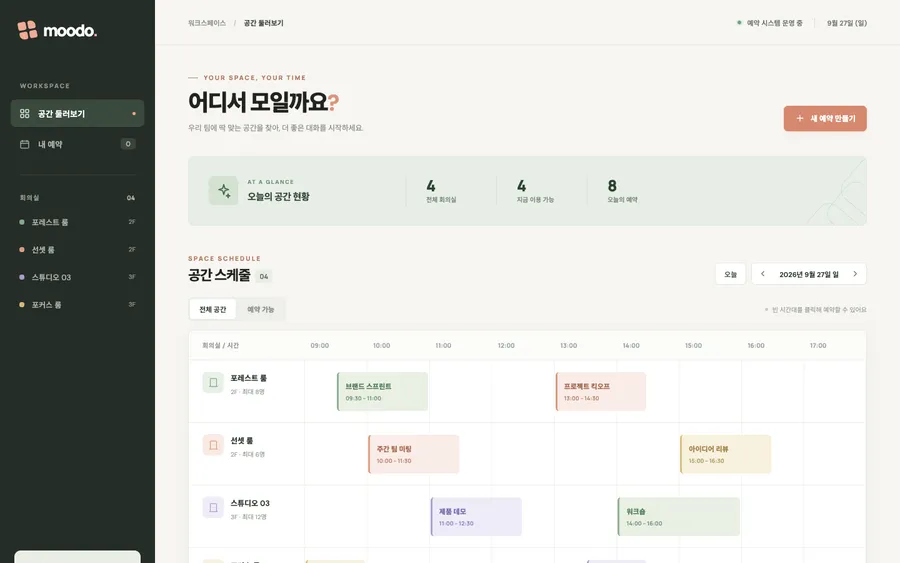 | 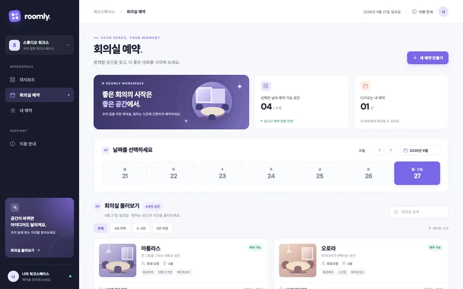 |

## 작동 방식

LitHermes는 Python 플러그인입니다. Hermes가 플러그인을 불러오면 `register(ctx)`가 훅, 명령, 스킬, 작업 도구를 등록합니다. 훅은 모델이나 도구를 호출하기 직전과 직후에 끼어듭니다. `goal_*` 도구는 목표와 그 목표를 위해 모은 확인 결과를 프로젝트 안의 로컬 기록에 적습니다.

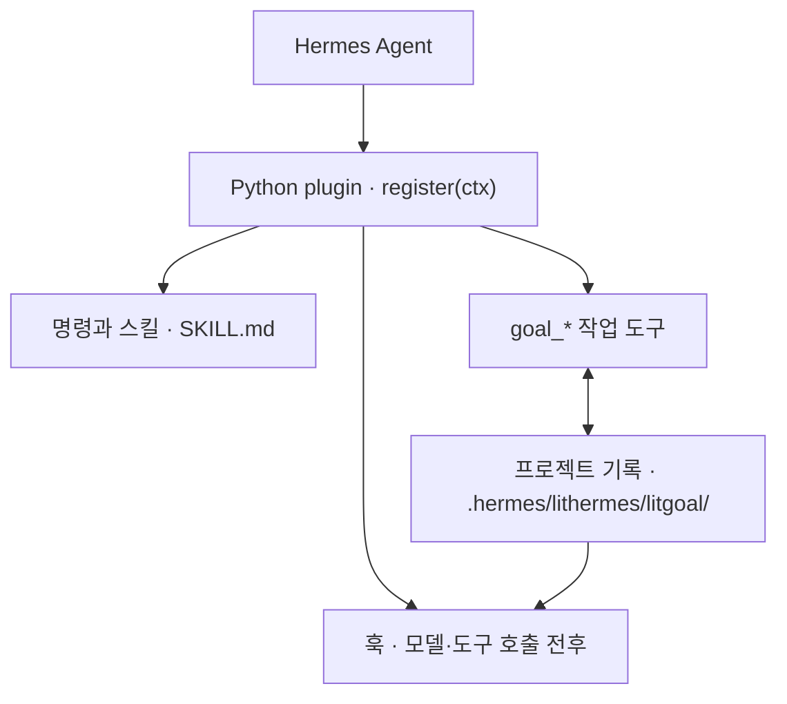
```mermaid
flowchart TD
    H["Hermes Agent"] --> P["Python plugin · register(ctx)"]
    P --> K["훅 · 모델·도구 호출 전후"]
    P --> S["명령과 스킬 · SKILL.md"]
    P --> T["goal_* 작업 도구"]
    T <--> R["프로젝트 기록 · .hermes/lithermes/litgoal/"]
    R --> K
```

다음 모델 호출 전에는 context 훅이 이 기록을 읽어, 지금 목표가 무엇이고 어디까지 왔는지 모델에게 건넵니다.

요청을 어디로 보낼지는 플러그인이 정하고, 모델은 여전히 Hermes Agent가 돌립니다. 권한 확인, 로그인, 모델 접근, 실제 화면이 필요한 검사는 모두 Hermes 쪽에서 처리합니다.

## 코드 밖의 결과물

### 보고서와 발표자료

보고서나 발표자료를 요청하면서 단독 `lit`을 붙이면, LitHermes가 함께 들어 있는 Word·PowerPoint 스킬에 일을 넘깁니다. 요청에 따라 DOCX나 PPTX, 또는 둘 다 나오고, 파일마다 Markdown 원본이 옆에 남습니다. 따로 고르지 않으면 한국어 문서는 korean-generic 프로필을, 발표자료는 AZURE-PRO와 Pretendard를 씁니다.

두 스킬 중 하나를 처음 쓸 때는 Office 런타임이 필요한 도구를 고정된 버전으로 LitHermes 캐시에 설치합니다. 완성된 문서나 발표자료는 그다음 QA 검사를 거칩니다. 스킬을 바로 부르려면 `/lit-docx <brief>`나 `/lit-pptx <brief>`를 입력하세요.

설치된 스킬 ID는 `lit-pptx`와 `lit-docx`이고, Hermes 목록에는 `lithermes:lit-pptx`와 `lithermes:lit-docx`로 나옵니다.

### 다이어그램

개념도나 기술 다이어그램이 필요하면 `lit-diagram-drawer`를 쓰세요. Hermes 목록에는 `lithermes:lit-diagram-drawer`로 나옵니다. 다이어그램을 부탁하면서 앞이나 뒤에 단독 `lit`만 붙여도 LitHermes가 이 스킬을 고르고, 설치된 진입 파일이 어디 있는지 Hermes에 알려 줍니다. 제품 화면은 `frontend-ui-ux`, 측정한 과학 데이터 그래프는 `lit-scientific-visualization`이 맡습니다.

### 영상

`lit-typographic-motion`은 `lithermes:lit-typographic-motion`과 `/lit-typographic-motion <brief>`로 쓸 수 있습니다. 영상 요청에 단독 `lit`을 붙이면 감독처럼 먼저 트리트먼트를 씁니다. 그다음 그림과 도형이 필요한 영상은 스테이지 경로(모델이 작성한 HTML 페이지를 프레임 단위로 캡처)로, 글자 자체가 영상일 때는 자체 WebGL2 타입 엔진으로 렌더합니다. 기본으로 생성 사운드 베드를 넣고, 생성한 소리라고 표시합니다.

영상을 만들려면 컴퓨터에 Chrome과 ffmpeg가 있어야 하고, 버전을 고정한 보조 패키지와 폰트도 몇 가지 필요합니다. 렌더링은 스스로 아무것도 내려받지 않기 때문에, 보조 패키지와 폰트는 영상을 만들기 전에 로컬 캐시에 들어 있어야 합니다. `lithermes install`이 설치하면서 이 캐시를 채워 보고, `--offline` 등으로 건너뛰었거나 끝내지 못했으면 그 사실을 한 줄로 알려 줍니다. 그럴 때는 렌더 세션 밖에서 `lithermes motion-runtime install`을 실행해 나중에 채우면 됩니다.

지금 상태가 궁금하면 `lithermes motion-runtime status`를 실행하세요. Chrome, ffmpeg, WebGL2, 소프트웨어 렌더링으로 내려갔는지 여부, 고정 폰트 상태를 보여 줍니다. 마지막 검사를 통과하면 60fps 영상(1920×1080, 스테이지 경로는 1080×1920도 가능), 미리보기, 포스터, 움직임 축소용 정지 이미지, 수치 검사 보고서를 받습니다. 타이포그래피 모션 엔진은 mexicat/pdoom-video (MIT, Giacomo Magnanini), 커밋 `ca251e3`에서 각색했습니다.

### 화면과 README

`frontend-ui-ux`는 요청한 화면을 만들되, 먼저 중요한 디자인 선택을 물어보고 정합니다. 검토나 계획만 부탁하면 읽고 보고할 뿐 파일은 고치지 않습니다. `readme-studio`(Hermes 목록에서는 `lithermes:readme-studio`)는 사실에 맞는 README와, 내 컴퓨터에서 만든 표지를 함께 만듭니다. 표지에는 Pretendard/Meslo 윤곽 글자와 편집 가능한 소스가 들어가고, 검증할 수 있으면 모션도 붙습니다. Hermes에 기본 이미지 생성기가 없으면 `IMAGE_GENERATION_UNAVAILABLE`로 알려 주고, 직접 건넨 이미지는 그래도 합성할 수 있습니다. 두 스킬 모두 로그인, 전역 설치, 배포는 하지 않습니다.

### 글 다듬기

`lit-humanizer` 스킬은 `lithermes:lit-humanizer`로 쓸 수 있습니다. 사실과 의도를 지키면서 한국어와 영어 초안을 다듬습니다.

이 스킬에는 Hermes가 사람이 읽을 글을 쓸 때 옆에서 살피는 감지기가 딸려 있습니다. Hermes가 `write_file`이나 `patch`로 글을 저장하면, 감지기가 바뀐 부분을 먼저 읽습니다. SVG를 포함해 지원하는 형식이면 모두 해당됩니다. 심각한 문제(차단 등급)가 보이면 파일이 저장되기 전에 쓰기를 멈출 수 있고, 가벼운 문제(주의 등급)는 검토해 볼 의견으로 돌려줍니다.

Office 파일과 PDF는 만들어진 뒤에 검사합니다. DOCX나 PPTX는 파일 쓰기 이벤트나 스크립트 결과에 저장 경로가 나오면 그때 읽습니다. PDF도 같은 방식이지만 `pdftotext`가 설치되어 있어야 읽을 수 있습니다. 이때는 파일이 이미 저장된 뒤라 막지는 못하고, Hermes에 원본을 고쳐 다시 만들라고 알려 줍니다. 감지기는 어느 경우든 표현만 살펴보고, 누가 쓴 글인지는 알 방법이 없습니다.

## Ignition 스킨

LitHermes는 Hermes CLI의 겉모습도 바꿔 줍니다. CLI에서 `/skin`을 입력하면 지금 쓰는 스킨과 고를 수 있는 스킨이 나옵니다. `/skin lithermes-ignition`을 고르고 Hermes를 다시 시작하면 주황·라임·아이보리·네이비로 된 시작 배너가 뜹니다. 컴팩트 레이아웃에서도 welcome 화면에 5행 MICRO 마크가 나오지만, 호스트가 전체 `banner_logo`는 빼고 보여 줄 수 있습니다. 번호 1~10의 색상 프리셋도 그대로 쓸 수 있습니다.

색을 표시하는 대화형 터미널에서 `--yes`로 처음 설치하면 Ignition이 자동으로 선택됩니다. 다만 설정에 `display.skin` 항목 자체가 없을 때만 그렇습니다. 이미 골라 둔 스킨과 가지고 있던 스킨 파일은 그대로 둡니다.

밝은 터미널이라면 `/skin lithermes-tokyonight-day`, 어두운 터미널이라면 `/skin lithermes-tokyonight`를 고르고 Hermes를 다시 시작하세요. 두 스킨 모두 본문, 상태 줄, 완료 메뉴 글자를 잘 읽히게 맞추고 MICRO 마크와 배너 그림을 새 색으로 칠합니다. 그 밖의 스킨 선택과 파일은 건드리지 않습니다. 직접 입력하는 글자는 터미널 기본 글자색을 따릅니다. 자연어 경로로 들어온 Lit 응답에는 끝에 MICRO 안내가 한 번 붙습니다.

스킨과 출력 스타일은 서로 다른 설정입니다. 스킨은 CLI 화면을, 출력 스타일은 답변 문체를 바꿉니다. Gateway 대화에는 CLI 스킨이 나오지 않습니다. 화면에 어떻게 보이는지는 호스트와 터미널에 따라 달라지니, 다시 시작한 뒤 화면에서 직접 확인하세요.

이미 있는 이름 붙은 스킨 파일은 LitHermes가 덮어쓰지 않습니다. 일반 파일로 된 스킨을 새것으로 받고 싶다면 그 파일을 백업 위치로 옮기고, 설치 프로그램을 다시 실행해 빠진 파일을 새로 만든 다음, 직접 고쳤던 내용을 다시 옮겨 넣으세요. 심볼릭 링크이거나 예상과 다른 것이 그 자리에 있으면 손대지 않습니다. macOS에서는 한 군데가 ANSI-256 색으로 남을 수 있습니다. CPR이 꺼진 상태의 `prompt_toolkit` 구분선인데, 나머지 Rich 출력은 승인된 색을 그대로 유지합니다.

## 명령

| 입력 | 하는 일 |
|---|---|
| `lit <요청>` 또는 `/lit` | 범위를 정한 작업을 시작하고 확인 결과를 남깁니다. |
| `handoff` 또는 `/lit-handoff` | 현재 작업과 다음 할 일을 다음 세션으로 넘깁니다. |
| `lit-plan` 또는 `/lit-plan` | 실행 전에 계획을 작성합니다. |
| `/start-work <승인된 계획>` | 승인한 계획을 실행합니다. |
| `/review-work` | 계획이나 결과를 검토하고 발견 사항을 남깁니다. |
| `lit review <대상>` | 계획이나 결과를 검토합니다. |
| `litresearch` 또는 `lit research <질문>` | 출처 메모가 있는 조사 흐름을 사용합니다. |
| `/lit-loop` | 명시적 반복 작업을 시작하고 확인하고, 다시 잇거나 끝냅니다. |
| `/litgoal` | 기준과 근거, 체크포인트와 막힌 지점을 추적합니다. |
| `/lit-humanizer` | 의미를 지키며 한국어·영어 문장을 다듬습니다. 이전 별칭은 `/lit-korean`, `/text-naturalization`, `/text-neutralization`, `/korean-ai-slop-remover`입니다. |
| `/lit-diagram-drawer <brief>` | 설치된 Python 도구로 내용과 기하 구조를 검사하며 접근성·한국어를 고려한 다이어그램을 만듭니다. |
| `/lit-pptx <brief>` | 번들된 AZURE-PRO 엔진으로 발표자료를 만들고 검사합니다. |
| `/lit-docx <brief>` | 출판 프로필을 적용해 Word 문서를 만들고 편집·검토합니다. |
| `/lit-typographic-motion <brief>` | 트리트먼트에서 출발해 스테이지 또는 타입 경로로 원본 영상을 연출하고 검사합니다. |

Telegram gateway에서는 `/lit_loop`와 `/lit_plan` 별칭을 씁니다. 전체 명령 예시와 훅 동작은 [운영 안내](./docs/guide.ko.md)에 있습니다. 명령 뒤에 확인 줄이 뜨면 작업이 시작된 것입니다. 결과를 믿고 쓰기 전에는 화면 확인까지 포함해 직접 살펴보세요.

## 선택 기능: Jev 스킬 힌트

평범하게 쓴 프롬프트가 사실은 번들 스킬 하나에 딱 맞는데, 문장만 봐서는 드러나지 않을 때가 있습니다. 이런 프롬프트에 대해 LitHermes는 TypeSafe가 호스팅하는 결정 모델 Jev에게 어떤 스킬이 맞는지 물어볼 수 있습니다. Jev의 답은 그 턴의 컨텍스트에 조언 한 줄로 붙습니다. 어디까지나 제안이라, 스킬을 불러올지는 여전히 Hermes 모델이 정하고 힌트로 권한을 주거나 도구를 실행할 수는 없습니다. 슬래시 명령이나 기존 LitHermes 경로가 이미 처리하는 프롬프트에는 끼어들지 않습니다.

기본값은 꺼짐입니다. 켜려면 Hermes가 실행되는 환경에 두 변수를 모두 설정하고, 키는 본인의 TypeSafe 키를 쓰세요.

```sh
export LITHERMES_JEV=1
export TYPESAFE_API_KEY=<your key>
```

켜 두면 조건에 맞는 프롬프트마다 2,000자로 자르고 홈 경로, 이메일 주소, 토큰 형태의 문자열을 가린 뒤 TypeSafe(typesafe.ai)로 보냅니다. 토큰 형태가 아닌 내용, 예를 들어 호스트 이름, 고객 이름, `password=...` 형식이 아닌 비밀번호는 쓴 그대로 전송됩니다. Hermes 게이트웨이 모드에서는 대화방의 다른 참여자가 보낸 메시지도 전송 대상입니다. 세션의 다른 내용은 보내지 않습니다.

`TYPESAFE_API_KEY`는 Hermes를 시작하는 셸에 export되어 있으므로 에이전트의 도구도 이 값을 읽을 수 있습니다. 이 기능 전용 키를 쓰고 사용 한도를 낮게 잡으세요. 비용은 TypeSafe가 본인 계정에 청구하며, 입력 토큰 100만 개당 약 0.04달러입니다. 요청마다 1.5초 제한이 있고 재시도하지 않습니다. 실패하면 턴은 그대로 진행되고, 짧은 안내가 세션마다 한 번만 표시됩니다.

켜져 있는 동안에는 세션의 첫 답변 맨 위에 `✦ Jev skill hint ON` 한 줄이 표시되어, 기능이 켜져 있다는 것을 바로 알 수 있습니다. `hermes lithermes status`와 `hermes lithermes doctor`에서도 확인할 수 있습니다. 마지막 힌트는 세션별로 따로 보관하므로, 에이전트의 터미널처럼 Hermes 세션 안에서 실행하세요.

- `Jev skill hint: on — last hint lit-humanizer (0.43s)`는 그 세션에서 마지막으로 힌트한 스킬과 Jev의 응답 시간을 보여 줍니다.
- `on — no hint yet`은 그 세션에 아직 힌트가 없다는 뜻입니다.
- 세션 밖에서 실행하면 `on — no session`이 표시되고, 그 밖에는 `off` 또는 `flag on but TYPESAFE_API_KEY missing`이 표시됩니다.

끄려면 `LITHERMES_JEV`를 해제하거나 `1`이 아닌 값으로 바꾸세요.

### 화면에서 보이는 것

아래 네 장은 Jev를 켰을 때 내 화면에서 무엇이 달라지는지 보여 줍니다. 그림 속 글자는 LitHermes가 출력하는 문구 그대로이고, 스킬 이름과 시간은 예시입니다.

**첫 응답.** Jev가 꺼져 있으면 응답은 Hermes가 쓴 그대로 도착합니다. 켜져 있으면 세션의 첫 응답 맨 위에 한 줄이 더 붙어서, 내 프롬프트가 Jev로 보내지고 있다는 것을 바로 알 수 있습니다. 이 줄은 세션마다 한 번만 나오고, 그 아래 응답은 그대로입니다.

<p align="center"><picture><source media="(prefers-color-scheme: dark)" srcset="./docs/assets/jev/jev-first-reply-dark.webp" />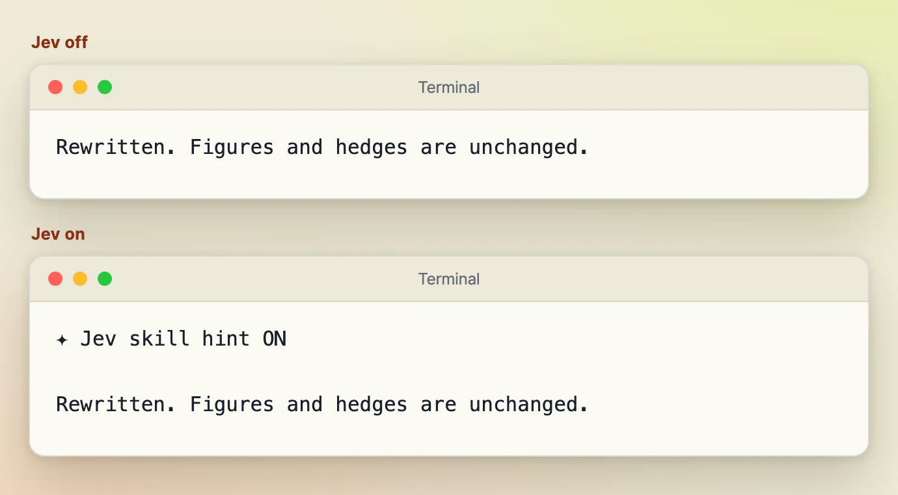</picture></p>

*예시 출력입니다. 첫 줄은 LitHermes의 응답 처리 코드가 실제로 만든 문구이고, 그 아래 문장은 지어낸 예시 글입니다.*

**Jev가 제때 답하지 못할 때.** TypeSafe가 느리거나 연결되지 않으면 힌트 없이 그대로 진행합니다. 힌트가 왜 없는지 알 수 있도록, 첫 줄 아래에 짧은 안내가 세션마다 한 번 붙습니다.

<p align="center"><picture><source media="(prefers-color-scheme: dark)" srcset="./docs/assets/jev/jev-first-reply-note-dark.webp" />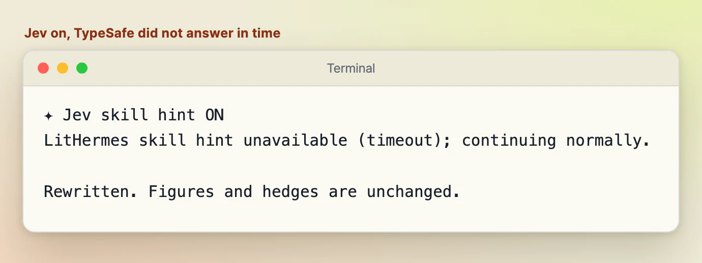</picture></p>

*LitHermes의 응답 처리 코드로 만든 예시 출력입니다. 답이 오지 않는 TypeSafe를 흉내 내는 대역을 썼고, 어디로도 아무것도 보내지 않았습니다.*

**켜기 전에.** `hermes lithermes doctor`에는 Jev 줄이 있습니다. 꺼져 있으면 참고용 줄이고, 스위치만 켜고 키를 빼먹으면 빠진 키 이름을 알려 주는 경고로 바뀝니다. 키를 빠뜨렸는지 가장 빨리 확인하는 방법입니다.

<p align="center"><picture><source media="(prefers-color-scheme: dark)" srcset="./docs/assets/jev/jev-status-before-dark.webp" />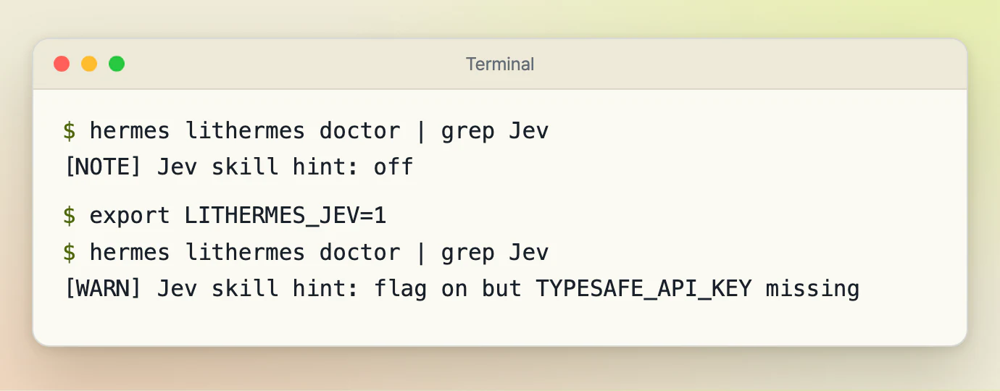</picture></p>

*스크래치용 Hermes 홈에서 실제 `hermes lithermes doctor` 명령으로 얻은 출력입니다.*

**켠 뒤에.** 세션 안에서 `status`는 처음에 아직 힌트가 없다고 알려 줍니다. Jev가 스킬을 제안한 뒤에는 같은 줄이 그 스킬 이름과 Jev가 걸린 시간을 보여 주고, `doctor`도 같은 내용을 OK 표시와 함께 보여 줍니다.

<p align="center"><picture><source media="(prefers-color-scheme: dark)" srcset="./docs/assets/jev/jev-status-on-dark.webp" />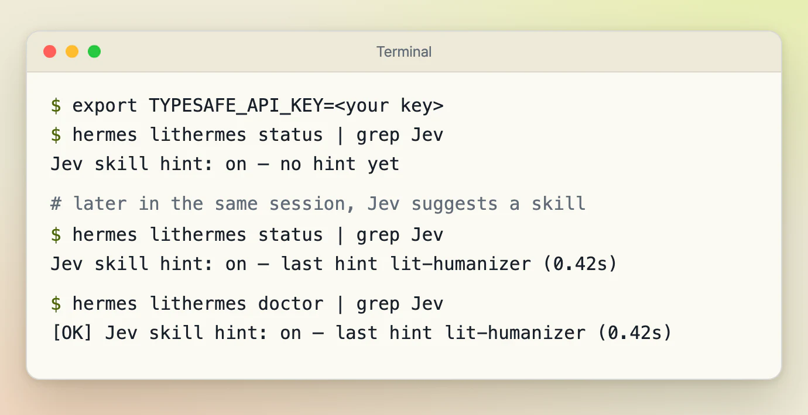</picture></p>

*스크래치용 Hermes 홈에서 실제 `hermes lithermes status`와 `doctor` 명령으로 얻은 출력입니다. 자리표시 키와 TypeSafe 답변 대역을 썼으므로 스킬 이름과 0.42초는 예시입니다.*

## 문제가 생겼을 때

먼저 오프라인으로 설치 상태를 확인하세요.

```sh
npx --package @litfamily/lithermes -- lithermes doctor --offline
```

Lit 스킬이 보이지 않으면 Hermes에 `skills_list` 도구를 불러 LitHermes 항목을 찾아 달라고 하세요. `/skills` 명령은 파일시스템만 읽기 때문에, Hermes 버전에 따라 플러그인이 제공하는 스킬과 목록이 다를 수 있습니다.

다른 곳에 같은 이름의 스킬이 있으면 LitHermes 스킬 대신 그쪽이 잡힐 수 있습니다. 스킬을 이름만으로 부르면 Hermes는 `config.yaml`의 `skills.external_dirs`에 적힌 폴더와 `<HERMES_HOME>/skills`를 먼저 뒤진 다음에야 플러그인으로 넘어옵니다. 앞에 접두어를 붙인 `lithermes:<name>` 형태는 이 탐색을 건너뜁니다. 이름이 겹치면 `lithermes doctor`가 `skill shadow check: WARNING` 줄에 해당 스킬과 그 스킬을 가리는 경로를 적어 줍니다. `lithermes:<name>`으로 불러오거나, 다른 쪽 사본을 지우거나 이름을 바꾸세요. 이 경고는 알려 주기만 할 뿐, doctor의 성공/실패 종료 상태는 그대로입니다.

Hermes 로그에 import 오류가 보이면 플러그인을 불러오지 못한 것입니다. 짐작으로 pip 패키지를 설치하기보다는, 오류 메시지를 보관해 두고 [운영 안내](./docs/guide.ko.md)를 확인하세요.

### 알아 둘 한계

- 설치 프로그램이 무엇을 바꿀지 실제로 바꾸기 전에 보고 싶다면 `lithermes install --dry-run`을 실행하세요.
- 붙여 넣은 코드, 인용문, 명령은 읽을 글로 다루고, 지시로 따르지는 않습니다. 비밀값은 저장하거나 모델에 넘기기 전에 가립니다.
- Hermes에 원래 있는 `/goal`은 사용자가 직접 관리하는 기능입니다. LitHermes는 이 기능을 건드리지 않고, 갱신하거나 지우거나 다시 이어 주지도 않습니다. 자기 목표는 `goal_*` 도구로 따로 저장해 두고, 그 기록을 기준으로 삼습니다.
- Hermes는 보조 작업을 모두 공통 모델 설정 하나로 보냅니다. 그래서 작업마다 모델을 고르거나 리뷰 전용 모델을 따로 지정할 수는 없습니다. 설치 보고서에는 설정한 값이 나옵니다. 보조 작업이 실제로 어떤 모델로 돌았는지는 실제 `delegate_task` 실행 기록으로만 확인할 수 있습니다.

### 삭제하기

```sh
npx --package @litfamily/lithermes -- lithermes uninstall --yes
```

설치 프로그램이 Hermes에 호환성 수정을 했다면 `--rollback-patches`를 붙여 되돌리세요. 삭제해도 스킨 파일과 `display.skin` 선택은 남습니다. Hermes 기본 모습으로 돌아가려면 같은 프로필에서 `npx --package @litfamily/lithermes -- lithermes hud off`를 실행하세요. 선택만 지우고, 스킨 파일과 다른 설정은 그대로 둡니다.

## 더 읽을 문서와 기여

- [운영 안내](./docs/guide.ko.md): 명령, 모델, 스킨, 문제 해결 전체
- [Python plugin 계약](./packages/lithermes-installer/assets/lithermes-plugin/README.md)
- [npm 패키지 페이지](./packages/lithermes-installer/README_Ko-KR.md): 패키지와 함께 배포되는 짧은 설치 안내
- [변경 기록](./CHANGELOG.md) · [개인정보](./docs/privacy.md) · [이전 패키지에서 옮겨 오기](./docs/migration.md)

[기여](./CONTRIBUTING.md) · [보안](./SECURITY.md) · [행동 강령](./CODE_OF_CONDUCT.md) · [지원](./SUPPORT.md)

MIT License. LitHermes는 LITFAMILY의 하나이며, 각 제품은 지원하는 에이전트 환경에 따로 설치합니다.
