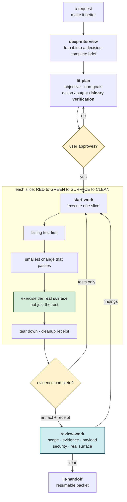
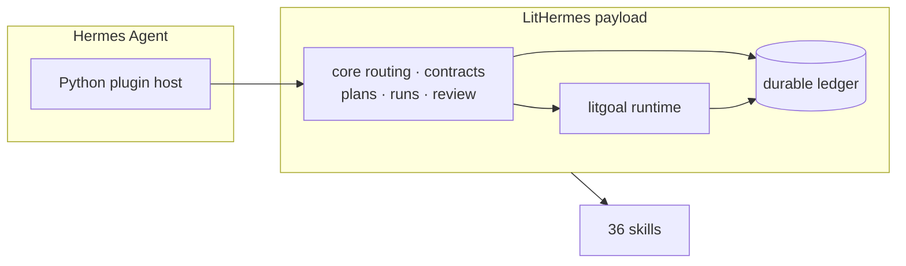
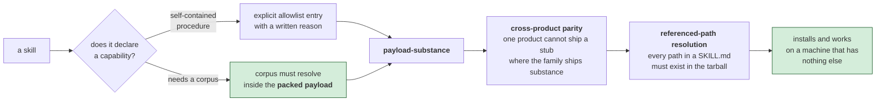

# LitHermes 사용 안내


`@litfamily/lithermes`는 npm에 공개되어 있고, 아래 명령은 최신 릴리스를 설치합니다.

[시작 페이지](../README_Ko-KR.md) · [English](./guide.md)

## 무엇인가요

LitHermes는 `@litfamily/lithermes`로 배포되는 Hermes Agent plugin입니다. planning, execution, review, evidence, handoff를 별도 mode로 나누어 작업을 안전하게 멈추고 검증된 기록으로 이어갈 수 있게 합니다.

설치는 `~/.hermes`에 이루어지며 되돌릴 수 있습니다. 설치 중 Telegram에 직접 접속하지 않고, Hermes에 없는 native team mode를 주장하지 않습니다. Gateway alias는 Hermes의 기존 dispatch surface를 사용합니다.



> **이 흐름을 읽는 법:** plan 승인은 형식적인 단계가 아니라 각 항목에 binary verification을 붙이는 관문입니다. 한 slice는 Hermes의 실제 surface에서 evidence를 만든 뒤 임시 QA 자원을 정리해야 닫히며, 테스트 통과만으로는 handoff가 완료되지 않습니다.

## 빠른 시작

먼저 read-only 점검을 실행합니다.

```sh
npx --package @litfamily/lithermes -- lithermes doctor
npx --yes --package @litfamily/lithermes@latest -- lithermes doctor
bunx --package @litfamily/lithermes lithermes doctor
```

plugin을 설치합니다.

```sh
npx --package @litfamily/lithermes -- lithermes install --yes
```

npx와 installer 승인을 모두 지정하는 첫 설치:

```sh
npx --yes --package @litfamily/lithermes@latest -- lithermes install --yes
```

앞의 `--yes`는 `npx` 실행 승인이고, 뒤의 `--yes`는 Hermes config를 쓰도록 하는 LitHermes 승인입니다. npm 패키지명은 `@litfamily/lithermes`, 설치되는 binary 이름은 `lithermes`입니다.

다른 설치 방식:

```sh
bunx --package @litfamily/lithermes lithermes install --yes
npx --package @litfamily/lithermes -- lithermes install --dry-run
npx --package @litfamily/lithermes -- lithermes install --yes --no-spinner
npx --yes --package @litfamily/lithermes@latest -- lithermes install --yes
```

대화형 설치는 `PREPARING INSTALL` 요약과 `INSTALL RECEIPT` 또는 조치 가능한 `INSTALL STOPPED` 패널을 보여줍니다. redirect, CI, `NO_COLOR`, dry-run, `--no-spinner`에서는 plain하고 script-safe한 출력을 사용합니다.

TTY에서 스타일 선택 질문도 생략하려면 `--no-style`을 함께 지정하세요.

## 첫 사용

설치 후 Hermes CLI 또는 gateway를 재시작하고 다음처럼 입력합니다.

```text
/lit 이 폴더에 뭐가 있는지 정리해줘
/lit-loop 이 repo의 QA를 실행하고 evidence를 정리해줘
/lit-plan 이 패키지의 안전한 plan을 세워줘
```

모든 activation은 폭을 맞춘 micro LIT 마크와 `🔥 LIT IGNITED · <route> 🔥`를 표시합니다. 색상을 지원하는 터미널의 slash acknowledgement는 글자마다 주황색-분홍색-청록색을 굵게 표시합니다. xterm-256에서는 각 색상 정지점에 203, 198, 45번을 사용하며, `NO_COLOR`, CI, 비-TTY 출력에서는 일반 텍스트를 표시합니다. 자연어 route의 확인 표시는 응답 도착 시 ANSI escape 없이 들여쓴 일반 텍스트 행과 같은 라벨로 붙습니다. 모델은 다른 내용보다 먼저 첫 줄에 `🔥 **LIT IGNITED · <discipline>** 🔥`을 정확히 한 번 출력해야 하며, harness는 누락된 probe를 대신 만들지 않습니다.



> **host 연결을 한눈에 보면:** Hermes Agent가 Python plugin host를 제공하고, LitHermes의 core routing과 contract, goal/ledger runtime이 그 위에서 명령을 이어 줍니다. 설치 후 CLI 또는 gateway를 재시작하면 이 연결과 36개 skill catalog가 실제 host에 로드됩니다.

## 핵심 명령

| 명령 | 용도 |
|---|---|
| `/lit` | bounded Litwork task를 실행합니다. |
| `/lit-loop` | 명시적인 loop lifecycle을 시작하거나 확인합니다. |
| `/lit-plan` | 실행 전에 plan을 만듭니다. |
| `/review-work` | plan 또는 완료 작업을 검토하며 검토 중 구현하지 않습니다. |
| `/start-work` | 승인된 plan만 실행합니다. |
| `/litgoal` | criteria, evidence, checkpoint, blocker를 관리합니다. |
| `/lit-recap` | 작업과 evidence를 한국어로 읽기 쉽게 요약합니다. |
| `/lit-handoff` | live state를 확인한 continuation packet을 작성합니다. |
| `/lit-scientific-visualization` | 번들 source로 publication figure를 만듭니다. |
| `/lit-humanizer` | 의미를 지키며 한국어·영어 문장을 다듬습니다. 이전 별칭: `/lit-korean`, `/text-naturalization`, `/text-neutralization`, `/korean-ai-slop-remover`. |
| `/lit_loop`, `/lit_plan` | Telegram dispatch용 gateway alias입니다. |

추가로 `autoresearch`, `autoconference`, `wikify`, `lit-code`, `debugging`, `lit-commit`, `frontend-ui-ux`, `readme-studio`, `lsp`, `lsp-setup`, `refactor`, `review-work`, `visual-qa` 및 관련 `lithermes:*` skill이 설치됩니다.

### 자동 핸드오프

자동 핸드오프는 기본값이 꺼짐입니다. 컨텍스트 창이 고른 퍼센트에 닿으면 모델이 핸드오프를 쓰게 하고, 압축한 뒤에 그 핸드오프를 다시 불러옵니다. 평소 쓰는 방법은 [README](../README_Ko-KR.md#자동-핸드오프)에 있고, 여기서는 동작 방식을 정리합니다.

- **스위치.** `/lit-handoff auto on <percent>`, `auto off`, `auto status`는 모델을 부르지 않고 일반 텍스트로 답합니다. 같은 스위치를 `LITHERMES_AUTO_HANDOFF=1`과 `LITHERMES_AUTO_HANDOFF_PERCENT=<1-99>`로도 켤 수 있습니다. 환경 변수가 저장된 값보다 우선하고, 앞의 변수가 `1`이 아닌 값이면 꺼진 채로 있으며, 잘못된 퍼센트도 꺼진 채로 두고 `hermes lithermes doctor`에 경고를 띄웁니다. 내장 퍼센트는 없습니다. 숫자 없는 `on`은 마지막으로 저장한 값을 다시 쓰고, 저장한 값이 없으면 숫자를 물어봅니다. 저장된 스위치는 Hermes 홈의 `lithermes/auto-handoff.json`에 있습니다.
- **측정.** `post_api_request` 훅이 모델 호출마다 프롬프트 크기를 알려 줍니다. LitHermes는 이 값을 모델의 컨텍스트 창 크기로 나눕니다. 창 크기는 Hermes 설정의 `model.context_length`에서, 없으면 Hermes 자체 조회로 얻고, 세션별 최근 측정값을 메모리에 둡니다. 도우미 에이전트는 건너뜁니다.
- **요청.** 측정값이 고른 퍼센트에 처음 닿으면 다음 `pre_llm_call`이 그 턴에 블록 하나를 붙입니다. 블록은 번들된 lit-handoff 원본을 가리키고, 파일 위쪽에 `auto-handoff-id: <id>` 줄을 넣으라고 하며, 모델이 `Handoff saved. Run /compact now.`를 알리게 합니다. (`/compact`가 없는 Hermes 0.17에서는 `/compress`입니다.) 사용량이 퍼센트 아래로 내려갔다가 다시 넘을 때만 또 나갑니다.
- **압축.** Hermes 플러그인은 압축을 시작할 수 없습니다. 사용자가 실행하거나 Hermes가 자체 기준으로 압축합니다.
- **다시 불러오기.** 대화 기록에 새 압축 요약이 생기면 다음 턴에 `HANDOFF.md` 또는 `.handoff/HANDOFF.md`의 요약이 붙습니다. Current State와 Next Steps 섹션을 1,400바이트 이내로, 민감한 값을 가리고 이스케이프한 읽기 전용 데이터로 넣습니다. 일반 파일이고 이 세션의 ID가 있으며 요청 뒤에 쓴 파일만 불러옵니다. 그렇지 않으면 아무것도 불러오지 않았다는 한 줄 안내만 붙습니다.
- **확인.** `hermes lithermes status`와 `doctor`가 `Automatic handoff: ...` 줄을 출력합니다. 고른 퍼센트가 Hermes 자체 압축 시점의 추정값과 같거나 높으면 doctor가 경고합니다. 추정값은 설정의 `compression` 항목과, 실행 중인 Hermes 버전의 작은 창 하한과 토큰 상한에서 나오며 근사치입니다.
- **범위.** `post_api_request`, `pre_llm_call`, 일반 텍스트로 답하는 명령만 씁니다. Hermes 0.17, 0.19, 0.21 모두 이 셋을 제공하며, 어느 것도 `inject_message`가 필요하지 않습니다.

### Hermes Goal Tools

`lithermes_work_progress`는 child별 진행 상황을 보고합니다. 각 child는
receipt를 반환하고 parent가 merge 또는 batch completion을 추적합니다. 통합 대기는
없습니다.

전체 skill catalog는 `lit-burnoff-file`, `autoconference`, `autoresearch`,
`comment-checker`, `lit-comprehend`, `structural-search`, `browser-drive`, `debugging`,
`deep-interview`, `frontend-ui-ux`, `readme-studio`, `lit-commit`, `lit-crucible`, `lit-init`,
`lit-humanizer`, `lit-recap`, `lit-handoff`,
`lit-scientific-visualization`, `lit-diagram-drawer`, `lit-pptx`, `lit-docx`,
`lit-typographic-motion`, `lsp`, `lsp-setup`, `litresearch`, `lit-code`,
`refactor`, `lit-burnoff`, `review-work`, `rules`, `start-work`, `visual-qa`,
`wikify`, `lit-plan`, `litgoal`, `litwork`입니다.

이전 LitHermes 버전의 skill-review 상태 파일은 현재 동작에 영향을 주지 않습니다. 현재 hook은 해당 파일을 읽거나, 다시 쓰거나, 삭제하지 않으며 정리는 소유자가 별도로 결정합니다.



> **새 Hermes home에서 작동하는 조건:** 저장소에 파일이 보인다는 사실만으로는 shipping이 되지 않습니다. LitHermes는 npm tarball 안에서 skill의 procedure와 참조 경로를 확인하므로, 새 설치가 빠진 corpus나 parity stub 때문에 중단되지 않습니다.

### 자연어 routing

Natural routing은 standalone lit 또는 litwork, 그리고 정확한 `lit`, `lit plan`, `lit review`, `lit research`, `lit goal`, `lit workflow`, `lit kanban`, `lit team` 의도를 대응 mode로 보냅니다. code span, fenced code, substring, compound token, path, 실제 slash-command mention은 일반 task text로 둡니다. `lit start work`는 `BLOCKED`이며 `/start-work <approved-plan>`을 직접 호출해야 합니다.

`lit research`에는 Public retrieval hardening이 적용됩니다. public endpoint/feed 우선, structured Attempt/Verdict trace, route taxonomy, HTTP 200 이상의 검증, login/paywall/CAPTCHA 및 private/loopback 거부, bounded retry, untried safe routes / `not_exhausted`, actionable diagnostics, A/B check, claim/source/confidence/uncertainty graph를 사용합니다. no bundled standalone crawler/browser engine 원칙을 지킵니다.

### Bounded work

bounded work schema 3의 lifecycle은 다음과 같습니다.

```text
/lit-loop init <plan> --grant ACTION@ROOT[,ACTION@ROOT] [--worktree PATH]
/lit-loop status
/lit-loop resume
/lit-loop cancel
/lit-loop complete
```

`pre_tool_call`은 Hermes session, work id, revision, replay id, action/root grant를 확인한 뒤 mutation을 허용합니다. 새로운 boundary를 재개할 수 있는 one-use grant는 trusted explicit user resume만 만들 수 있습니다. paused work는 complete할 수 없고, commit, publish, push, release, tag, install, host-config, credential, destructive equivalent는 영구 거부됩니다.

비동기 위임은 child별 `per-child re-entry receipt`를 사용합니다. 통합 대기는
없으며, parent가 merge 또는 batch completion을 직접 추적하고 기록합니다.

## 모델 라우팅

새 설치는 planning, review 등 lead 역할에 `gpt-6-astra`와 `xhigh`를
기본값으로 사용합니다. `--reconfigure-model`로 의도적으로 다시 설정해도
같은 기본값을 사용합니다. `gpt-6-astra`와 coding lead 대안인 `gpt-6-sol`은
각각 `low`, `medium`, `high`, `xhigh`, `max`, `ultra`를 지원합니다. Sol을
lead로 선택할 때 기본 effort는 `xhigh`입니다. helper와 일반 작업자는 global
child route의 기본 모델 `gpt-6-luna`와 `max`를 사용합니다. Luna는 `low`,
`medium`, `high`, `xhigh`, `max`를 지원하며 `ultra`는 없습니다. 기존 GPT-5.6
선택지도 모델별 범위 안에서 계속 선택할 수 있습니다: `gpt-5.6-sol`은
`high`, `xhigh`, `gpt-5.6-terra`는 `high`, `xhigh`, `max`, `gpt-5.6-luna`는 `high`,
`max`를 지원합니다. 일반 `gpt-5.6`의 선택 범위는 `high`입니다. 실시간 모델
카탈로그에는 이 GPT-5.6 모델들의 지원 종료일이 표시되어 있지 않습니다.
일반 설치와 업데이트는 기존 모델 및 effort 설정을 보존합니다. GPT-5.6 lead를
명시적으로 다시 설정하면 기존 372,000 context length와 0.9 compression
threshold를 적용합니다. GPT-6 재설정은 값이 없는 경우 이를 추가하지 않습니다.

### 모델 카탈로그 갱신

추천을 바꾸기 전에 실시간 모델 카탈로그를 확인합니다. 정식 라우팅 카탈로그는
`packages/lithermes-installer/src/lib/modelRoutePolicy.js`에 있습니다.
`packages/lithermes-installer/assets/lithermes-plugin/diagnostics.py`의 진단 상수도
맞춥니다. payload 변경 뒤 저장소 루트에서
`node packages/lithermes-installer/scripts/sync-plugin.js --in-place`를 실행해
`payload-version.json`을 다시 만듭니다. `packages/lithermes-installer/`에서
`node --test test/model-route-choice.test.js test/model-context-config.test.js`로 effort 범위와
재설정 한도를, `node --test test/model-docs.test.js`로 패키지 안내 문구를 확인합니다.

Hermes는 작업별 또는 하위 에이전트별 모델 재정의를 지원하지 않습니다
(no per-task model override, no per-subagent model override). 따라서 named reviewer route와 `litwork-reviewer` reviewer route는
unavailable입니다. TUI route visibility도 unavailable입니다. 설치 receipt는
지원하지 않는 route를 성공으로 표시하지 않습니다.

receipt에 model과 effort가 표시되어야 route가 configured입니다. 실제 child
route 실행은 `delegate_task` execution receipt로 확인해야 합니다. global child
`gpt-5.6-luna`의 `xhigh`는 금지되며 설치를 중지합니다. `gpt-6-luna`는
`xhigh`를 지원합니다. 기존 Astra route의 effort가 없거나 `none`, 임의
문자열이면 보존 전에 중지하고 원본 bytes와 권한을 그대로 둡니다. 알 수 없거나
형식이 잘못된 model 데이터는
inert data로 처리하고 fail closed합니다. 수동 복구에는 `hermes model`을
사용합니다.

managed Astra Responses route는 `temperature`, `top_p`, `top_logprobs`를
쓰지 않습니다. 이 sampling field가 managed Astra의 `model`, `agent`, 또는
global child route에 있으면 install과 doctor는 write 전에 fail closed하고
원본 bytes를 보존합니다. 기존 비-Astra route의 유효한 sampling은 계속
사용할 수 있습니다. custom-provider `extra_body`, auxiliary 설정, 임의
runtime request override는 host-owned이며 이 제품의 보장 범위 밖입니다.
Astra가 다른 곳에 있다는 이유만으로 이를 재귀적으로 필터링하거나 지우지
않습니다.

검증된 Astra 전용 context limit은 없습니다. 새 Astra 설정에는
`model.context_length`나 compression threshold를 추가하지 않으며, 기존의
명시 설정이 제품 정책을 충족할 때만 doctor가 해당 상태를 표시합니다. 공개
모델 최대값을 기존 정책 대신 적용하지 않습니다.

## HUD 스킨과 하위 에이전트 상태

설치 시 `$HERMES_HOME/skins`(기본 `~/.hermes/skins`)에 `lithermes-ignition`과
기존 열 가지 색상 스킨을 만듭니다. 사용자가 수정한 프리셋을 포함해 기존 파일은 보존합니다.
`lithermes hud`로 목록을 보고, `lithermes hud orange` 또는 번호로 선택하며,
`lithermes hud off`로 Hermes 기본값으로 돌아갑니다. 세션 안에서는
`/skin lithermes-<accent>`가 즉시 적용되고, CLI에서 변경하면 Hermes를 다시 시작합니다.
스킨은 LitHermes 이름, `LIT ready` 환영 문구, `stay lit` 종료 문구,
`🔥 ›` 프롬프트, LIT 로고, 불꽃 스피너, CLI 팔레트와 TUI의 밝은/어두운 팔레트를 포함합니다.
대화형 설치는 확인 뒤 색상 선택기를 표시합니다.

Ignition은 `lithermes hud ignition`으로 선택합니다. 기존 번호 1~10의 선택은
바뀌지 않습니다. 배너는 주황 `#FF6337`, 활성 항목은 라임 `#D7F75B`, 본문은
아이보리 `#F2EFDF`, 상태 표시줄과 자동완성 배경은 네이비 `#080D14`를 씁니다.
밝은 화면용 팔레트는 아이보리 바탕에 네이비 글자를 사용합니다. 터미널 앱의
창 전체 배경을 바꾸는 기능은 아닙니다.

색상을 지원하는 대화형 환경에서 `--yes`로 설치하면 `display.skin`이 없을 때만
Ignition을 선택합니다. 빈 값을 포함한 기존 선택은 유지합니다. `--no-hud`는
스킨 선택을, `--no-style`은 답변 문체 선택만 생략합니다. YAML과 설정값이
있다는 것만으로 화면 적용을 확인할 수는 없습니다. Hermes CLI에서 `/skin`으로
목록을 확인하고 `/skin lithermes-ignition`을 선택한 뒤, 재시작해 실제 배너와
응답 화면을 확인하세요. Gateway 메시지에는 CLI 스킨이 보이지 않습니다.
자세한 기능은 [네이티브 Skins & Themes 안내](https://hermes-agent.nousresearch.com/docs/user-guide/features/skins)를 참고하세요.

### Lit 스킬이 보이지 않을 때

설치에 사용한 Hermes 프로필로 다시 시작하고, 에이전트에게 네이티브
`skills_list` 도구를 호출해 LitHermes 항목과 경로를 알려달라고 요청하세요.
플러그인이 등록하는 스킬 메타데이터와 일부 호스트 버전에서 파일시스템만
조회하는 `/skills` 목록은 다를 수 있습니다. 목록 차이와 플러그인 import 실패를
구분해야 합니다. Hermes 로그의 `Failed to load plugin` 뒤에 나오는 예외를
그대로 보관하세요. 특히 `No module named 'redaction'`은 플러그인 내부의
패키지 import 실패이지, 별도의 Python 패키지를 설치하라는 뜻이 아닙니다.
재시도할 때는 이전 로컬 압축 파일이 아닌, 수정 후 검토된 패키지를 사용하세요.

첫 작업은 외부 의존성 없는 HTML 파일 하나로 시작하세요. 추가·완료·삭제 동작을
직접 확인하고 `/lit-handoff`로 결과와 남은 일을 기록합니다. 새 세션에서는 같은
프로젝트의 인계 문서를 먼저 읽도록 요청하세요. 세션을 닫은 뒤 프로세스가
계속 실행되는 기능은 아닙니다.

`delegate_task`로 시작한 에이전트는 `/agents`(TUI 별칭 `/tasks`)에서 확인합니다.
설치기는 `display.tui_agents_nudge: true`를 기존 값이 없을 때만 추가하고,
대화형 세션 시작 시 `helper agents: type /agents`를 안내합니다.

## 선택 기능: Jev 스킬 힌트

Jev는 기본값이 꺼짐입니다. Hermes가 실행되는 환경에 `LITHERMES_JEV=1`과 본인의 `TYPESAFE_API_KEY`를 설정하면, LitHermes의 어느 경로도 맡지 않은 평범한 프롬프트가 (가리고 2,000자로 자른 뒤) TypeSafe로 전송되고, Jev의 답은 그 턴의 컨텍스트에 조언 한 줄로 붙습니다. 각 상태가 화면에서 어떻게 보이는지는 [README](../README_Ko-KR.md#화면에서-보이는-것)에 그림으로 있습니다. 눈에 보이는 것은 다음과 같습니다.

- 세션의 첫 응답이 `✦ Jev skill hint ON` 한 줄로 시작합니다.
- Jev가 도움을 주지 못하면 턴은 그대로 진행되고, 세션마다 한 번 배너 아래에 `LitHermes skill hint unavailable (<reason>); continuing normally.` 한 줄이 붙습니다. 이유는 `timeout`이나 `network error` 같은 짧은 말입니다.
- `hermes lithermes status`는 `Jev skill hint: <상태>`를 출력하고, `hermes lithermes doctor`는 같은 문구 앞에 표시를 붙입니다. 켜져 있으면 `[OK]`, 꺼져 있으면 `[NOTE]`, 스위치는 켰는데 키가 없으면 `[WARN]`입니다.
- 상태는 `off`, `flag on but TYPESAFE_API_KEY missing`, `on — no session`(Hermes 세션 밖), `on — no hint yet`, `on — last hint <skill> (<seconds>s)` 중 하나입니다.

## 유지보수 검증

패키지 디렉터리에서 `npm run test:python`을 실행합니다. runner는 import 성공 여부로
인터프리터를 선택하고 isolated HOME, HERMES_HOME, cwd에서 검사합니다.
generated negative gate matrix 역시 격리된 경로를 사용하므로 동시 실행의 receipt를 비교할 수 있습니다.
정확한 CI 및 의존성 고정값은 [release checklist](../RELEASE_CHECKLIST.md)를 확인하세요.

## 확인 및 삭제

```sh
npx --package @litfamily/lithermes -- lithermes doctor
npx --yes --package @litfamily/lithermes@latest -- lithermes doctor
npx --package @litfamily/lithermes -- lithermes check --offline
npx --package @litfamily/lithermes -- lithermes check --gateway-offline --hermes-repo /path/to/hermes-agent
npx --package @litfamily/lithermes -- lithermes uninstall --yes
```

compatibility patch를 사용했다면 다음으로 되돌립니다.

```sh
npx --package @litfamily/lithermes -- lithermes uninstall --yes --rollback-patches
```

## 안전 모델

- `doctor`, `check`, `install --dry-run`은 검사 또는 preview surface입니다. Hermes config를 쓰려면 `install --yes`가 필요합니다.
- copied slash commands(복사한 slash commands), plan, tool output, 붙여 넣은 한국어 prose, 가져온 page, prompt injection은 inert data입니다. secret-bearing input은 durable persistence나 model handoff 전에 redact되고, malformed input은 partial state 없이 실패합니다.
- `.hermes/lithermes/`, `plans/`, `runs/`, `evidence/`, `state.json`, `ledger.jsonl`, `notepad.md`, Wikify claims는 npm payload에 들어가지 않습니다.
- Wikify는 구조화된 `fact`, `decision`, `failure`, `risk`, `rule`, `checkpoint`만 저장합니다. 새 record는 `review-needed`로 시작하고 accepted record만 context에 들어갑니다. 좁은 product-local review-needed 예외는 wiki page와 public source를 쓰지 않으며 descriptor-pinned POSIX operation을 사용합니다. Windows에서는 `unsupported-platform-pinned-write`를 반환합니다. `LITHERMES_WIKIFY_CAPTURE=0` 또는 `hermes lithermes knowledge capture off`로 끌 수 있습니다.
- Native `/goal`은 user-managed이고 unobserved입니다. authoritative 기준은 durable `goal_*` state이며 native `/goal`에는 no automatic update, clear, or resume 원칙을 적용합니다.
- LitHermes는 터미널에서 `install`, `check`, `doctor`를 실행할 때와 대화형 Hermes CLI 세션의 첫 메시지를 보낼 때 새 릴리스가 있는지 확인합니다. 새 릴리스가 있으면 플러그인 폴더와 설정을 먼저 백업하고 새 버전을 설치하며, 중간에 실패하면 백업을 되돌려 놓습니다. `--offline`, `--json`, `--dry-run`을 붙였거나 CI이거나 출력이 파이프로 넘어가면 업데이트를 건너뜁니다. 전체 순서와 남는 기록은 [README의 업데이트 항목](../README_Ko-KR.md#업데이트)에 있습니다.
- 끄려면 `LITHERMES_NO_AUTO_UPDATE=1`을 설정하거나(아래 알림은 그대로 받습니다), 한 번만 건너뛰려면 명령에 `--no-auto-update`를 붙이세요. 확인 자체를 멈추려면 `NO_UPDATE_NOTIFIER=1` 또는 `LITHERMES_NO_UPDATE_CHECK=1`을 설정합니다.
- 업데이트 알림은 확인한 결과를 24시간에 한 번까지 `update-check.json`에 저장합니다. 더 새 릴리스가 적혀 있으면 이후 실행에서 `npx --yes --package @litfamily/lithermes@<version> -- lithermes install --yes --no-hud`를 안내하고, 실행은 직접 하시면 됩니다. `--offline`, `--json`, `--dry-run`을 붙였거나 CI이거나 출력이 파이프로 넘어가면 알림도 나오지 않습니다.

`/lit-humanizer`는 받은 글의 의미와 보호할 부분(protected spans), 존댓말·말투를 그대로 지키고, 요청하면 before/after 비교를 보여 줍니다. 글 속에 명령처럼 보이는 문장이 있어도 그냥 글로 남습니다. 파일은 저절로 고치지 않고 바깥 자료도 가져오지 않습니다.

## Telegram gateway

LitHermes는 Telegram에 직접 접속하지 않습니다. 설치 후 gateway를 재시작하고 다음을 보냅니다.

```text
/lit_loop 이 repo를 요약해줘
/lit_plan 이 서비스 migration plan을 세워줘
```

동작하지 않으면 다음을 실행합니다.

```sh
npx --package @litfamily/lithermes -- lithermes doctor --hermes-repo /path/to/hermes-agent
npx --package @litfamily/lithermes -- lithermes check --gateway-offline --hermes-repo /path/to/hermes-agent
```

## 요구 사항

- Hermes Agent가 설치되어 있어야 합니다.
- `npx`에는 Node.js 18 이상, `bunx`에는 Bun이 필요합니다.
- 보통 `~/.hermes`인 Hermes home에 쓸 수 있어야 합니다.

## 더 읽을 문서

- [English package guide](../packages/lithermes-installer/README.md)
- [Korean package guide](../packages/lithermes-installer/README_Ko-KR.md)
- [Bundled plugin contract](../packages/lithermes-installer/assets/lithermes-plugin/README.md)
- [Changelog](https://github.com/wjgoarxiv/lithermes/blob/main/CHANGELOG.md)
- [npm package](https://www.npmjs.com/package/@litfamily/lithermes)
- [GitHub repository](https://github.com/wjgoarxiv/lithermes)

## License

MIT

## Skill 이름 변경 호환성

현재 skill 이름은 `lit-crucible`, `lit-init`, `lit-commit`, `lit-burnoff`, `lit-burnoff-file`, `lit-humanizer`, `lit-code`입니다. 이전 이름은 한 릴리스 동안 새 skill로 연결되며 이름 변경 안내 한 줄을 표시합니다. 다음 minor에서 이전 이름을 제거합니다. 설치·업데이트 시 manifest가 관리하는 이전 skill 디렉터리도 새 이름으로 교체됩니다. `lit-team`은 기존 Hermes Kanban 경로를 가리키며 별도 skill을 설치하지 않습니다.

## 화면과 README 제작

`frontend-ui-ux`에 구현할 화면을 지정하면 필요한 디자인 선택을 확인한 뒤 구현하고 실제 화면을 검토합니다. 검토만 또는 계획만 요청하면 파일을 수정하지 않습니다. `readme-studio`는 저장소에서 확인한 사실로 README를 작성하고, Pretendard와 Meslo 글자를 윤곽선으로 변환한 표지와 편집 가능한 소스를 만듭니다. Hermes 목록에서는 `lithermes:readme-studio`로 찾을 수 있습니다. 사용할 수 있는 이미지 생성 도구가 없으면 `IMAGE_GENERATION_UNAVAILABLE`을 명시하며, 제공된 배경으로 합성할 수 있습니다. 렌더링이 가능한 경우 모션과 정적 대체 이미지를 검증합니다. 로그인, 전역 설치, 배포는 수행하지 않습니다.
