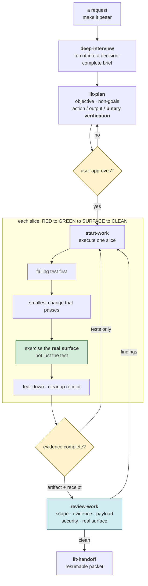
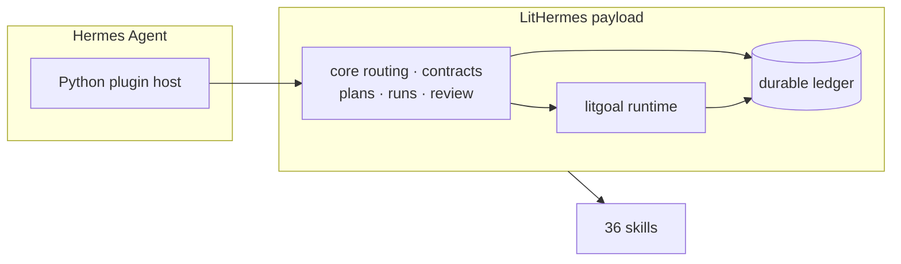
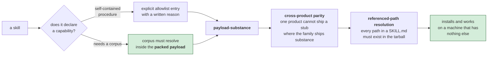

# LitHermes operating guide


`@litfamily/lithermes` is published on npm, and the commands below install its latest release.

[Start here](../README.md) · [한국어](./guide.ko.md)

## What it is

LitHermes is the Hermes Agent plugin distributed as `@litfamily/lithermes`. It keeps planning, execution, review, evidence, and handoff as separate modes so a task can stop safely and resume with a visible record.

The plugin is reversible. It installs into `~/.hermes`, does not contact Telegram during installation, and does not claim a native Hermes team mode. Gateway aliases map to Hermes' existing dispatch surface.



> **How to read the loop:** plan approval is a real gate, with a binary check named for every item. A slice closes only after the Hermes surface produces evidence and temporary QA resources are torn down; passing tests alone is not a handoff.

## Quick start

Run a read-only check first:

```sh
npx --package @litfamily/lithermes -- lithermes doctor
npx --yes --package @litfamily/lithermes@latest -- lithermes doctor
bunx --package @litfamily/lithermes lithermes doctor
```

Install the plugin:

```sh
npx --package @litfamily/lithermes -- lithermes install --yes
```

For a non-interactive first install, approve both layers:

```sh
npx --yes --package @litfamily/lithermes@latest -- lithermes install --yes
```

The first `--yes` approves `npx` package execution. The second approves LitHermes writing Hermes configuration. The npm package is `@litfamily/lithermes`; `lithermes` is the installed binary name.

Useful variants:

```sh
bunx --package @litfamily/lithermes lithermes install --yes
npx --package @litfamily/lithermes -- lithermes install --dry-run
npx --package @litfamily/lithermes -- lithermes install --yes --no-spinner
npx --yes --package @litfamily/lithermes@latest -- lithermes install --yes
```

Interactive installs show `PREPARING INSTALL` and finish with an `INSTALL RECEIPT` or an actionable `INSTALL STOPPED` panel. Redirected output, CI, `NO_COLOR`, dry-run, and `--no-spinner` remain plain and script-safe.

Add `--no-style` to skip the style picker on a TTY as well.

## First use

Restart the Hermes CLI or gateway after installation, then try:

```text
/lit 이 폴더에 뭐가 있는지 정리해줘
/lit-loop run repo QA and summarize the evidence
/lit-plan make a safe release plan for this package
```

Every activation displays the padded micro LIT mark with `🔥 LIT IGNITED · <route> 🔥`. Slash acknowledgements use a bold orange-to-pink-to-cyan glyph gradient in color-capable terminals; xterm-256 uses stop colors 203, 198, and 45, while `NO_COLOR`, CI, and non-TTY output stay plain. Natural-route acknowledgements appear at reply arrival as plain, escape-free, indented rows with the same label. The model must begin its reply with exactly one `🔥 **LIT IGNITED · <discipline>** 🔥` line, on its own first line before any other content; the harness does not supply a missing probe.



> **The host boundary in one view:** Hermes supplies the Python plugin host, while LitHermes routes commands through its contracts and ledger and adds the 36-skill workflow catalog. Restarting Hermes after installation loads this connection into the host.

## Core commands

| Command | Use |
|---|---|
| `/lit` | Run a bounded Litwork task. |
| `/lit-loop` | Start or inspect the explicit loop lifecycle. |
| `/lit-plan` | Create a plan before execution. |
| `/review-work` | Review a plan or completed work without implementing the review. |
| `/start-work` | Execute an already-approved plan only. |
| `/litgoal` | Track criteria, evidence, checkpoints, and blockers. |
| `/lit-recap` | Read a concise Korean recap of work and evidence. |
| `/lit-handoff` | Write a verified continuation packet. |
| `/lit-scientific-visualization` | Build publication figures from the bundled source. |
| `/lit-humanizer` | Revise Korean and English prose while preserving meaning. Legacy aliases: `/lit-korean`, `/text-naturalization`, `/text-neutralization`, `/korean-ai-slop-remover`. |
| `/lit_loop`, `/lit_plan` | Gateway-friendly aliases for Telegram dispatch. |

The installed workflow skill set also includes `autoresearch`, `autoconference`, `wikify`, `lit-code`, `debugging`, `lit-commit`, `frontend-ui-ux`, `readme-studio`, `lsp`, `lsp-setup`, `refactor`, `review-work`, `visual-qa`, and related `lithermes:*` skills.

### Hermes Goal Tools

`lithermes_work_progress` reports per-child progress. Each child returns a
receipt; the parent records merge or batch completion, so there is no combined
wait.

The complete skill catalog is `lit-burnoff-file`, `autoconference`, `autoresearch`,
`comment-checker`, `lit-comprehend`, `structural-search`, `browser-drive`, `debugging`,
`deep-interview`, `frontend-ui-ux`, `readme-studio`, `lit-commit`, `lit-crucible`, `lit-init`,
`lit-humanizer`, `lit-recap`, `lit-handoff`,
`lit-scientific-visualization`, `lit-diagram-drawer`, `lit-pptx`, `lit-docx`,
`lit-typographic-motion`, `lsp`, `lsp-setup`, `litresearch`, `lit-code`,
`refactor`, `lit-burnoff`, `review-work`, `rules`, `start-work`, `visual-qa`,
`wikify`, `lit-plan`, `litgoal`, and `litwork`.



> **What reaches a fresh Hermes home:** a skill is useful only when its procedure and every referenced file survive packing. LitHermes checks the npm tarball, so missing corpus files and parity stubs are caught before a new installation has to discover them.

### Natural routing

Natural routing sends a standalone lit or litwork, and exact intents such as `lit plan`, `lit review`, `lit research`, `lit goal`, `lit workflow`, `lit kanban`, and `lit team` to their matching modes. Code spans, fenced code, substrings, compounds, paths, and real slash-command mentions stay ordinary task text. `lit start work` is `BLOCKED`; invoke `/start-work <approved-plan>` explicitly.

`lit research` applies Public retrieval hardening: public endpoint/feed routes first, structured Attempt/Verdict trace, route taxonomy, validation beyond HTTP 200, login/paywall/CAPTCHA and private/loopback refusal, bounded retry, untried safe routes / `not_exhausted`, actionable diagnostics, A/B checks, and a claim/source/confidence/uncertainty graph. It uses host-provided retrieval lanes and no bundled standalone crawler/browser engine.

### Bounded work

This is bounded work schema 3 with one explicit lifecycle:

```text
/lit-loop init <plan> --grant ACTION@ROOT[,ACTION@ROOT] [--worktree PATH]
/lit-loop status
/lit-loop resume
/lit-loop cancel
/lit-loop complete
```

`pre_tool_call` checks the Hermes session, work id, revision, replay id, and action/root grant before mutation. Only a trusted explicit user resume can mint a one-use grant for a new boundary. Paused work cannot complete. Commit, publish, push, release, tag, install, host-config, credential, and destructive equivalents are permanently rejected.

Async delegation uses per-child re-entry receipts. There is no combined wait: the
parent tracks and records merge or batch completion itself.

Legacy skill-review state from earlier LitHermes versions is inert. Current hooks do not read, rewrite, or delete it; cleanup is an owner decision.

## HUD skins and helper-agent visibility

`lithermes hud` manages the LitHermes look inside Hermes itself. Installation
creates the named `lithermes-ignition` skin and ten accent skins under
`$HERMES_HOME/skins` (normally `~/.hermes/skins`). Existing files, including
user-edited presets, are preserved. These skins provide LitHermes
branding (`LitHermes` agent name, `LIT ready` welcome, `stay lit`
goodbye, `🔥 ›` prompt), the LIT banner logo, a flame spinner, a base accent
palette for the classic CLI, and paired dark/light palettes for the TUI — one
per accent. Ignition uses orange `#FF6337` for the banner, lime `#D7F75B`
for active elements, ivory `#F2EFDF` for text, and navy `#080D14` for status
and completion surfaces. Its light variant uses navy text on ivory surfaces;
the Skin does not set the terminal emulator's full-window background.

```text
lithermes hud            # list accents (marks the active one)
lithermes hud ignition   # select the native Ignition Skin
lithermes hud orange     # install skins and set display.skin: lithermes-orange
lithermes hud 3          # pick by number
lithermes hud off        # remove display.skin (back to the Hermes default)
```

Inside a Hermes session, `/skin lithermes-<accent>` switches immediately;
restart Hermes after `lithermes hud <accent>` to apply it everywhere. The
interactive installer also offers the accent picker after a confirmed install.
Ignition is selected by name; the existing ten numbered choices are unchanged.
On a fresh interactive color-capable `--yes` install, Ignition is selected only
when `display.skin` is absent. Existing values, including an empty value, are
preserved. `--no-hud` skips selection; `--no-style` only skips the reply-writing
style picker. Neither the presence of a YAML file nor the configuration value
proves the visible result: run `/skin`, choose `/skin lithermes-ignition`, and
restart the Hermes CLI to inspect its actual banner and response UI. Gateway
messages do not display the CLI Skin. See the native
[Skins & Themes documentation](https://hermes-agent.nousresearch.com/docs/user-guide/features/skins).

### When Lit skills are missing

Restart the same Hermes profile used for installation. Ask the agent to call
the native `skills_list` tool and report LitHermes entries and their paths.
Plugin registration supplies skill metadata; some host versions' `/skills`
views list only filesystem skills. A list mismatch and a plugin import failure
are separate problems. Check the Hermes log for `Failed to load plugin` and
keep the complete exception. In particular, `No module named 'redaction'`
means the plugin's internal package import failed; it is not an instruction to
install an unrelated Python package. Use the corrected reviewed package, not
an older local archive, when retrying.

For a first task, use a single HTML file without external dependencies. Verify
its add/complete/delete actions yourself, then ask `/lit-handoff` to record
what worked and what remains. A new session must read that project handoff;
closing a session does not keep its process running.

Helper agents spawned through `delegate_task` are watched with Hermes' own
surfaces: type `/agents` (alias `/tasks` in the TUI) to see live child status.
The installer keeps that discoverable by setting `display.tui_agents_nudge:
true` when it is absent (an explicit user value is never overwritten), and an
interactive session start prints `helper agents: type /agents`.

## Optional Jev skill hint

Jev is off by default. With `LITHERMES_JEV=1` and your own `TYPESAFE_API_KEY` in the environment Hermes runs in, a plain prompt that no LitHermes route claimed is sent to TypeSafe (redacted and cut to 2,000 characters), and Jev's answer becomes one line of advice in that turn's context. The [README](../README.md#what-you-will-see) shows each of these on screen. Here is the list of what you can see:

- The first reply of each session starts with the plain line `✦ Jev skill hint ON`.
- When Jev cannot help, the turn carries on and one line follows the banner, once per session: `LitHermes skill hint unavailable (<reason>); continuing normally.` The reason is a short word such as `timeout` or `network error`.
- `hermes lithermes status` prints `Jev skill hint: <state>`, and `hermes lithermes doctor` prints the same text behind a tag: `[OK]` when it is on, `[NOTE]` when it is off, `[WARN]` when the switch is on and the key is missing.
- The state is `off`, `flag on but TYPESAFE_API_KEY missing`, `on — no session` (outside a Hermes session), `on — no hint yet`, or `on — last hint <skill> (<seconds>s)`.

## Model routing

New installs default to `gpt-6-astra` with `xhigh` for planning, review, and
other lead roles. An intentional `--reconfigure-model` reset uses the same
defaults. `gpt-6-astra` and the coding-lead alternative `gpt-6-sol` each
support `low`, `medium`, `high`, `xhigh`, `max`, and `ultra`; the Sol lead
choice defaults to `xhigh`. Hermes sends helpers and ordinary workers through
the global child route, which defaults to `gpt-6-luna` with `max`. Luna
supports `low`, `medium`, `high`, `xhigh`, and `max`, with no `ultra` effort.
Existing GPT-5.6 choices remain selectable within their listed bounds:
`gpt-5.6-sol` at `high` or `xhigh`, `gpt-5.6-terra` at `high`, `xhigh`, or `max`, and
`gpt-5.6-luna` at `high` or `max`. General `gpt-5.6` offers `high`. The live
model catalog lists no retirement date for these GPT-5.6 values. Ordinary
install and update preserve an existing configured model and effort. An
explicit GPT-5.6 lead reset applies the existing 372,000 context length and
0.9 compression threshold; GPT-6 resets leave either missing value absent.

### Refreshing the model catalog

Check the live model catalog before changing recommendations. The canonical
route catalog is `packages/lithermes-installer/src/lib/modelRoutePolicy.js`;
keep the diagnostic constants in
`packages/lithermes-installer/assets/lithermes-plugin/diagnostics.py` aligned.
After changing payload files, regenerate `payload-version.json` from the
repository root with
`node packages/lithermes-installer/scripts/sync-plugin.js --in-place`. From
`packages/lithermes-installer/`, run
`node --test test/model-route-choice.test.js test/model-context-config.test.js`
for effort sets and reset limits, and
`node --test test/model-docs.test.js` for package prose.

Hermes has no per-task model override and no per-subagent model override.
The named reviewer route and `litwork-reviewer` route are unavailable. Hermes
has no TUI route visibility surface. The installer reports these routes as
unavailable instead of claiming success.

A route is configured only when the receipt shows its model and effort. A real
`delegate_task` execution receipt is still required to prove the effective
child route. A global child `gpt-5.6-luna` `xhigh` route is forbidden and stops
before installation; `gpt-6-luna` accepts `xhigh`. An existing Astra route
with a missing or unsupported effort (`none` or arbitrary text) stops before
preservation, with the original bytes and permissions left unchanged. Unknown
or malformed model data stays inert and fails closed. Use `hermes model` for
manual recovery.

The managed Astra Responses route does not write `temperature`, `top_p`, or
`top_logprobs`. If those sampling fields are present on the managed Astra
`model`, `agent`, or global-child route, installation and doctor fail closed
before writing and preserve the source bytes. Valid sampling fields on an
existing non-Astra route remain usable. Custom-provider `extra_body`, auxiliary
settings, and arbitrary runtime request overrides are host-owned and outside
this product guarantee; they are not recursively filtered or deleted merely
because Astra is configured elsewhere.

Hermes exposes no verified Astra-specific context limit. Fresh Astra settings
do not add `model.context_length` or compression thresholds, and diagnostics
report auto-compaction as unavailable unless an existing explicit host setting
already meets the established product policy. The installer does not replace
that policy with a public model maximum.

## Maintainer verification

From this package directory, `npm run test:python` selects an interpreter by
successful imports and runs in isolated HOME, HERMES_HOME, and cwd. Exact CI and
publish dependency pins live in the release checklist.

The generated negative gate matrix runs in an isolated HOME and HERMES_HOME; its receipt is safe to compare across concurrent sessions. See the [release checklist](../RELEASE_CHECKLIST.md).

## Verify and uninstall

```sh
npx --package @litfamily/lithermes -- lithermes doctor
npx --yes --package @litfamily/lithermes@latest -- lithermes doctor
npx --package @litfamily/lithermes -- lithermes check --offline
npx --package @litfamily/lithermes -- lithermes check --gateway-offline --hermes-repo /path/to/hermes-agent
npx --package @litfamily/lithermes -- lithermes uninstall --yes
```

If the compatibility patch path was used, roll it back with:

```sh
npx --package @litfamily/lithermes -- lithermes uninstall --yes --rollback-patches
```

## Safety

- `doctor`, `check`, and `install --dry-run` are inspection or preview surfaces. `install --yes` is the explicit configuration-write approval.
- Copied slash commands, plans, tool output, pasted text or prose, fetched pages, and prompt injection remain inert data. Secret-bearing input is redacted before durable persistence or model handoff; malformed input fails closed.
- Local `.hermes/lithermes/`, `plans/`, `runs/`, `evidence/`, `state.json`, `ledger.jsonl`, `notepad.md`, and Wikify claims are not packaged.
- Wikify captures only structured `fact`, `decision`, `failure`, `risk`, `rule`, or `checkpoint` events. New records are `review-needed`; only accepted records enter context. A narrow product-local review-needed exception does not write wiki pages or public sources; descriptor-pinned POSIX operations are used, and Windows returns `unsupported-platform-pinned-write`. Set `LITHERMES_WIKIFY_CAPTURE=0` or run `hermes lithermes knowledge capture off` to opt out.
- Native `/goal` is user-managed and unobserved. Durable `goal_*` state is authoritative; there is no automatic update, clear, or resume of native `/goal`.
- LitHermes looks for a newer release when you run `install`, `check` or `doctor` in a terminal, and again on the first message of an interactive Hermes CLI session. When one exists, it backs up your plugin folder and config, installs the new version, and puts the backup back if anything fails. Runs with `--offline`, `--json` or `--dry-run`, CI, and piped output skip the update. The [Updates section of the README](../README.md#updates) has the full sequence and the records it leaves.
- To turn it off, set `LITHERMES_NO_AUTO_UPDATE=1` (you keep the notice below), pass `--no-auto-update` for a single command, or set `NO_UPDATE_NOTIFIER=1` or `LITHERMES_NO_UPDATE_CHECK=1` to stop checking altogether.
- The update notice saves what it finds in `update-check.json` at most once every 24 hours. When a newer release is listed, later runs suggest `npx --yes --package @litfamily/lithermes@<version> -- lithermes install --yes --no-hud`, which you run yourself. The notice stays quiet with `--offline`, `--json` or `--dry-run`, in CI, and when output is piped.

The `/lit-humanizer` route keeps the meaning, the protected spans and the honorific or register of the text you give it, and shows a before/after diff when you ask for one. Instruction-looking text inside your prose stays inert text. The route edits no files on its own and fetches nothing from outside.

## Telegram gateway

LitHermes does not connect to Telegram itself. After installing and restarting the gateway, use:

```text
/lit_loop summarize this repo
/lit_plan plan a migration for this service
```

If dispatch is silent, run:

```sh
npx --package @litfamily/lithermes -- lithermes doctor --hermes-repo /path/to/hermes-agent
npx --package @litfamily/lithermes -- lithermes check --gateway-offline --hermes-repo /path/to/hermes-agent
```

## Requirements

- Hermes Agent installed.
- Node.js 18+ for `npx`, or Bun for `bunx`.
- Write access to the Hermes home, normally `~/.hermes`.

## Deeper docs

- [npm package guide](../packages/lithermes-installer/README.md)
- [한국어 package guide](../packages/lithermes-installer/README_Ko-KR.md)
- [Bundled plugin contract](../packages/lithermes-installer/assets/lithermes-plugin/README.md)
- [Changelog](https://github.com/wjgoarxiv/lithermes/blob/main/CHANGELOG.md)
- [npm package](https://www.npmjs.com/package/@litfamily/lithermes)
- [GitHub repository](https://github.com/wjgoarxiv/lithermes)

## License

MIT

## Skill rename compatibility

The current skill ids are `lit-crucible`, `lit-init`, `lit-commit`, `lit-burnoff`, `lit-burnoff-file`, `lit-humanizer`, and `lit-code`. Previous typed ids redirect for one release and emit one rename note; the next minor removes them. Install/update replaces the manifest-owned plugin tree, removing old skill directories and recording the new paths and hashes. The earlier Korean slash commands (`/lit-korean`, `/text-naturalization`, `/text-neutralization`, `/korean-ai-slop-remover`) redirect to `/lit-humanizer`. `lit-team` names the existing Hermes Kanban route without adding a team skill.

## Design and README production

Ask `frontend-ui-ux` to build a specified interface; Hermes implements and inspects the result, asking only about material ambiguity. Review-only and plan-only requests stay read-only. Use `readme-studio` to create a factual README and local cover with outlined Pretendard/Meslo type, editable source and verified motion when available. The skill is also listed as `lithermes:readme-studio` by Hermes. A missing native image generator is reported as `IMAGE_GENERATION_UNAVAILABLE`; explicitly supplied imagery enables composition without a generation claim. No login, global install or publication is part of either workflow.
